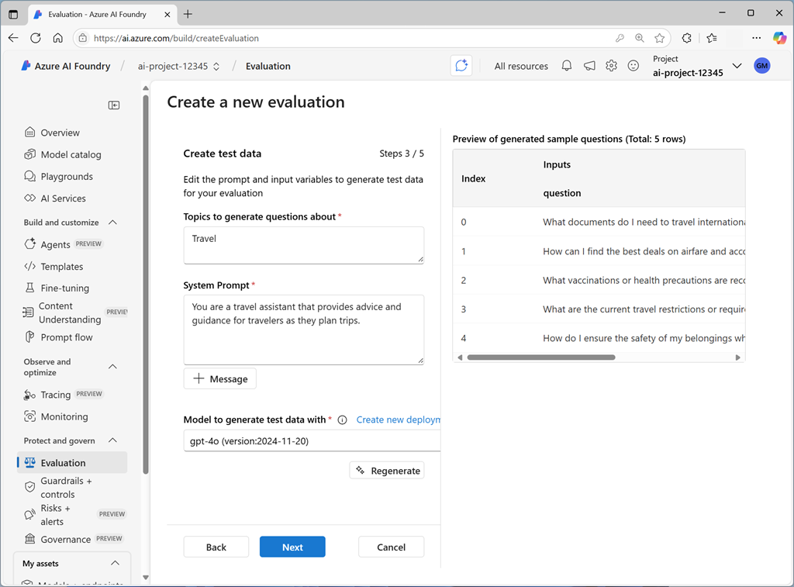

# 🤖 Automated Evaluations in Azure AI Foundry

> Let Azure do the heavy lifting of evaluating your AI models!

---

---

## 🚀 What Are Automated Evaluations?

Automated evaluations let **Azure AI Foundry automatically check**:

- How **good** your model’s responses are 💬
- How **safe** the content is from risks 🚫

These evaluations can be applied to:

- Models
- Datasets
- Prompt flows

No need for human feedback here — just use **AI models to test other AI models**!

---

## 📦 Step 1: Prepare Evaluation Data

You need a dataset with:

- ✅ Prompts (example user questions)
- ✅ Responses (what the model said)
- (Optional) 🟨 **Ground truth** answers — what you expected ideally

### 🧠 How to create this?

A fast way is:

1. Use an AI model to **auto-generate** realistic prompts and responses.
2. Manually tweak them if needed.
3. Use that as your test dataset!

📸 _Imagine: You generate a Q\&A about travel destinations. Then test a different model to see if it gives better answers._

---

## 📏 Step 2: Choose Evaluation Metrics

When setting up automated evaluation, you select:

- **What to test** (quality, safety)
- **Which metrics to use** (AI-based or standard NLP)

Let’s break them down 👇

---

### 📊 AI Quality Metrics

These check **how good** the answers are — with or without ground truth.

| Metric                         | What it checks                      | Example                                                     |
| ------------------------------ | ----------------------------------- | ----------------------------------------------------------- |
| **Coherence**                  | Does the answer make logical sense? | Is it easy to follow?                                       |
| **Relevance**                  | Is it related to the user question? | If the user asked about Paris, is it answering about Paris? |
| **F1 / BLEU / ROUGE / METEOR** | Match with ground truth             | Useful if you have expected answers                         |

> Example: You expected “Paris is great for culture,” and the model said “Paris is famous for art and museums” → High overlap.

---

### 🛡️ Risk & Safety Metrics

These detect **unsafe or harmful content** in model outputs.

| Risk Type    | Description                         |
| ------------ | ----------------------------------- |
| ☠️ Violence  | Mentions of physical harm or threat |
| 💬 Hate      | Offensive or hateful speech         |
| 🔞 Sexual    | Inappropriate or explicit content   |
| ⚠️ Self-harm | Mentions of suicide or self-injury  |

> Azure flags such responses automatically, so you can review or block them.

---

## 🔁 When to Use Automated Evaluations?

| Phase          | Use case                                                      |
| -------------- | ------------------------------------------------------------- |
| 🔬 Development | Test multiple prompt styles or models automatically           |
| 🧪 Testing     | Compare new versions of your model before going live          |
| 🚀 Production  | Monitor content safety in live interactions (optional audits) |

---

## 📝 Summary

| Step                 | What You Do                                   |
| -------------------- | --------------------------------------------- |
| 1️⃣ Prepare dataset   | Prompts + responses (+ ground truth optional) |
| 2️⃣ Generate prompts  | Use AI or app output                          |
| 3️⃣ Choose evaluators | Quality or Safety checks                      |
| 4️⃣ View results      | Understand where to improve your model        |
