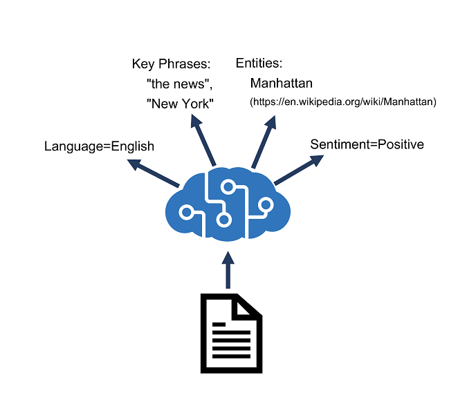

# Text Analysis

Azure AI Language is designed to help you extract information from text. It provides functionality that you can use for tasks like:

1️⃣ `Language detection` - determining the language in which text is written.  
2️⃣ `Key phrase extraction` - identifying important words and phrases in the text that indicate the main points.  
3️⃣ `Sentiment analysis` - quantifying how positive or negative the text is.  
4️⃣ `Named entity recognition` - detecting references to entities, including people, locations, time periods, organizations, and more.  
5️⃣ `Entity linking` - identifying specific entities by providing reference links to Wikipedia articles.

---

<div style="text-align: center;">
    
</div>

---

## 📚 1.Language detection

### 📥 Request

```json
{
  "kind": "LanguageDetection",
  "parameters": {
    "modelVersion": "latest"
  },
  "analysisInput": {
    "documents": [
      {
        "id": "1",
        "text": "Hello world"
      },
      {
        "id": "2",
        "text": "Bonjour tout le monde"
      }
    ]
  }
}
```

### 📤 Response

```json
{
  "kind": "LanguageDetectionResults",
  "results": {
    "documents": [
      {
        "detectedLanguage": {
          "confidenceScore": 1,
          "iso6391Name": "en",
          "name": "English"
        },
        "id": "1",
        "warnings": []
      },
      {
        "detectedLanguage": {
          "confidenceScore": 1,
          "iso6391Name": "fr",
          "name": "French"
        },
        "id": "2",
        "warnings": []
      }
    ],
    "errors": [],
    "modelVersion": "2022-10-01"
  }
}
```

---

## 🔠 2.Key phrase extraction

### 📥 Request

```json
{
    "kind": "KeyPhraseExtraction",
    "parameters": {
        "modelVersion": "latest"
    },
    "analysisInput":{
        "documents":[
            {
              "id": "1",
              "language": "en",
              "text": "You must be the change you wish
                       to see in the world."
            },
            {
              "id": "2",
              "language": "en",
              "text": "The journey of a thousand miles
                       begins with a single step."
            }
        ]
    }
}
```

### 📤 Response

```json
{
  "kind": "KeyPhraseExtractionResults",
  "results": {
    "documents": [
      {
        "id": "1",
        "keyPhrases": ["change", "world"],
        "warnings": []
      },
      {
        "id": "2",
        "keyPhrases": ["miles", "single step", "journey"],
        "warnings": []
      }
    ],
    "errors": [],
    "modelVersion": "2021-06-01"
  }
}
```

## 😭 3.Sentiment analysis

### 📥 Request

```json
{
  "kind": "SentimentAnalysis",
  "parameters": {
    "modelVersion": "latest"
  },
  "analysisInput": {
    "documents": [
      {
        "id": "1",
        "language": "en",
        "text": "Good morning!"
      }
    ]
  }
}
```

### 📤 Response

```json
{
  "kind": "SentimentAnalysisResults",
  "results": {
    "documents": [
      {
        "id": "1",
        "sentiment": "positive",
        "confidenceScores": {
          "positive": 0.89,
          "neutral": 0.1,
          "negative": 0.01
        },
        "sentences": [
          {
            "sentiment": "positive",
            "confidenceScores": {
              "positive": 0.89,
              "neutral": 0.1,
              "negative": 0.01
            },
            "offset": 0,
            "length": 13,
            "text": "Good morning!"
          }
        ],
        "warnings": []
      }
    ],
    "errors": [],
    "modelVersion": "2022-11-01"
  }
}
```

## 👀 4.Named entity recognition

Named Entity Recognition identifies entities that are mentioned in the text. Entities are grouped into categories and subcategories, for example:

- Person
- Location
- DateTime
- Organization
- Address
- Email
- URL

### 📥 Request

```json
{
  "kind": "EntityRecognition",
  "parameters": {
    "modelVersion": "latest"
  },
  "analysisInput": {
    "documents": [
      {
        "id": "1",
        "language": "en",
        "text": "Joe went to London on Saturday"
      }
    ]
  }
}
```

### 📤 Response

```json
{
  "kind": "EntityRecognitionResults",
  "results": {
    "documents": [
      {
        "entities": [
          {
            "text": "Joe",
            "category": "Person",
            "offset": 0,
            "length": 3,
            "confidenceScore": 0.62
          },
          {
            "text": "London",
            "category": "Location",
            "subcategory": "GPE",
            "offset": 12,
            "length": 6,
            "confidenceScore": 0.88
          },
          {
            "text": "Saturday",
            "category": "DateTime",
            "subcategory": "Date",
            "offset": 22,
            "length": 8,
            "confidenceScore": 0.8
          }
        ],
        "id": "1",
        "warnings": []
      }
    ],
    "errors": [],
    "modelVersion": "2021-01-15"
  }
}
```

## 🔗 5. Link Entity

In some cases, the same name might be applicable to more than one entity. For example, does an instance of the word "Venus" refer to the planet or the goddess from mythology?

Entity linking can be used to disambiguate entities of the same name by referencing an article in a knowledge base. Wikipedia provides the knowledge base for the Text Analytics service. Specific article links are determined based on entity context within the text.

For example, "I saw Venus shining in the sky" is associated with the link <https://en.wikipedia.org/wiki/Venus>; while "Venus, the goddess of beauty" is associated with <https://en.wikipedia.org/wiki/Venus_(mythology)>.

### 📥 Request

```json
{
  "kind": "EntityLinking",
  "parameters": {
    "modelVersion": "latest"
  },
  "analysisInput": {
    "documents": [
      {
        "id": "1",
        "language": "en",
        "text": "I saw Venus shining in the sky"
      }
    ]
  }
}
```

### 📤 Response

```json
{
  "kind": "EntityLinkingResults",
  "results": {
    "documents": [
      {
        "id": "1",
        "entities": [
          {
            "bingId": "89253af3-5b63-e620-9227-f839138139f6",
            "name": "Venus",
            "matches": [
              {
                "text": "Venus",
                "offset": 6,
                "length": 5,
                "confidenceScore": 0.01
              }
            ],
            "language": "en",
            "id": "Venus",
            "url": "https://en.wikipedia.org/wiki/Venus",
            "dataSource": "Wikipedia"
          }
        ],
        "warnings": []
      }
    ],
    "errors": [],
    "modelVersion": "2021-06-01"
  }
}
```
