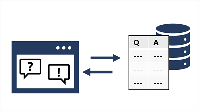
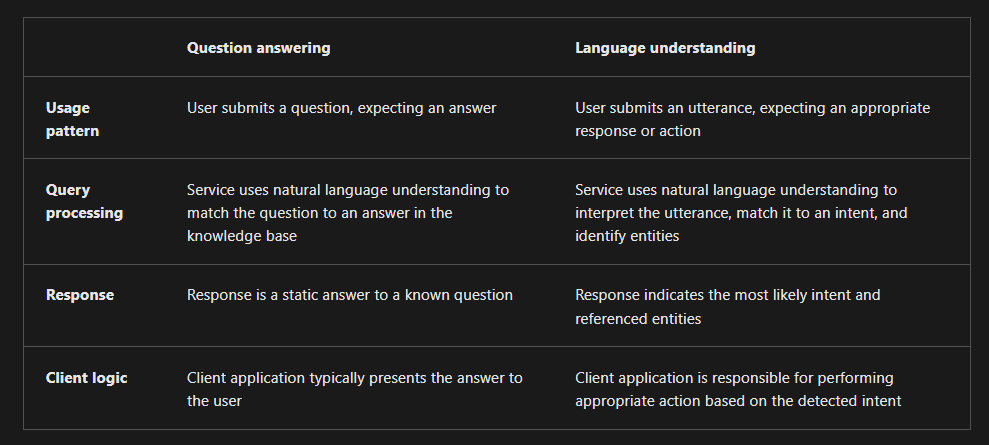
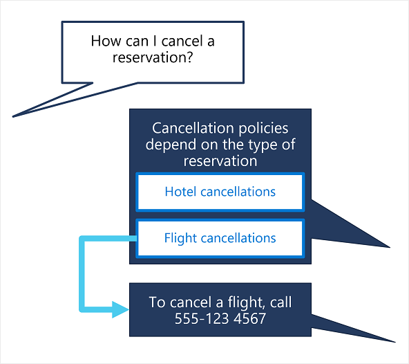
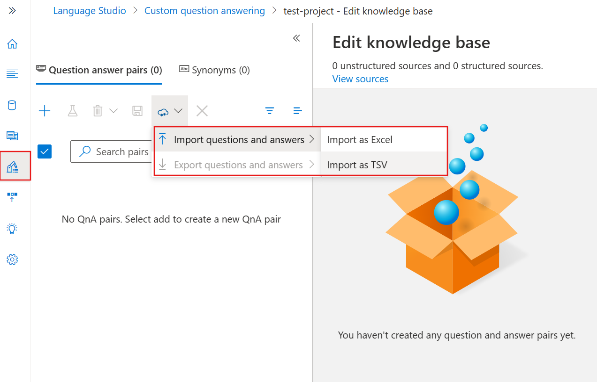
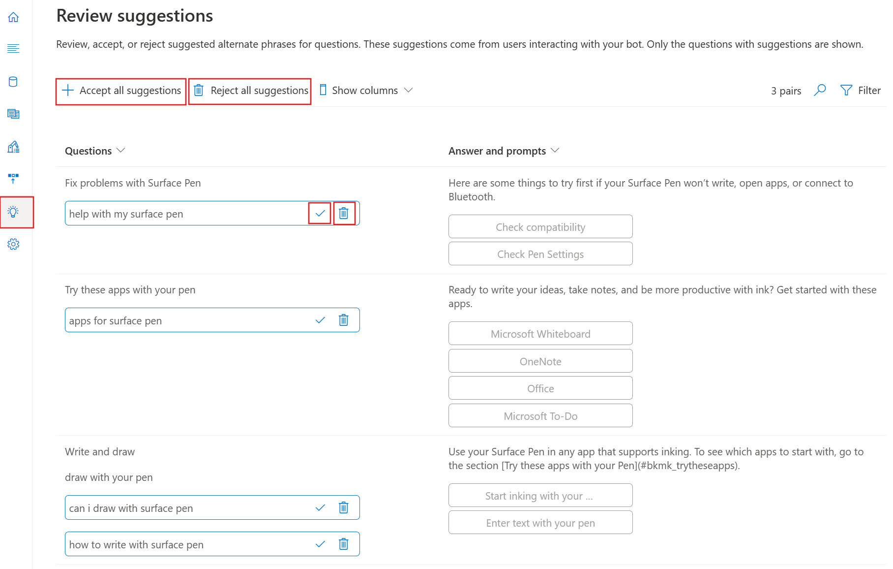
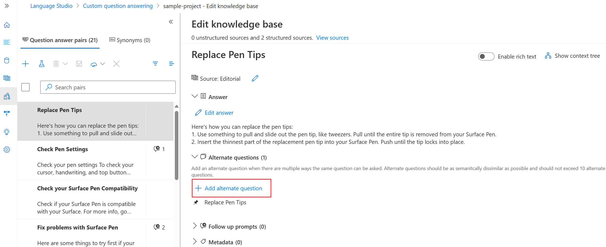

# ❓ Azure AI Language – Question Answering (QnA)

Want your app or chatbot to sound smarter? Add **conversational intelligence** with **Azure AI Language’s Question Answering** feature. It lets users ask **natural language questions** and receive **accurate, relevant answers**, just like asking a human expert!

---

<div style="text-align: center;">
    
</div>

---

## 📌 **What is it?**

> A modern replacement for **QnA Maker**, integrated into **Azure AI Language**, allowing you to create **FAQ-style knowledge bases** and connect them to applications or bots.

---

> 💡 **Migration Tip:**
> Already using QnA Maker? You can migrate to Azure AI Language via their official [migration guide](https://learn.microsoft.com/en-us/azure/cognitive-services/language-service/question-answering/migrate-qnamaker).

---

## 🔁 Question Answering vs Language Understanding

Confused between **QnA** and **Language Understanding (LUIS)**?

<div style="text-align: center;">
    
</div>

---

## 🛠️ Create a Knowledge Base

You can build a QnA knowledge base using:

- 🌐 URLs to FAQ pages (HTML parsing supported)
- 📄 PDF/TSV/XLSX/Docx files
- 🤖 Chit-chat datasets (for casual conversations like "How are you?")

🧰 **Best Tool**: Use **Language Studio** for a no-code experience!

---

## 🔄 Implement Multi-turn Conversations

Need follow-up questions? No problem!

**Multi-turn conversations** allow clarifying questions, like:

> ❓ User: “How can I cancel a reservation?”
> 🤖 Bot: “Is it a hotel or a flight reservation?”

<div style="text-align: center;">
    
</div>

### ✅ You can:

- Link follow-up questions to existing answers
- Create new follow-up-specific answers
- Restrict follow-up flow to context-only answers

---

## 🧪 Try Your Knowledge Base via API

### 🔗 Endpoint

```http
POST https://<your-resource-name>.cognitiveservices.azure.com/language/:query-knowledgebases?projectName=<your-kb-name>&deploymentName=production&api-version=2023-04-01
```

### 📤 Sample Request

```json
{
  "question": "What do I need to do to cancel a reservation?",
  "top": 2,
  "scoreThreshold": 20,
  "strictFilters": [
    {
      "name": "category",
      "value": "api"
    }
  ]
}
```

### 📥 Sample Response

```json
{
  "answers": [
    {
      "score": 27.7,
      "id": 20,
      "answer": "Call us on 555 123 4567 to cancel a reservation.",
      "questions": ["How can I cancel a reservation?"],
      "metadata": [
        {
          "name": "category",
          "value": "api"
        }
      ]
    }
  ]
}
```

---

## 🚀 Improve QnA Performance

Even smart bots need training! Improve your knowledge base using:

---

### 1️⃣ Active Learning

Let the system suggest alternative phrasings based on real user queries.

#### 🧱 Step 1: Define question/answer pairs

<div style="text-align: left;">
    
</div>

#### 🔍 Step 2: Review suggestions

<div style="text-align: left;">
    
</div>

#### ➕ Step 3: Add alternate questions

<div style="text-align: left;">
    
</div>

---

### 2️⃣ Define Synonyms

Ensure users using different words still get matched to the right answer.

📄 Example:

```json
{
  "synonyms": [
    {
      "alterations": ["reservation", "booking"]
    }
  ]
}
```

---

## ✅ Summary (Exam Flashcard)

| Feature             | Description                                                   |
| ------------------- | ------------------------------------------------------------- |
| Question Answering  | Answer retrieval from structured/unstructured sources         |
| Multi-turn Support  | Enable follow-up prompts                                      |
| Active Learning     | Suggest better Q/A alternatives from usage data               |
| Synonym Support     | Define alternate words to match answers                       |
| REST Endpoint       | `/language/:query-knowledgebases`                             |
| Deployment Required | Yes – you must publish your knowledge base before querying it |
