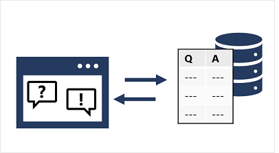
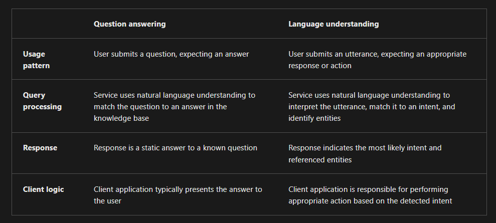
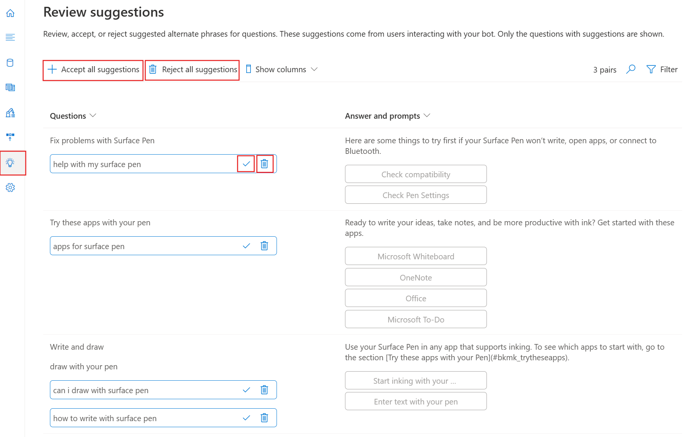

# Question answering

A common pattern for "intelligent" applications is to enable users to ask questions using natural language, and receive appropriate answers. In effect, this kind of solution brings conversational intelligence to a traditional frequently asked questions (FAQ) publication. In this module, you will learn how to use Azure AI Language to create a knowledge base of question and answer pairs that can support an `application` or `bot`.

---

<div style="text-align: center;">
    
</div>

---

> 📒 Note:
> The question answering capability of Azure AI Language is a newer version of the `QnA Service`, which still exists as a standalone service. To learn how to migrate a QnA Maker knowledge base to Azure AI Language, see the migration guide.

---

## Azure AI Language Question Answering 🆚 Azure AI Language understanding

<div style="text-align: center;">
    
</div>

---

## Create a knowledge base

To create a question answering solution, you can use the REST API or SDK to write code that defines, trains, and publishes the knowledge base. However, it's more common to use the Language Studio web interface to define and manage a knowledge base.

Add one or more data sources to populate the knowledge base:

- URLs for web pages containing FAQs.
- Files containing structured text from which questions and answers can be derived.
- Predefined chit-chat datasets that include common conversational questions and responses in a specified style.

---

## Implement multi-turn conversation

Although you can often create an effective knowledge base that consists of individual question and answer pairs, sometimes you might need to ask follow-up questions to elicit more information from a user before presenting a definitive answer. This kind of interaction is referred to as a multi-turn conversation.

<div style="text-align: center;">
    
</div>

You can enable multi-turn responses when importing questions and answers from an existing web page or document based on its structure, or you can explicitly define follow-up prompts and responses for existing question and answer pairs.

For example, suppose an initial question for a travel booking knowledge base is "How can I cancel a reservation?". A reservation might refer to a hotel or a flight, so a follow-up prompt is required to clarify this detail. The answer might consist of text such as "Cancellation policies depend on the type of reservation" and include follow-up prompts with links to answers about canceling flights and canceling hotels.

When you define a follow-up prompt for multi-turn conversation, you can link to an existing answer in the knowledge base or define a new answer specifically for the follow-up. You can also restrict the linked answer so that it is only ever displayed in the context of the multi-turn conversation initiated by the original question.

---

## Use a knowledge base

### Request

```json
{
  "question": "What do I need to do to cancel a reservation?",
  "top": 2,
  "scoreThreshold": 20,
  "strictFilters": [
    {
      "name": "category",
      "value": "api"
    }
  ]
}
```

### Response

```json
{
  "answers": [
    {
      "score": 27.74823341616769,
      "id": 20,
      "answer": "Call us on 555 123 4567 to cancel a reservation.",
      "questions": ["How can I cancel a reservation?"],
      "metadata": [
        {
          "name": "category",
          "value": "api"
        }
      ]
    }
  ]
}
```

---

## Improve question answering performance

After creating and testing a knowledge base, you can improve its performance with active learning and by `defining synonyms`.

### 1️⃣ Use active learning

Active learning can help you make continuous improvements to get better at answering user questions correctly over time. People often ask questions that are phrased differently, but ultimately have the same meaning. Active learning can help in situations like this because it enables you to consider alternate questions to each question and answer pair. Active learning is enabled by default.

#### 1. Create your question and answer pairs

<div style="text-align: center;">
    
</div>

#### 2. Review suggestions

<div style="text-align: center;">
    
</div>

### 3. Add alternate questions:

You can also manually add `alternate questions` when you select Add alternate question for a pair in the Edit knowledge base pane:

<div style="text-align: center;">
    
</div>

### 2️⃣ Define synonyms

Synonyms are useful when questions submitted by users might include multiple different words to mean the same thing. For example, a travel agency customer might refer to a "reservation" or a "booking". By defining these as synonyms, the question answering service can find an appropriate answer regardless of which term an individual customer uses.

```json
{
  "synonyms": [
    {
      "alterations": ["reservation", "booking"]
    }
  ]
}
```
