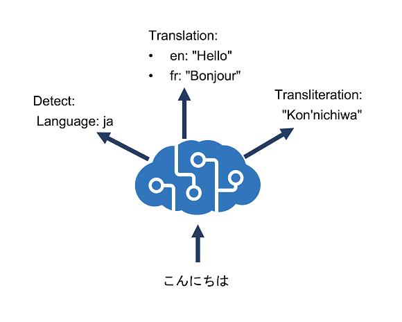

# 🌎 Azure AI Translator

Azure AI Translator provides a multilingual text translation API that you can use for:

1. `Language detection`.
1. `One-to-many translation`.
1. `Script transliteration` (converting text from its native script to an alternative script).

---

<div style="text-align: center;">
    
</div>

---

## 👮 1. Language detection

You can use the Detect function of the REST API to detect the language in which text is written.

### Request

```bash
curl -X POST "https://api.cognitive.microsofttranslator.com/detect?api-version=3.0"
-H "Ocp-Apim-Subscription-Region: <your-service-region>"
-H "Ocp-Apim-Subscription-Key: <your-key>"
-H "Content-Type: application/json"
-d "[{ 'Text' : 'こんにちは' }]
```

### Response

```json
[
  {
    "language": "ja",
    "score": 1.0,
    "isTranslationSupported": true,
    "isTransliterationSupported": true
  }
]
```

## 🗺️ 2.Translation

To translate text from one language to another, use the Translate function; specifying a single from parameter to indicate the source language, and one or more to parameters to specify the languages into which you want the text translated.

For example, you could submit the same JSON we previously used to detect the language, specifying a from parameter of ja (Japanese) and two to parameters with the values en (English) and fr (French). To do this, you'd call:

### Request

```bash
curl -X POST "https://api.cognitive.microsofttranslator.com/translate?api-version=3.0&from=ja&to=fr&to=en"
-H "Ocp-Apim-Subscription-Key: <your-key>"
-H "Ocp-Apim-Subscription-Region: <your-service-region>"
-H "Content-Type: application/json; charset=UTF-8"
-d "[{ 'Text' : 'こんにちは' }]"
```

### Response

```json
[
  {
    "translations": [
      { "text": "Hello", "to": "en" },
      { "text": "Bonjour", "to": "fr" }
    ]
  }
]
```

## 🔊 3. Transliteration

Our Japanese text is written using Hiragana script, so rather than translate it to a different language, you may want to transliterate it to a different script - for example to render the text in Latin script (as used by English language text).

To accomplish this, we can submit the Japanese text to the Transliterate function with a fromScript parameter of Jpan and a toScript parameter of Latn:

### Request

```bash
curl -X POST "https://api.cognitive.microsofttranslator.com/transliterate?api-version=3.0&fromScript=Jpan&toScript=Latn"
-H "Ocp-Apim-Subscription-Key: <your-key>"
-H "Ocp-Apim-Subscription-Region: <your-service-region>"
-H "Content-Type: application/json"
-d "[{ 'Text' : 'こんにちは' }]"
```

### Response

```json
[
  {
    "script": "Latn",
    "text": "Kon'nichiwa"
  }
]
```

## Specify translation options

### 🟰 Word alignment

In written English (using Latin script), spaces are used to separate words. However, in some other languages (and more specifically, scripts) this is not always the case.

For example, translating "Smart Services" from en (English) to zh (Simplified Chinese) produces the result "智能服务", and it's difficult to understand the relationship between the characters in the source text and the corresponding characters in the translation. To resolve this problem, you can specify the includeAlignment parameter with a value of true in your call to produce the following result:

```json
[
  {
    "translations": [
      {
        "text": "智能服务",
        "to": "zh-Hans",
        "alignment": {
          "proj": "0:4-0:1 6:13-2:3"
        }
      }
    ]
  }
]
```

### 🔢 Sentence length

Sometimes it might be useful to know the length of a translation, for example to determine how best to display it in a user interface. You can get this information by setting the includeSentenceLength parameter to true.

For example, specifying this parameter when translating the English (en) text "Hello world" to French (fr) produces the following results:

```json
[
  {
    "translations": [
      {
        "text": "Salut tout le monde",
        "to": "fr",
        "sentLen": { "srcSentLen": [12], "transSentLen": [20] }
      }
    ]
  }
]
```

### 🔞 Profanity filtering

Sometimes text contains profanities, which you might want to obscure or omit altogether in a translation. You can handle profanities by specifying the profanityAction parameter, which can have one of the following values:

- NoAction: Profanities are translated along with the rest of the text.
- Deleted: Profanities are omitted in the translation.
- Marked: Profanities are indicated using the technique indicated in the profanityMarker parameter (if supplied). The default value for this parameter is Asterisk, which replaces characters in profanities with "\*". As an alternative, you can specify a profanityMarker value of Tag, which causes profanities to be enclosed in XML tags.

For example, translating the English (en) text "JSON is ▇▇▇▇ great!" (where the blocked out word is a profanity) to German (de) with a profanityAction of Marked and a profanityMarker of Asterisk produces the following result:

```json
[
  {
    "translations": [
      {
        "text": "JSON ist *** erstaunlich.",
        "to": "de"
      }
    ]
  }
]
```
