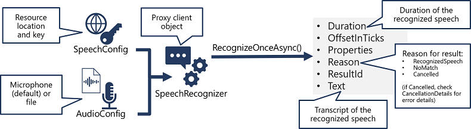

# 💬 Azure AI Speech

Azure AI Speech provides APIs that you can use to build speech-enabled applications. This includes:

- `Speech to text:` An API that enables speech recognition in which your application can accept spoken input.
- `Text to speech:` An API that enables speech synthesis in which your application can provide spoken output.
- `Speech Translation:` An API that you can use to translate spoken input into multiple languages.
- `Keyword Recognition:` An API that enables your application to recognize keywords or short phrases.
- `Intent Recognition:` An API that uses conversational language understanding to determine the semantic meaning of spoken input.

The Azure AI Speech service supports speech recognition through the following features:

- **Real-time transcription:** Instant transcription with intermediate results for live audio inputs.
- **Fast transcription:** Fastest synchronous output for situations with predictable latency.
- **Batch transcription:** Efficient processing for large volumes of prerecorded audio.
- **Custom speech:** Models with enhanced accuracy for specific domains and conditions.

## 1️⃣ **Speech to Text API SDK**

While the specific details vary, depending on the SDK being used (Python, C#, and so on); there's a consistent pattern for using the Speech to text API:

<div style="text-align: center;">
    
</div>

1. Use a `SpeechConfig` object to encapsulate the information required to connect to your Azure AI Speech resource. Specifically, its location and key.
1. Optionally, use an `AudioConfig` to define the input source for the audio to be transcribed. By default, this is the default system microphone, but you can also specify an audio file.
1. Use the `SpeechConfig` and `AudioConfig` to create a `SpeechRecognizer` object. This object is a proxy client for the Speech to text API.
1. Use the methods of the `SpeechRecognizer` object to call the underlying API functions. For example, the `RecognizeOnceAsync()` method uses the Azure AI Speech service to asynchronously transcribe a single spoken utterance.
1. Process the response from the Azure AI Speech service. In the case of the `RecognizeOnceAsync()` method, the result is a `SpeechRecognitionResult` object that includes the following properties:
   - Duration
   - OffsetInTicks
   - Properties
   - Reason
   - ResultId
   - Text

## 2️⃣ **Text TO Speech API SDK**

As with speech recognition, in practice most interactive speech-enabled applications are built using the Azure AI Speech SDK.
The pattern for implementing speech synthesis is similar to that of speech recognition:

<div style="text-align: center;">
    
</div>

1. Use a `SpeechConfig` object to encapsulate the information required to connect to your Azure AI Speech resource. Specifically, its location and key.
1. Optionally, use an `AudioConfig` to define the output device for the speech to be synthesized. By default, this is the default system speaker, but you can also specify an audio file, or by explicitly setting this value to a null value, you can process the audio stream object that is returned directly.
1. Use the `SpeechConfig` and `AudioConfig` to create a `SpeechSynthesizer` object. This object is a proxy client for the Text to speech API.
1. Use the methods of the `SpeechSynthesizer` object to call the underlying API functions. For example, the `SpeakTextAsync()` method uses the Azure AI Speech service to convert text to spoken audio.
1. Process the response from the Azure AI Speech service. In the case of the `SpeakTextAsync` method, the result is a `SpeechSynthesisResult` object that contains the following properties:
   - AudioData
   - Properties
   - Reason
   - ResultId

## ⚙️ Configure audio format and voices

### 🔉 Audio format

The Azure AI Speech service supports multiple output formats for the audio stream that is generated by speech synthesis. Depending on your specific needs, you can choose a format based on the required:

- Audio file type
- Sample-rate
- Bit-depth

### 🗣️ Voices

The Azure AI Speech service provides multiple voices that you can use to personalize your speech-enabled applications. There are two kinds of voice that you can use:

Standard voices - synthetic voices created from audio samples.
Neural voices - more natural sounding voices created using deep neural networks.

```c#
speechConfig.SpeechSynthesisVoiceName = "en-GB-George";
```

## 🎺 SSML - Speech Synthesis Markup Language

While the Azure AI Speech SDK enables you to submit plain text to be synthesized into speech (for example, by using the SpeakTextAsync() method), the service also supports an XML-based syntax for describing characteristics of the speech you want to generate. This Speech Synthesis Markup Language (SSML) syntax offers greater control over how the spoken output sounds, enabling you to:

- Specify a speaking style, such as "excited" or "cheerful" when using a neural voice.
- Insert pauses or silence.
- Specify phonemes (phonetic pronunciations), for example to pronounce the text "SQL" as "sequel".
- Adjust the prosody of the voice (affecting the pitch, timbre, and speaking rate).
- Use common "say-as" rules, for example to specify that a given string should be expressed as a date, time, telephone number, or other form.
- Insert recorded speech or audio, for example to include a standard recorded message or simulate background noise.

```xml
<speak version="1.0" xmlns="http://www.w3.org/2001/10/synthesis"
                     xmlns:mstts="https://www.w3.org/2001/mstts" xml:lang="en-US">
    <voice name="en-US-AriaNeural">
        <mstts:express-as style="cheerful">
          I say tomato
        </mstts:express-as>
    </voice>
    <voice name="en-US-GuyNeural">
        I say <phoneme alphabet="sapi" ph="t ao m ae t ow"> tomato </phoneme>.
        <break strength="weak"/>Lets call the whole thing off!
    </voice>
</speak>
```
