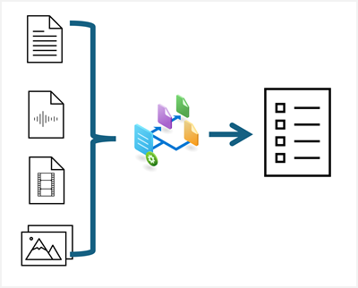
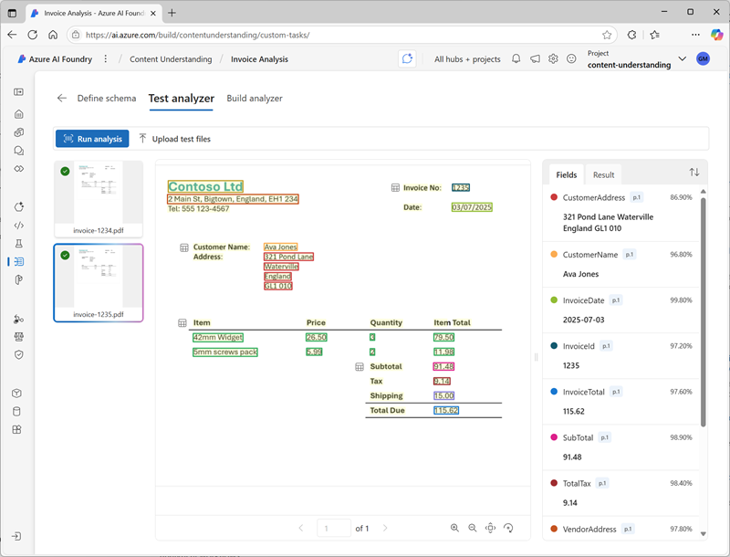
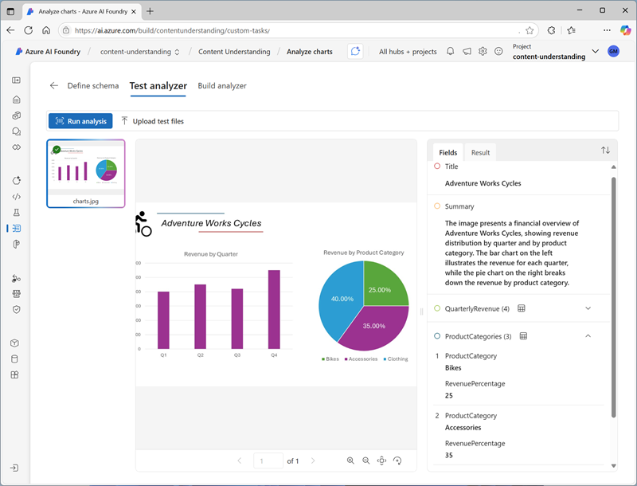
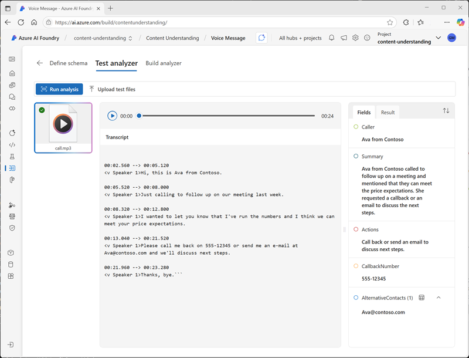
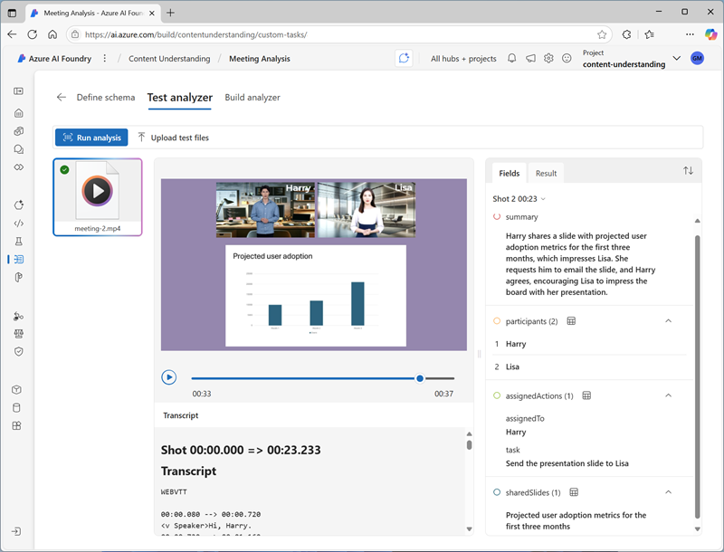
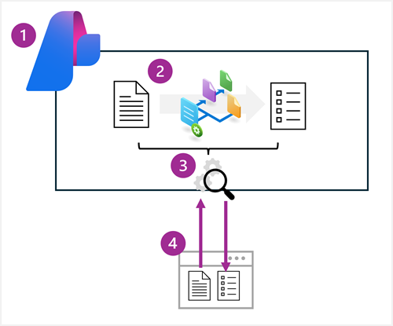

# Azure AI Content Understanding

**Azure AI Content Understanding** is a `multimodal` service that simplifies the creation of AI-powered analyzers that can extract information from content in practically any format.

---

    

---

Azure AI Content Understanding is a generative AI service that you can use to `extract insights` and data from multiple kinds of content. With Content Understanding, you can quickly build applications that analyze complex data and generate outputs that can be used to automate and optimize processes.

## Multimodal content analysis

### 1. Documents and forms

You can use Content Understanding to analyze documents and forms and retrieve specific field values. For example, you could extract key data values from an invoice to automate payment processing.

### 2. Images

You can analyze images to infer information from visuals such as charts, identify physical defects in products or other items, detect the presence of specific objects or people, or determine other information visually.

### 3. Audio

Analysis of audio enables you to automate tasks like summarizing conference calls, determining sentiment of recorded customer conversations, or extracting key data from telephone messages.

### 4. Video

Video accounts for a large volume of the data captured today, and you can use Content Understanding to analyze and extract insights from video to support many scenarios. For example, to extract key points from video conference recordings, to summarize presentations, or to detect the presence of specific activity in security footage.

---

## Create a Content Understanding analyzer

Content Understanding solutions are based on the creation of an analyzer; which is trained to extract specific information from a particular type of content based on a schema that you define.

1. Create an Azure AI services resource.
1. Define a Content Understanding schema for the information to be extracted. This can be based on a content sample and an analyzer template.
1. Build an analyzer based on the completed schema.
1. Use the analyzer to extract or generate fields from new content.

## Use the Content Understanding REST API
