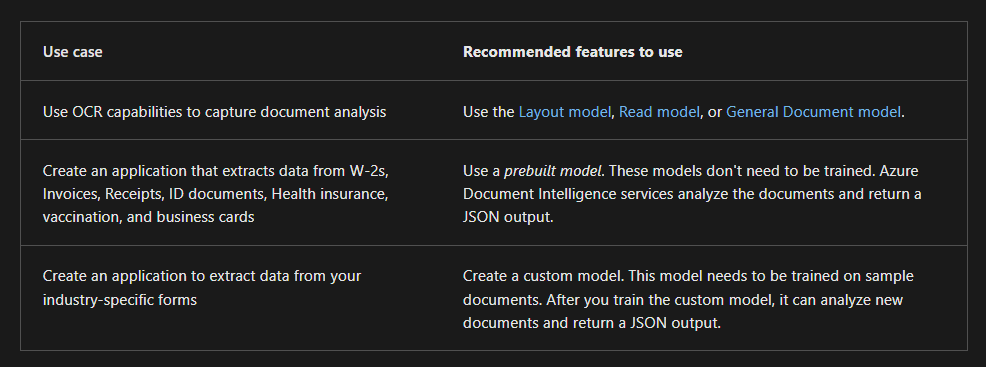

# 🧾 Azure AI Document Intelligence

Many forms and documents that businesses handle are common across disparate companies in different sectors. For example, most companies use invoices and receipts. Microsoft Azure AI Document Intelligence includes prebuilt models so you can handle common document types easily.

---

## 📦 What Are Prebuilt Models?

Prebuilt models in Azure AI Document Intelligence enable you to extract data from common forms and documents without training your own models.

they can be:

1. General-Purpose Models (for unpredictable document structures)
2. Specialized Prebuilt Models (for known document types)

## 📌 I. General-Purpose Models (for unpredictable document structures)

These are perfect when documents don't follow a fixed format – like contracts, specs, or tenders.

---

### 👀 **1. Read Model**

- 📌 Extracts **printed and handwritten text**.
- 🈲 Detects **language per line** (supports more for printed).
- ✍️ Identifies if text is **handwritten or printed**.
- 📑 Use `pages` parameter to analyze specific pages in PDFs/TIFFs.
- 📦 Used internally by all other models.

🧠 **Example**: Scanning messy handwritten notes or mixed-language brochures and extracting clean text.

---

### 📋 **2. Layout Model**

- 🧾 Extracts **tables** and **selection marks** in addition to text.
- 📐 Returns detailed structure: cell size, position, headers, row/col index.
- ☑️ Detects checkboxes (selected/unselected) with confidence score.

🧠 **Example**: Digitizing multi-format surveys or forms with tables and checkmarks.

---

### 🎯 **3. General Document Model**

- 💬 it can Extracts:

  - Key-value pairs
  - Tables
  - Selection marks
  - **Entities** (unique to this model!)

- 📊 Works on structured, semi-structured, and unstructured docs.
- 🧾 Supports **entity detection** like:

  | Entity Type      | Example                                         |
  | ---------------- | ----------------------------------------------- |
  | 👤 Person        | "Sara Ahmed"                                    |
  | 🧑‍💼 PersonType | "Senior Architect"                              |
  | 📍 Location      | "Dubai", "Eiffel Tower"                         |
  | 🏢 Organization  | "OpenAI", "NASA"                                |
  | 🗓️ Event         | "Build 2025", "Expo 2020"                       |
  | 📦 Product       | "iPhone 15 Pro"                                 |
  | ⚙️ Skill         | "C#", "Terraform"                               |
  | 📬 Address       | "123 King Rd, London"                           |
  | ☎️ Phone Number  | "+971-50-123-4567"                              |
  | 📧 Email         | "[hello@example.com](mailto:hello@example.com)" |
  | 🔗 URL           | "[https://example.com](https://example.com)"    |
  | 🌐 IP Address    | "192.168.0.1"                                   |
  | ⏰ DateTime      | "June 25, 2025 08:00 AM"                        |
  | 📏 Quantity      | "3 GB", "100 USD"                               |

  🧠 **Example**: Extracting names, product names, emails, and organizations from a messy SOW.

---

## 📌 II. Specialized Prebuilt Models (for known document types)

These are **ready-made for real-world documents** like invoices, IDs, and tax forms — no training required!

| 📚 **Model Name**            | 🔍 **Purpose**                                   |
| ---------------------------- | ------------------------------------------------ |
| 🧾 **Invoice**               | Vendor, date, total, line items                  |
| 🛍️ **Receipt**               | Store, tax, payment method                       |
| 🇺🇸 **US Tax**                | Supports W-2, 1099, 1040, etc.                   |
| 🪪 **ID Document**            | Extracts from passports, EU/US driver’s licenses |
| 💳 **Credit/Debit Card**     | Masked card number, expiry date                  |
| 🏦 **Bank Statement**        | Transactions, balances, dates                    |
| 💸 **Pay Stub**              | Net pay, hours, tax breakdown                    |
| 💍 **Marriage Certificate**  | Names, marriage date, location                   |
| 💼 **Business Card**         | Name, phone, company, email                      |
| 🩺 **Health Insurance Card** | Member ID, provider, plan type                   |
| 🏡 **Mortgage Docs**         | Extracts from Form 1003, 1004, 1005, 1008, CD    |
| 🧾 **Check**                 | Payee, amount, date                              |

---

## ✅ Summary: Which model to choose?

| 🧠 **Need**                                                  | 🧰 **Use Model**     |
| ------------------------------------------------------------ | -------------------- |
| Extract plain text (printed/handwritten)                     | **Read**             |
| Extract text + structure (tables/marks)                      | **Layout**           |
| Extract key-values + entities                                | **General Document** |
| Recognize specific document types (e.g. invoices, passports) | **Prebuilt Models**  |

## 🥸 file input requirements

Azure Document Intelligence works on input documents that meet these requirements:

- `Format must be JPG, PNG, BMP, PDF (text or scanned), or TIFF.`
- `The file size must be less than 500 MB for paid (S0) tier and 4 MB for free (F0) tier.`
- `Image dimensions must be between 50 x 50 pixels and 10,000 x 10,000 pixels.`
- `The total size of the training data set must be 500 pages or less.`

## 🏗️ Component of Azure Document Intelligence

