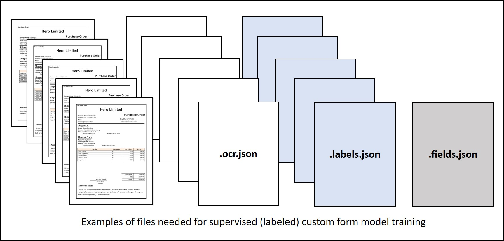

# Train Doc AI

Azure's Azure Document Intelligence service supports supervised machine learning. You can train custom models and create composite models with form documents and JSON documents that contain labeled fields.

    

## 📦 Required Training Data

To train a custom model:

1️⃣ Store sample forms in an Azure blob container, along with JSON files containing layout and label field information.

- You can generate an ocr.json file for each sample form using the Azure Document Intelligence's Analyze document function. Additionally, you need a single fields.json file describing the fields you want to extract, and a labels.json file for each sample form mapping the fields to their location in that form.

2️⃣ Generate a shared access security (SAS) URL for the container.  
3️⃣ Use the Build model REST API function (or equivalent SDK method).  
4️⃣ Use the Get model REST API function (or equivalent SDK method) to get the trained model ID.

OR

5️⃣ Use the Azure Document Intelligence Studio to label and train. There are two types of underlying models for custom forms custom template models or custom neural models.

- Custom template models accurately extract labeled key-value pairs, selection marks, tables, regions, and signatures from documents. Training only takes a few minutes, and more than 100 languages are supported.
- Custom neural models are deep learned models that combine layout and language features to accurately extract labeled fields from documents.This model is best for semi-structured or unstructured documents.
