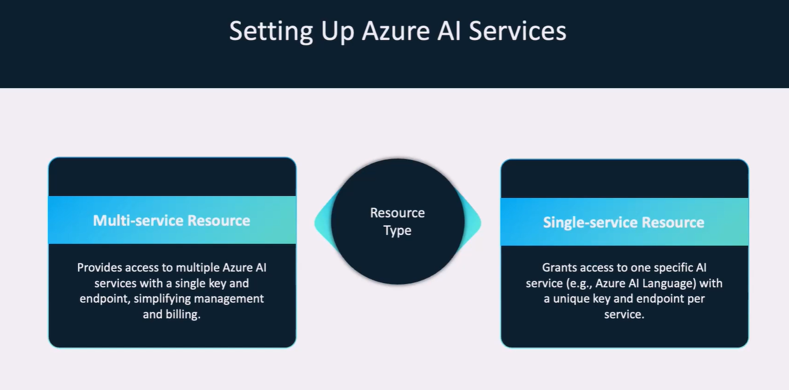
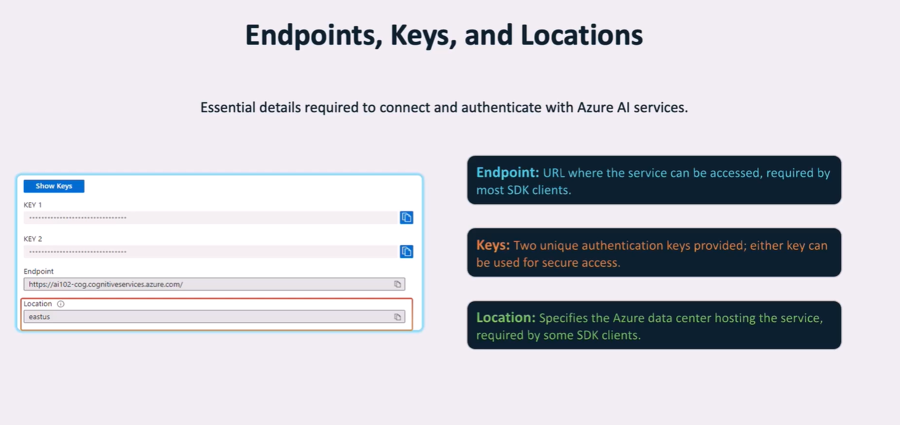

# 🧠 How to Access Azure AI Services

## 🌐 What Are Azure AI Services?

**Azure AI Services** are a set of prebuilt APIs by Microsoft to solve common AI tasks like image analysis, language understanding, speech recognition, and more — all without requiring deep ML expertise. You send data ➡️ Azure does the AI magic ✨.

---

### 🔍 What Can They Do?

| 🧠 Category       | 🛠️ Services / Features                      | 📦 Use Cases                           |
| ----------------- | ------------------------------------------- | -------------------------------------- |
| 👁️ Vision         | OCR, tagging, face & object detection       | Image moderation, ID scanning, AR apps |
| 🗣️ Speech         | Text-to-speech, speech-to-text, translation | Voice assistants, real-time captions   |
| 🌍 Language       | Sentiment, key phrases, NER, summarization  | Feedback analysis, document processing |
| 🌐 Translator     | Real-time text translation                  | Global apps, multilingual chatbots     |
| 🤖 OpenAI         | GPT-4, embeddings, prompt completion        | Chatbots, summarization, RAG           |
| 🛡️ Content Safety | Harm detection, content moderation          | Filter user input / AI output          |

---

## 🏗️ Three Ways to Access Azure AI Services

| ⚙️ Method                                          | 📋 Description                                          | ✅ Best For                     | 💸 Free Tier |
| -------------------------------------------------- | ------------------------------------------------------- | ------------------------------- | ------------ |
| 1️⃣ **Standalone AI Service**                       | Provision just one service (e.g., Translator)           | Learning, free testing          | ✅ Yes       |
| 2️⃣ **Multi-Service Resource** (`kind: AIServices`) | Access all AI services using one key + endpoint         | Real apps needing multiple APIs | ❌ No        |
| 3️⃣ **AI Foundry Hub + Project**                    | Full AI platform with agents, prompts, workflows, teams | GenAI apps, enterprise AI teams | ❌ No        |

---

<div style="text-align: center;">
    
    
</div>

## 1️⃣ Standalone Azure AI Resource

### 🎯 Ideal For:

- Beginners exploring **one service at a time**
- **Free tier usage** (F0 pricing available)
- Testing without complex auth

---

### ☁️ Portal Setup

1. Go to [Azure Portal](https://portal.azure.com)
2. **Create a resource** ➡️ Search for services like:

   - `Computer Vision`
   - `Translator`
   - `Text Analytics`
   - `Speech`

3. Fill the form:

   - 📛 Name: `my-ai-demo`
   - 🌍 Region: `East US`
   - 💰 Pricing: Select **F0** (if available)

4. ✅ Create and copy your:

   - 🔑 **Key1**
   - 🌐 **Endpoint**

---

### 🖥️ CLI Setup

```bash
az group create --name my-rg --location eastus

az cognitiveservices account create \
  --name myStandaloneAI \
  --resource-group my-rg \
  --kind TextAnalytics \  # Or Translator, Speech, etc.
  --sku F0 \
  --location eastus
```

---

### 💻 Sample Code (Text Analytics)

```python
from azure.core.credentials import AzureKeyCredential
from azure.ai.textanalytics import TextAnalyticsClient

client = TextAnalyticsClient(
    endpoint="https://myStandaloneAI.cognitiveservices.azure.com/",
    credential=AzureKeyCredential("<your-key>")
)

docs = ["Azure is awesome!", "Cognitive Services make life easier."]
result = client.analyze_sentiment(docs)

for doc in result:
    print(f"Sentiment: {doc.sentiment}")
```

---

## 2️⃣ Azure AI Multi-Service Resource (`AIServices`)

### 🎯 Ideal For:

- Real-world apps using **multiple AI services**
- **One endpoint + key** to rule them all
- Unified billing & resource management

---

### ☁️ Portal Setup

1. In [Azure Portal](https://portal.azure.com)
2. Click **Create a resource** → Search: `Azure AI Services`
3. Select `Azure AI Services (kind: AIServices)`
4. Fill the form:

   - 📛 Name: `my-multi-ai`
   - 📍 Region: `East US`
   - 💳 SKU: `S0`

5. ✅ Copy:

   - 🌐 Endpoint
   - 🔑 Key1

---

### 🖥️ CLI Setup

```bash
az group create --name my-ai-rg --location eastus

az cognitiveservices account create \
  --name myAIServicesRes \
  --resource-group my-ai-rg \
  --kind AIServices \
  --sku S0 \
  --location eastus
```

---

### 💻 Sample Code (Speech SDK)

```python
import azure.cognitiveservices.speech as speechsdk

speech_config = speechsdk.SpeechConfig(
    subscription="<your-key>",
    region="eastus"
)

synthesizer = speechsdk.SpeechSynthesizer(speech_config=speech_config)
synthesizer.speak_text_async("Hello from Azure AI Services!")
```

> ✅ Use the same credentials for other services like Vision, Translator, OpenAI, and more!

---

## 3️⃣ Azure AI Foundry (Hub + Project)

### 🎯 Ideal For:

- Full **GenAI development** experience
- Agent-based apps, **Prompt Flow**, and **secure deployments**
- Teams collaborating on workflows and AI prompts

---

### ☁️ Portal Setup → [https://ai.azure.com](https://ai.azure.com)

1. 🧱 Create a **Hub**

   - Name: `my-hub`
   - Region: `East US`

2. 🔧 Create a **Project**

   - Name: `my-ai-project`
   - Select Hub
   - Enable AI services ✅

---

🎁 What You Get:

- A **multi-service AI resource** (auto-created)
- **Prompt Flow**, Agent Service, environments
- Built-in key management and tracing tools
- Pre-wired resource access in portal and SDK

---

### 🧠 Example Usage with SDK

```python
from azure.identity import DefaultAzureCredential
from azure.ai.foundry import FoundryClient
from azure.ai.textanalytics import TextAnalyticsClient
from azure.core.credentials import AzureKeyCredential

foundry = FoundryClient(
    project_name="my-ai-project",
    credential=DefaultAzureCredential()
)

# Fetch service resource
text_service = foundry.get_ai_service("textanalytics")

# Use service as normal
client = TextAnalyticsClient(
    text_service.endpoint,
    AzureKeyCredential(text_service.key)
)

result = client.analyze_sentiment(["This is amazing!"])
for doc in result:
    print(doc.sentiment)
```

---

## 🔐 Authentication Options

| 🔒 Auth Type           | 📘 Description                                        | ✅ Best For                |
| ---------------------- | ----------------------------------------------------- | -------------------------- |
| 🔑 **Key-based**       | Copy/paste API key                                    | Testing, simplicity        |
| 🪪 **Entra ID (AAD)**   | Secure auth using Azure AD tokens                     | Enterprise-grade security  |
| 🛡 **Managed Identity** | Auto-auth for apps inside Azure (VMs, Web Apps, etc.) | Secure prod deployments    |
| 🔐 **Key Vault**       | Safely store keys and secrets                         | Highly recommended always! |

---

## 🧾 Summary Cheat Sheet

| 🎯 Goal                                       | ✅ Use This                           |
| --------------------------------------------- | ------------------------------------- |
| Test a single service with free quota         | Standalone AI Resource (F0 tier)      |
| Use multiple services together                | Multi-Service Resource (`AIServices`) |
| Build full GenAI apps (prompts, agents, logs) | Foundry Project + Hub                 |
| Quick API usage                               | Key-based auth                        |
| Secure deployment with Azure-hosted apps      | Managed Identity or Entra ID          |
