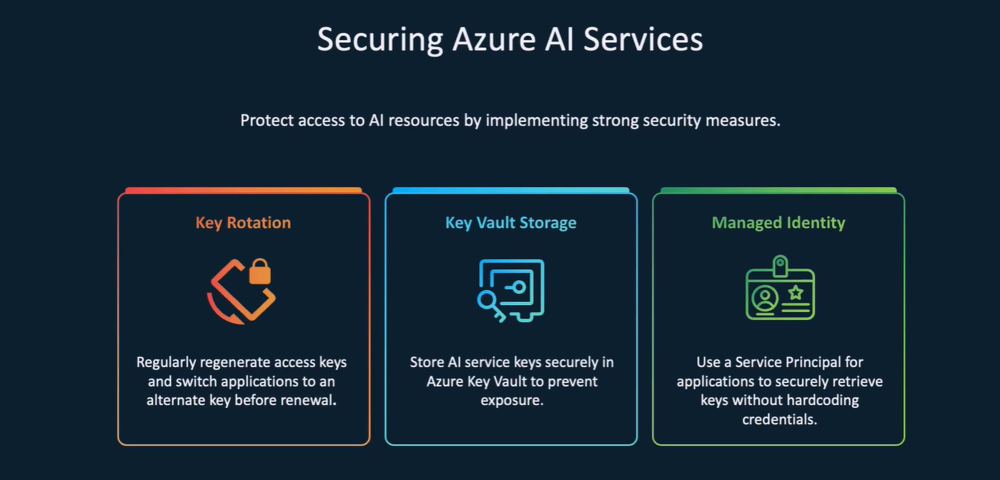
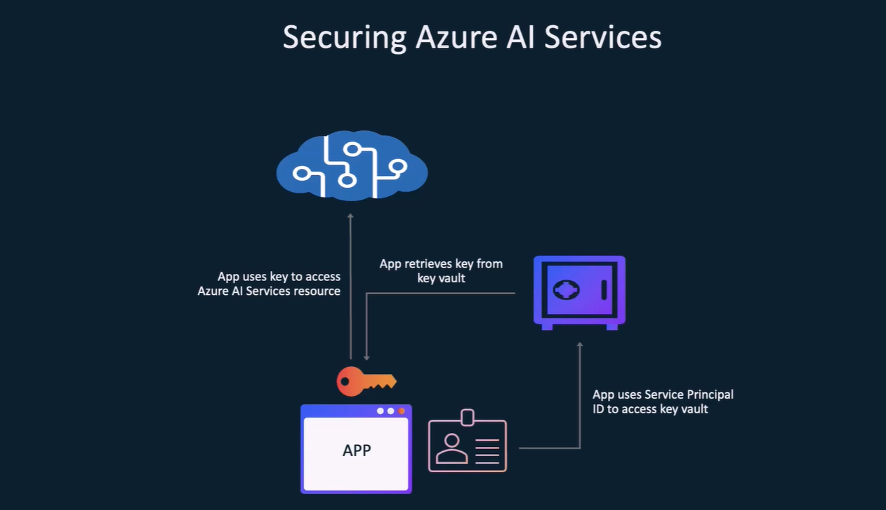

# 🛡️ Securing Azure AI Services with Key Vault, Managed Identity & Key Rotation

Azure AI Services often require **API keys** or **endpoint secrets** to access services like OpenAI, Computer Vision, or Text Analytics. Storing these secrets securely and rotating them without downtime is critical in production.

---

<div style="text-align: center;">
    
</div>

---

## 🧱 Core Security Components Explained

### 🔐 Azure Key Vault (AKV)

**Azure Key Vault** is a cloud service that stores:

- **Secrets** (e.g., AI Service keys)
- **Keys** (for encryption)
- **Certificates**

It allows:

- Secure storage
- Granular access control via RBAC or policies
- Automatic key rotation & versioning

### 🆔 Managed Identity (MSI)

**Managed Identity** provides Azure services with a secure, passwordless identity in Azure AD to access other services.

Types:

- **System-assigned**: Bound to a single resource (e.g., App Service)
- **User-assigned**: Reusable across multiple resources

Used to:

- Access **Azure Key Vault**
- Authenticate without storing credentials

### 🔁 Key Rotation

**Key Rotation** means periodically replacing an API key with a new one.

Why it matters:

- Follows security best practices
- Limits blast radius of leaked keys
- Helps comply with regulatory standards

Approaches:

- Manual via Azure Portal or CLI
- **Automated with Key Vault & Azure Automation or Event Grid**
- Use **two keys** (Key1, Key2) for safe switchover without downtime

---

## 🔄 Best Practice Lifecycle for Securing Azure AI Services

This step-by-step guide shows how to:

> 🔧 Deploy an app → 🛡 Secure secrets → 🆔 Access with identity → 🔁 Enable key rotation → 🚀 Run safely in production

---

<div style="text-align: center;">
    
</div>

---

### 🔨 Step 1: Provision Azure AI Service

```bash
az cognitiveservices account create \
  --name my-ai-service \
  --resource-group my-rg \
  --kind OpenAI \
  --sku S0 \
  --location eastus \
  --yes
```

- Note down the **Key1** and **Key2** from the service.
- These will be stored in Key Vault.

---

### 🏗️ Step 2: Create Azure Key Vault and Store Secrets

```bash
az keyvault create \
  --name myKeyVault \
  --resource-group my-rg \
  --location eastus

az keyvault secret set \
  --vault-name myKeyVault \
  --name "AzureAI-Key1" \
  --value "<copied-key1>"

az keyvault secret set \
  --vault-name myKeyVault \
  --name "AzureAI-Key2" \
  --value "<copied-key2>"
```

---

### 🚀 Step 3: Deploy App with Managed Identity (VM or App Service)

#### 🔹 Option 1: App Service with System-Assigned Identity

```bash
az webapp identity assign \
  --name myApp \
  --resource-group my-rg
```

#### 🔹 Option 2: VM with System-Assigned Identity

```bash
az vm identity assign \
  --name myVM \
  --resource-group my-rg
```

---

### 🔐 Step 4: Grant Key Vault Access to App's Managed Identity

```bash
# Get app identity principal ID
az webapp show \
  --name myApp \
  --resource-group my-rg \
  --query identity.principalId \
  --output tsv

# Assign Key Vault Secret Reader role
az keyvault set-policy \
  --name myKeyVault \
  --object-id <app-identity-principal-id> \
  --secret-permissions get list
```

---

### 🧠 Step 5: In App Code — Access AI Key Securely

#### Example in Python:

```python
from azure.identity import DefaultAzureCredential
from azure.keyvault.secrets import SecretClient

vault_url = "https://myKeyVault.vault.azure.net"
credential = DefaultAzureCredential()
client = SecretClient(vault_url=vault_url, credential=credential)

secret = client.get_secret("AzureAI-Key1")
ai_key = secret.value
```

- `DefaultAzureCredential()` uses the app's Managed Identity automatically when deployed in Azure.

---

### 🔁 Step 6: Implement Key Rotation (No Downtime)

> ✅ **Recommended Strategy: Use Two Keys & Zero-Downtime Rotation**

#### 🔄 Rotation Process:

1. **Rotate Key2 in Azure Portal**
   Generate a new Key2 → Store updated Key2 in Key Vault → Keep app using Key1

2. **Swap keys in code/config when convenient**
   Update app to use new Key2 from Key Vault → Restart/redeploy app

3. **Regenerate Key1 safely**
   After app uses Key2, regenerate Key1 in the Azure Portal → Store new Key1 in Key Vault

4. **Repeat the pattern every 30-90 days**

📌 Use Key Vault **secret versioning** to update secrets without breaking current versions.

---

## ✅ Summary Checklist

| Step | Task                                                 |
| ---- | ---------------------------------------------------- |
| ✅   | Deploy Azure AI Service                              |
| ✅   | Store keys securely in Azure Key Vault               |
| ✅   | Enable Managed Identity for App Service/VM           |
| ✅   | Grant Key Vault `get` access to the identity         |
| ✅   | Retrieve key securely in app code                    |
| ✅   | Use dual-key rotation strategy with Key1 and Key2    |
| ✅   | Avoid downtime during rotation with controlled swaps |
