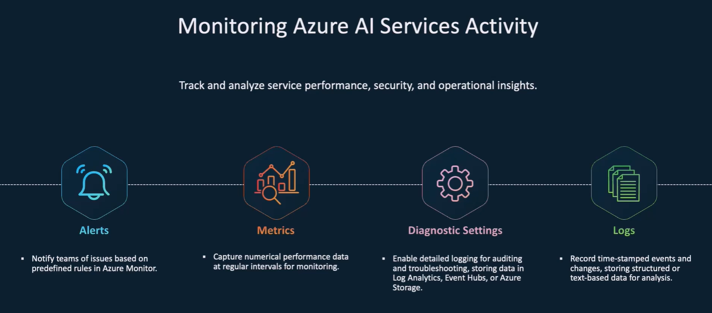

# 🧠 Monitoring Azure AI Services – From Zero to Hero

## 📍 Why Monitor Azure AI Services?

> **Official Reason**: Monitoring ensures your AI services (like Language, Vision, Speech, OpenAI) are healthy, cost-effective, secure, and performant.

---

> **Human Reason**: So you don’t get surprised by errors at 2 AM or get billed \$700 for a test run you forgot to turn off 😅.

---

<div style="text-align: center;">
    
</div>

---

## 🧩 Dependency Order – The Superhero Flow

We'll walk step-by-step like building a cake 🧁:

1. **Diagnostic Settings** – tell Azure what to collect.
2. **Logs** – collect events and traces.
3. **Metrics** – monitor performance and usage.
4. **Alerts** – scream at you when stuff breaks.
5. **Dashboards / Workbooks** – pretty charts for visibility.

---

## 📦 1. Diagnostic Settings – The Root of All Monitoring

🧠 Think of it as flipping on the “record everything” switch.

### 🔧 What are Diagnostic Settings?

They **control what logs and metrics** Azure AI services emit and **where to send them**:

- ✅ Log Analytics Workspace (for querying and alerting)
- ✅ Storage Account (for raw archive)
- ✅ Event Hub (for streaming to external systems)
- ✅ Partner Solutions (like Splunk, Datadog)

### 📌 How to Enable?

1. Go to your Azure AI service (like OpenAI, Language, etc.)
2. Navigate to: **Monitoring > Diagnostic Settings**
3. Create a diagnostic setting:

   - Check **logs** (AuditLogs, RequestResponseLog, etc.)
   - Check **metrics**
   - Send to: **Log Analytics Workspace** (most useful)

### 📘 Best Practice

> Always enable Diagnostic Settings first! Without this, no logs/metrics are collected.

---

## 📜 2. Logs – Who did what, when, how?

Logs are your forensic record 👮‍♀️. Useful for:

- Tracing user/API activity
- Debugging
- Audit compliance

### 📚 Common Log Types

| Log Name             | Description                                                    |
| -------------------- | -------------------------------------------------------------- |
| `AuditLogs`          | Who accessed what and when                                     |
| `RequestResponseLog` | Full trace of AI calls, success/failure, duration, token usage |
| `Trace`              | Internal processing details                                    |
| `Usage`              | Quantity of requests, tokens, etc.                             |

### 📊 Query Logs in Log Analytics (Kusto)

```kusto
AzureDiagnostics
| where ResourceType == "MICROSOFT.COGNITIVESERVICES/ACCOUNTS"
| where OperationName == "Request"
| project TimeGenerated, OperationName, StatusCode, identity_s, requestUri_s
```

> Use this to build **cost, latency, or error heatmaps**.

---

## 📈 3. Metrics – How is the service performing?

> Metrics are like health sensors: CPU, memory, request rate, latency, success rate.

### ⏱ Key Metrics for Azure AI Services

| Metric Name         | What it shows                       |
| ------------------- | ----------------------------------- |
| `TotalCalls`        | Total number of API calls           |
| `SuccessfulCalls`   | Count of 2xx calls                  |
| `ClientErrors`      | Count of 4xx errors (bad input)     |
| `ServerErrors`      | Count of 5xx errors (service issue) |
| `TotalTokens`       | OpenAI-specific – tokens consumed   |
| `ThrottledRequests` | Requests blocked due to rate limits |
| `Latency`           | Average API response time (ms)      |

### 📊 View in Portal

1. Go to: **Monitoring > Metrics**
2. Select metric namespace: e.g., `CognitiveServicesAccounts`
3. Choose chart type, filter by operation type, status, etc.

---

## 🚨 4. Alerts – Send help when something breaks!

> Imagine your app gets 50% 5xx errors and your AI app is down. Alerts will **notify you automatically** by email, SMS, webhook, Teams, etc.

### 🎯 How to Create Smart Alerts

1. Go to **Monitor > Alerts > New Alert Rule**
2. Select the **resource** (your AI service)
3. Set **Condition**:

   - Example: `ServerErrors > 5 in last 5 minutes`
   - Or: `Latency > 2000 ms`

4. Set **Action Group**:

   - Who to notify (email, webhook, Logic App, etc.)

5. Name & Save the alert

### 📘 Real Examples

- 🛑 Alert when 4xx or 5xx errors spike
- 💸 Alert when token usage exceeds 10k/hour
- 🧠 Alert when latency > 2s for >3 minutes

---

## 📊 5. Dashboards & Workbooks – The Bird’s Eye View

> Monitoring without visuals is like flying blind ✈️.

### 🎨 Use Workbooks for:

- AI usage patterns over time
- Error trends
- Token consumption by endpoint or model
- Regional performance

### 🛠 Example Workbook Template

```kusto
AzureDiagnostics
| where Resource == "Your OpenAI Resource"
| summarize Count=count() by bin(TimeGenerated, 1h), ResultType_s
| render timechart
```

> You can plug this into a custom workbook and visualize request success vs failure over time 📉📈.

---

## ✅ Summary Table – Tools and Their Jobs

| Tool                    | What it Does                   | Where to Use                 |
| ----------------------- | ------------------------------ | ---------------------------- |
| **Diagnostic Settings** | Enables data collection        | First setup step (mandatory) |
| **Logs**                | Deep tracing & auditing        | Log Analytics                |
| **Metrics**             | Fast performance indicators    | Metrics tab, alert triggers  |
| **Alerts**              | Get notified of issues         | Monitor > Alerts             |
| **Workbooks**           | Visual dashboards for insights | Monitor > Workbooks          |

---

## 🔐 Bonus Tips (Exam + Real Life)

- 🔒 **RBAC matters**: Users need `Monitoring Reader` or higher to access logs/metrics.
- 🧪 Test alerts using Logic Apps (send email/Teams)
- 📆 Use **Retention Policies**: Set log retention in Log Analytics to control cost.
- 🏷️ Tag resources with `Environment`, `Team`, `CostCenter` to slice usage metrics in dashboards.

---

## 🧠 Final Thought

> Monitoring AI services is not optional—it's your safety net. Without it, you're blind to failures, cost leaks, or abuse.
