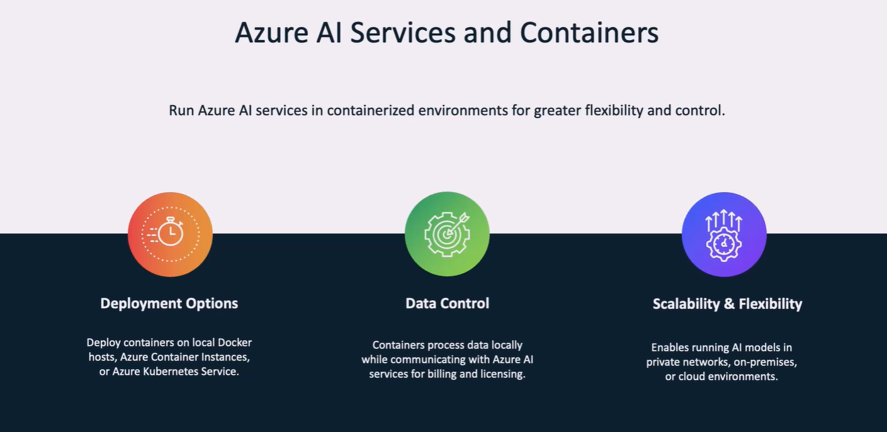
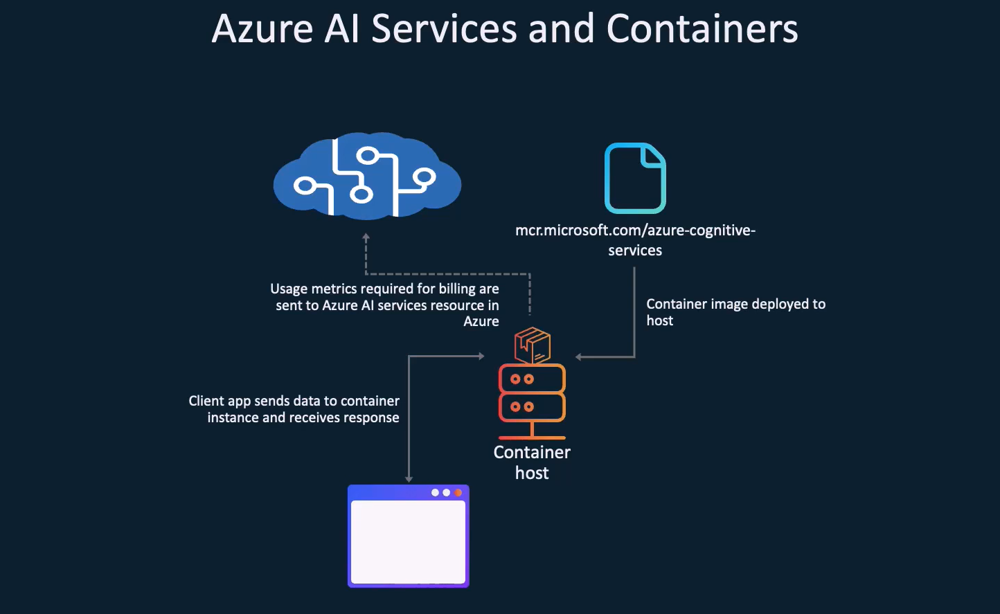
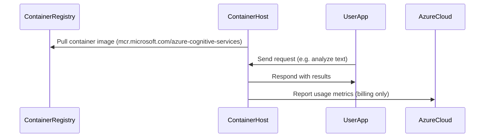

# 🐳 Running Azure AI Services in Containers – Ultimate Guide

> Run Azure AI anywhere — in your Kubernetes cluster, Docker on-prem, or air-gapped server, with full control over **data**, **scale**, and **billing**.

---

<div style="text-align: center;">
    
</div>

## 📦 Why Run Azure AI in Containers?

| Feature                       | Description                                          |
| ----------------------------- | ---------------------------------------------------- |
| **Deployment Options**        | Run in Docker, AKS, ACI, or even offline             |
| **Data Control**              | All data is processed locally, stays on your network |
| **Scalability & Flexibility** | Use containers in any environment, scale as needed   |

🌟 Ideal for: Regulated industries, private data, hybrid cloud, or disconnected edge environments.

---

## 🛠️ Architecture – How Containerized Azure AI Works

<div style="text-align: center;">
    
</div>

---



---

> ✅ Only the **metrics for billing** are sent to Azure `periodically`.  
> ✅ Your **data never leaves your container**.

---

## 🧪 Step-by-Step: Run Azure AI in a Container

### 🔹 Step 1: Get Container Image

Use [Microsoft Container Registry (MCR)](https://mcr.microsoft.com/) to pull the AI service container, for example:

```bash
docker pull mcr.microsoft.com/azure-cognitive-services/textanalytics
```

### 🔹 Step 2: Create Azure AI Resource (for licensing)

You still need to create an Azure resource like “Language” or “Vision” in the portal. This enables:

- Billing
- Licensing
- API key for local container

### 🔹 Step 3: Run the Container

```bash
docker run -it -p 5000:5000 \
  -e EULA=accept \
  -e API_KEY=your-azure-key \
  -e BILLING=https://<your-resource-name>.cognitiveservices.azure.com/ \
  mcr.microsoft.com/azure-cognitive-services/textanalytics
```

### 🔹 Step 4: Call the Local Endpoint

```bash
curl http://localhost:5000/text/analytics/v3.0/entities/recognition/general \
  -H "Content-Type: application/json" \
  -d '{"documents":[{"id":"1","language":"en","text":"Microsoft was founded by Bill Gates."}]}'
```

---

## 💰 How Billing Works in Containers

> Even when running locally, billing happens through Azure based on usage **telemetry** sent to Azure from the container.

### 📌 Billing Rules:

- Each request is **counted locally**, but **reported to Azure**.
- Azure AI resource acts like a meter 🧾.
- If you disconnect from the internet, telemetry is **buffered** (short term), then **fails**.

---

## 🤖 FAQ – You Asked, I Answered

### ❓1. Is Swagger (OpenAPI) Supported?

✅ **YES**
Most Azure AI containers expose:

- **Swagger UI** at `http://localhost:5000/swagger`
- **OpenAPI specs** for testing and integration

Use it for:

- Testing endpoints
- Understanding supported parameters
- Generating SDK clients

---

### ❓2. If I call `localhost:5000/status`, will it go to Azure?

🚫 **NOPE!**
`localhost:5000` is handled **completely by your local container**. The request:

- Stays on your machine
- Does not touch Azure at all
- Is safe, fast, and local

---

### ❓3. What if I run the container and disconnect from the internet?

🔌 **It may work temporarily**, but there are caveats.

| Scenario                           | Behavior                                                                              |
| ---------------------------------- | ------------------------------------------------------------------------------------- |
| ⏱ Short-term offline (few minutes) | Works fine, container buffers metrics                                                 |
| ❌ Long offline (hours/days)       | Container will **refuse requests** after failing to report usage                      |
| 📉 Billing impact                  | Azure doesn’t bill for requests it can’t see — so **service stops** until reconnected |

> ☁️ Azure AI container must **check in** periodically to keep working. It's like a licensing ping. No ping = no party.

---

## ✅ Summary – Containerized Azure AI

| Feature                        | Works in Containers?                |
| ------------------------------ | ----------------------------------- |
| Fully local data processing    | ✅ Yes                              |
| Internet required for billing? | ✅ Yes (periodic ping)              |
| Swagger / OpenAPI              | ✅ Yes (`/swagger`)                 |
| Supports Docker, AKS, ACI      | ✅ Yes                              |
| Can run fully offline forever  | ❌ No (must call Azure for billing) |

---

## 🔐 Pro Tips

- 🧪 Test containers with `--network=none` to simulate offline use
- 🔍 Monitor metrics using logs inside the container (`/status`, `/metrics`)
- 🛑 Throttle limits and licensing are still enforced by Azure cloud

---

## 🧠 Final Thought

Running Azure AI in containers = total control over **data + scale**, but you still need to stay connected enough for Azure to say “cool, here’s your license” 😄
