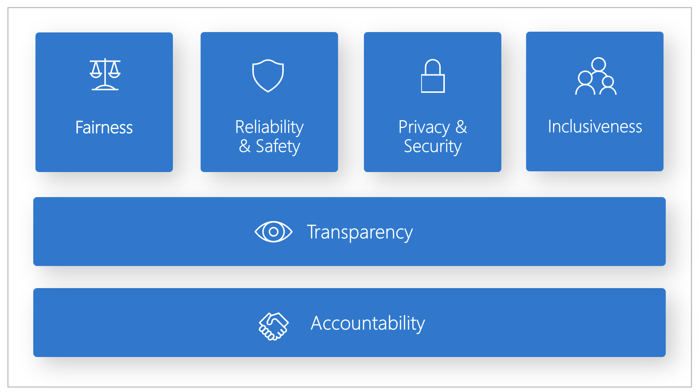

# 🛡️ Responsible AI Principles in Azure

Microsoft’s Responsible AI (RAI) framework is built on **six core principles**, and Azure services implement them through tools, features, and governance options.

---

    

---

## 1️⃣ **Fairness**

> _Ensure AI doesn’t treat people or groups unfairly._

### ✅ What it means:

The model should **not discriminate** based on race, gender, age, language, or any other factor. All users should get **equally accurate and useful results**.

### 📘 Example for AI-102:

> An HR recruitment AI consistently ranks male resumes higher than female ones for the same qualifications.

This is a **fairness violation**. You’d fix this in Azure using:

- **Responsible AI Dashboard → Fairness tab**
- **Dataset balancing**
- **Model impact analysis across groups**

---

## 2️⃣ **Reliability and Safety**

> _AI should behave consistently and not cause harm._

### ✅ What it means:

AI systems must be **robust, reliable, and safe** under all scenarios. They should handle bad input, edge cases, and not fail silently or dangerously.

### 📘 Example for AI-102:

> An AI doctor assistant gives wrong dosage instructions for children during low-confidence predictions.

This violates **safety**. Mitigation includes:

- Adding **confidence thresholds** before showing predictions
- Enabling **human-in-the-loop review**
- Using **fallback mechanisms**

---

## 3️⃣ **Privacy and Security**

> _AI should protect users’ data and not expose sensitive information._

### ✅ What it means:

The system must ensure **data confidentiality**, respect **consent**, and **never leak** PII (personally identifiable information) like names, phone numbers, SSNs, etc.

### 📘 Example for AI-102:

> An LLM returns a user’s address from a support ticket in its answer to another user.

This violates **privacy**. In Azure, you would:

- Use **Content Safety** or **PII redaction**
- Add **identity-based access control**
- Encrypt inputs/outputs in **Azure OpenAI**

---

## 4️⃣ **Inclusiveness**

> _Everyone should be able to use and benefit from AI._

### ✅ What it means:

AI services must support **diverse users** — including people with disabilities, language differences, or from underrepresented groups.

### 📘 Example for AI-102:

> A computer vision app fails to identify objects for users with color blindness or doesn't support non-English inputs.

This violates **inclusiveness**. Fixes may include:

- Adding **alt text support** or **screen reader metadata**
- Using **multilingual language models**
- Testing models across diverse populations

---

## 5️⃣ **Transparency**

> _Make it clear how the AI works, what it does, and why it made a decision._

### ✅ What it means:

Users should understand the **reasoning behind model decisions**. There should be a way to **explain predictions** and **trace back** what data or logic led to the outcome.

### 📘 Example for AI-102:

> A user is denied a loan by an AI model but isn’t told why.

That’s a **transparency violation**. Solutions include:

- Using **Azure ML → Explanation tools**
- Providing **model cards** or **traceability logs**
- Showing **confidence scores and feature contributions**

---

## 6️⃣ **Accountability**

> _Humans are responsible for how AI is used._

### ✅ What it means:

There must be **human oversight** — meaning:

- AI shouldn’t make critical decisions without review
- Someone should be **accountable** for the outcome
- **Audit trails** must be kept

### 📘 Example for AI-102:

> A facial recognition model is used by law enforcement without any manual review process or approvals.

This is a **lack of accountability**. You need:

- Human-in-the-loop validation
- Logging access to the AI model
- Assigning **clear roles** via **Azure RBAC**

---

## ✅ Final Exam Summary Table

| 🧭 Principle           | 🔎 Exam Clue                      | ⚠️ Violation Looks Like                            |
| ---------------------- | --------------------------------- | -------------------------------------------------- |
| **Fairness**           | Bias by gender, race, age         | Skewed model predictions                           |
| **Reliability/Safety** | Unsafe output, inconsistent logic | Misdiagnosis, hallucination, failure in edge cases |
| **Privacy/Security**   | PII leakage, no consent           | User info shown to others                          |
| **Inclusiveness**      | Not working for diverse users     | Only English supported, no disability support      |
| **Transparency**       | No reason for AI decisions        | Black-box outputs, no explainability               |
| **Accountability**     | No audit, no human oversight      | AI acts autonomously in critical systems           |
