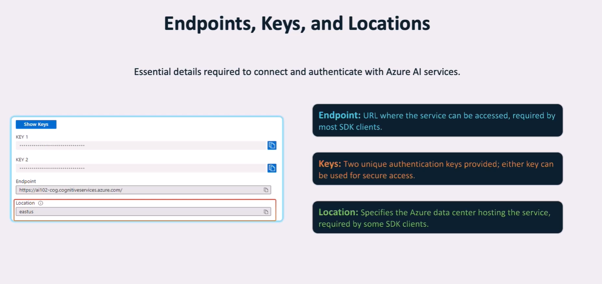

# 🔑 Azure AI Resource Kinds: Two Options

## 🌀 1. **Multi-Service Resource** (`Azure AI services`)

- Think of this as an **"all-in-one" subscription**.
- **Single endpoint + single key** gives you access to multiple Azure AI services:

  - Vision
  - Language
  - Speech
  - OpenAI (optional, if added)
  - etc.

- **Benefits**:

  - ✅ One set of credentials for all services
  - ✅ Unified billing across services
  - ✅ Easier to manage access/permissions

- **Use case**: Ideal for apps using multiple services (e.g., OCR + translation + speech).

---

## 🔒 2. **Single-Service Resource** (e.g., `Face`, `Computer Vision`, `Text Analytics`)

- You provision **each service individually**.
- Each one gets its **own endpoint and keys**.
- **Benefits**:

  - ✅ More isolated access control
  - ✅ Most services offer a **free pricing tier** (great for testing)

- **Use case**: Best if you're only using **one specific service** (e.g., just `Face API` for PPE detection).

---

## 🔄 Which One Should You Choose?

| Scenario                               | Recommended Resource Kind      |
| -------------------------------------- | ------------------------------ |
| Using **multiple AI services**         | ✅ **Multi-Service Resource**  |
| Testing a **single feature/service**   | ✅ **Single-Service Resource** |
| Need **centralized billing & auth**    | ✅ **Multi-Service Resource**  |
| Want **granular security per service** | ✅ **Single-Service Resource** |

---

## ✅ Final Notes (2025 Update)

- Azure now **encourages use of Multi-Service Resources** for most production workloads.
- Some new services (like **Azure AI Content Safety**) are only available through **multi-service**.
- **Azure OpenAI** can be attached to a multi-service resource, but it still has **region restrictions and requires approval**.

---

📌 Let me know if you want a table comparing the two with actual pricing, endpoint examples, or how to provision each in the portal!
