# Exam 1

## ❌ Question 6

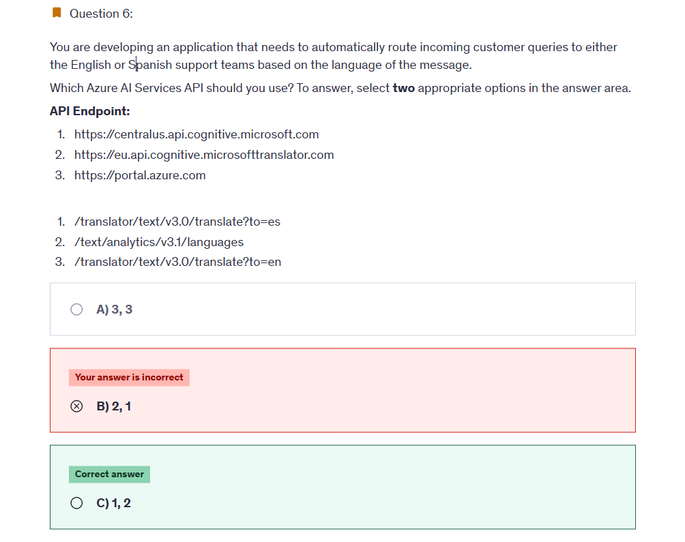

---

**✅ The answer:**
`1. https://centralus.api.cognitive.microsoft.com`
`2. /text/analytics/v3.1/languages`

---

**🤔 Why This Is the Best Answer:**

- `https://centralus.api.cognitive.microsoft.com`: This is a valid **base endpoint** for Azure Cognitive Services in the **Central US region**, commonly used for services like Text Analytics (Language Detection).
- `/text/analytics/v3.1/languages`: This is the correct **API path** for detecting the language of a given input using the **Azure AI Language** service. It helps you determine whether a customer query is in English or Spanish so you can route it accordingly.

---

**❌ Why Other Options Are Wrong:**

- `https://eu.api.cognitive.microsofttranslator.com`: While valid for Translator, it doesn't relate to **language detection**; it's just a **regional base URL**.
- `/translator/text/v3.0/translate?to=es` and `/translate?to=en`: These are **translation endpoints**, not for detecting language. Translation is **not required** in this use case since the goal is routing based on **original message language**, not converting it.
- `https://portal.azure.com`: This is just the **web portal**, not an API endpoint. It cannot be used in code to detect or translate language.

---

## ❌ Question 12

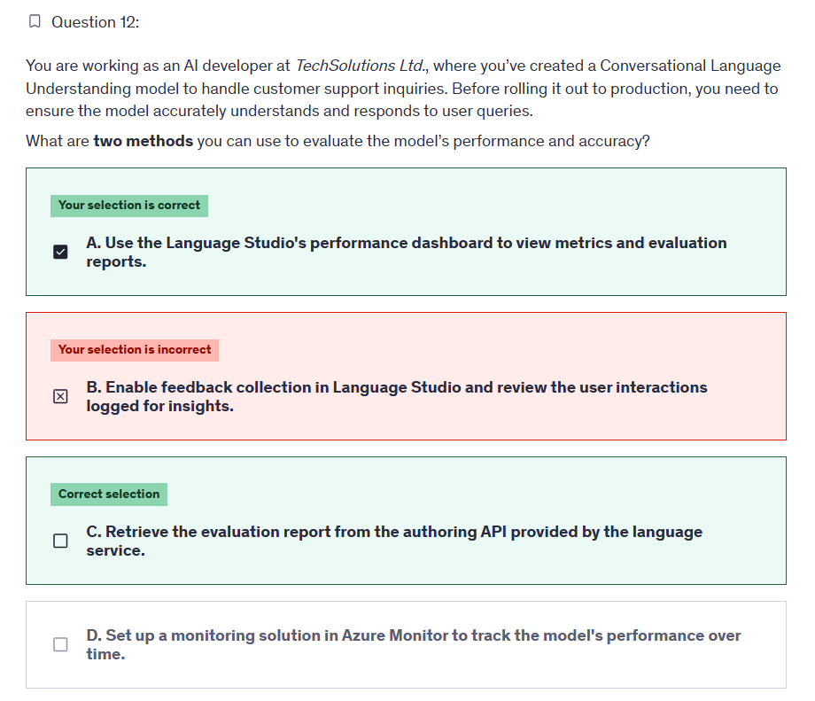

---

**✅ The answer:**

- **A. Use the Language Studio's performance dashboard to view metrics and evaluation reports.**
- **C. Retrieve the evaluation report from the authoring API provided by the language service.**

---

**🤔 Why This Is the Best Answer:**
These two methods directly support **pre-deployment evaluation**:

- ✅ **A. Language Studio’s performance dashboard** gives you an interactive view of how your model performs on test data — showing **metrics like precision, recall, F1 score**, confusion matrices, and misclassified utterances.

- ✅ **C. Authoring API for evaluation summary** allows you to **retrieve detailed evaluation reports** via REST. You can use this in automation or integrate it into your CI/CD pipeline.

Example API:

```http
GET https://{endpoint}/language/authoring/analyze-conversations/projects/{projectName}/models/{trainedModelLabel}/evaluation/summary-result?api-version=2023-04-01
```

---

**❌ Why Other Options Are Wrong:**

- ❌ **B. Enable feedback collection...**
  Feedback collection is part of a **post-deployment** improvement loop. It relies on **live user interaction logs** and does **not help in pre-deployment** evaluation.

- ❌ **D. Azure Monitor**
  Azure Monitor is used for **infrastructure and service health**, not for evaluating the **model's linguistic understanding**. It tracks **performance metrics like latency and availability**, not NLP accuracy.

---

📘 **Key Concept (AI-102):**

> **Pre-deployment evaluation** should be done using test datasets, evaluation reports, and built-in performance dashboards — **not production feedback or monitoring tools**.

---

## ❌ Question 15

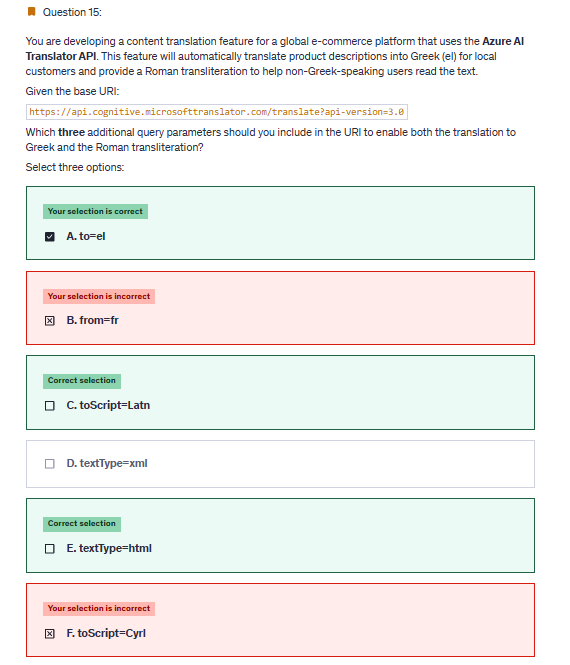

---

**✅ The answer:**

- **A. to=el**
- **C. toScript=Latn**
- **E. textType=html**

---

**🤔 Why This Is the Best Answer:**

- ✅ **A. `to=el`** – This sets the **target language to Greek**, which is the main translation objective. `"el"` is the correct ISO language code for Greek.

- ✅ **C. `toScript=Latn`** – This enables **Roman (Latin script) transliteration** of the translated Greek text. Greek normally uses the Greek script, so `toScript=Latn` provides a phonetic version readable by non-Greek users.

- ✅ **E. `textType=html`** – This indicates the input is **HTML content**, so the API treats tags appropriately and doesn’t translate elements like `<div>` or `<strong>`. This is important for product descriptions that may contain formatting.

---

**❌ Why Other Options Are Wrong:**

- ❌ **B. `from=fr`** – This is only useful if the source text is explicitly in French. Since source detection is automatic by default and the question doesn’t mention French, this is unnecessary.

- ❌ **D. `textType=xml`** – This is not correct for standard product description text. Unless you're passing actual XML documents, `textType=html` is more appropriate.

- ❌ **F. `toScript=Cyrl`** – `Cyrl` is Cyrillic script (used in Russian, Serbian, etc.), which is **not appropriate for Greek**. Greek uses its own script and transliterates to **Latin (Latn)**, not Cyrillic.

---

## ❌ Question 16

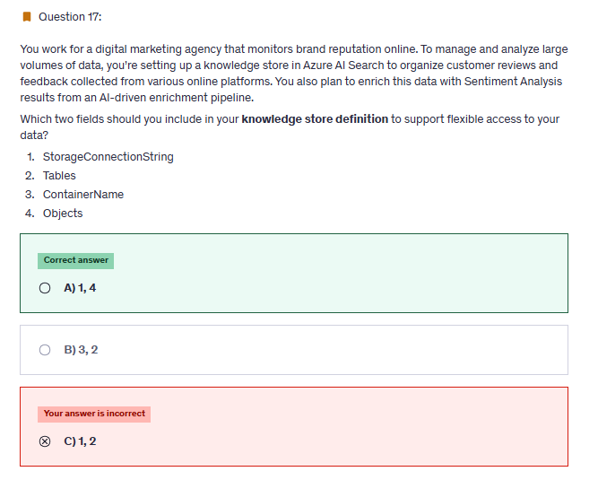

---

**✅ The answer:**
**(A) 1, 4 — `StorageConnectionString`, `Objects`**

---

**🤔 Why This Is the Best Answer:**
To build a functional **Knowledge Store** in Azure AI Search that supports **enriched data like Sentiment Analysis**, you need to define:

- ✅ **`StorageConnectionString`** – This is **mandatory** to connect your Knowledge Store to an **Azure Storage account** where enriched data (tables, objects) will be saved.
- ✅ **`Objects`** – This defines **projection formats** such as enriched JSON documents. Objects are used when you want to store complete enriched documents (e.g., customer review + sentiment + key phrases) for flexible retrieval or further processing.

These two together allow:

- Saving enriched results in a structured but flexible way.
- Retrieving entire enriched documents (great for dashboards, analytics, or full reviews).

---

**❌ Why Other Options Are Wrong:**

- ❌ **`Tables`** – While valid, it’s optional and only needed when you want **normalized/tabular projections** (like splitting key phrases or entities into separate rows). It’s not the best **default** if you want flexible, full-document access.

- ❌ **`ContainerName`** – This is **not a valid field** in the `knowledgeStore` definition block. Azure uses the storage connection string to resolve the correct container or blob context.

- ❌ **C) 1, 2 (`StorageConnectionString`, `Tables`)** – Close, but not ideal for **flexible access**. Tables are great for relational processing, not for retrieving the entire enriched review.

- ❌ **B) 3, 2 (`ContainerName`, `Tables`)** – Incorrect. `ContainerName` is not used in Knowledge Store definitions. Plus, it omits the required `StorageConnectionString`.

---

📦 **Correct Knowledge Store JSON (simplified):**

```json
"knowledgeStore": {
  "storageConnectionString": "<your-azure-blob-connection-string>",
  "projections": [
    {
      "objects": [
        {
          "source": "/document",
          "storageContainer": "enriched-reviews"
        }
      ]
    }
  ]
}
```

---

## ✅ Question 20

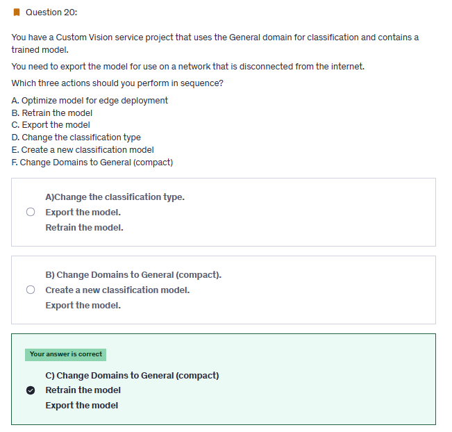

**✅ The answer:**
**C) Change Domains to General (compact) → Retrain the model → Export the model**

---

**🤔 Why This Is the Best Answer:**
To export a model for **offline or edge deployment**, Azure Custom Vision requires that you use a **Compact domain** (like _General (compact)_), which supports model export in ONNX, TensorFlow, or other embedded formats.

Here’s why each step is necessary:

1. ✅ **Change Domains to General (compact):**

   - Only **Compact domains** support **exporting models**. The standard "General" domain does **not support export**.

2. ✅ **Retrain the model:**

   - After changing the domain, you **must retrain** the model — Custom Vision models are tied to a specific domain during training.

3. ✅ **Export the model:**

   - Once retrained with a compact domain, the **export button becomes available**, allowing you to download the model in formats like ONNX or TensorFlow Lite for use on devices without internet access.

---

**❌ Why Other Options Are Wrong:**

- ❌ **A. Optimize model for edge deployment** – There’s no separate "optimize" step in Custom Vision. The optimization happens automatically when you **train using a compact domain**.

- ❌ **B. Retrain the model** (first) – Retraining before switching to a compact domain is **pointless**, because only compact domains allow exports. You’d have to retrain again anyway after switching.

- ❌ **D. Change the classification type** – This isn’t related to exportability. It determines **how labels are assigned** (multiclass vs. multilabel), not deployment compatibility.

- ❌ **E. Create a new classification model** – You can reuse the existing project by just changing its domain and retraining. Creating a new model isn’t necessary unless you want to start from scratch.

---

🛠️ **Pro Tip:**
For exporting a model to work on disconnected or embedded environments like Raspberry Pi, microcontrollers, or industrial devices, **always use Compact domains** in Custom Vision.

---

📘 **Final Workflow:**
👉 **Change to General (compact)** → 🔁 **Retrain the model** → ⬇️ **Export the model for offline use**.

---

## ❌ Question 29

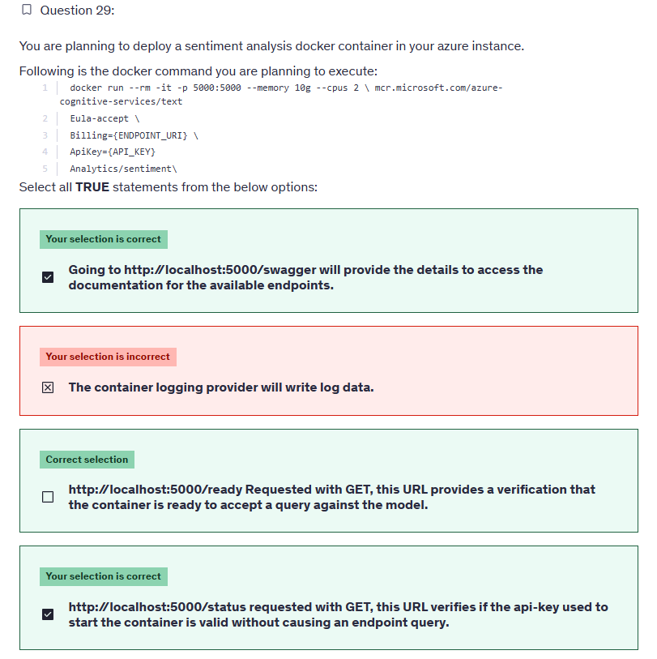

---

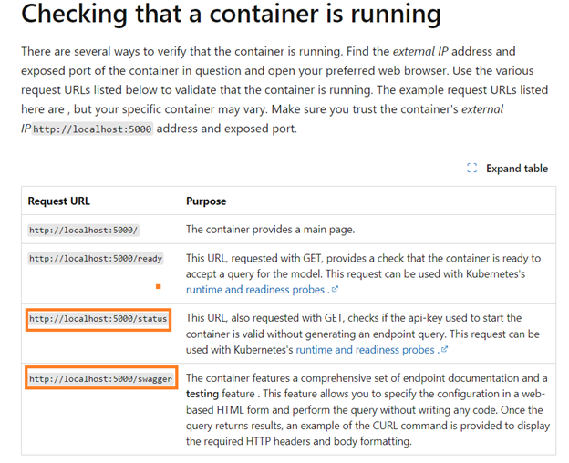

Why other options are not correct:

No logging options are mentioned in the docker run command. For ex:

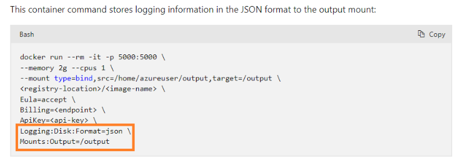

---

## ❌ Question 44

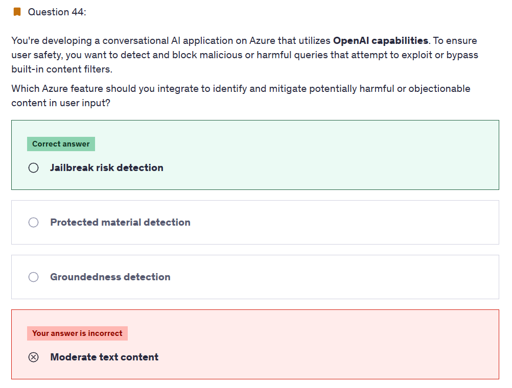

---

**✅ The answer:**
**Jailbreak risk detection**

---

**🤔 Why This Is the Best Answer:**

- **Jailbreak risk detection** is a **specialized safety feature** in Azure OpenAI that helps detect **attempts to bypass or manipulate content filters**.
- It identifies **malicious prompts** designed to get the model to output harmful, unsafe, or restricted content (e.g., asking the model to "pretend" or "ignore safety rules").
- This is **critical for protecting conversational AI apps** that rely on OpenAI models, especially before or alongside traditional moderation techniques.

---

**❌ Why Other Options Are Wrong:**

- ❌ **Moderate text content** – This is part of **Azure AI Content Safety**, which detects **harmful, sexual, hate, or violent language**, but it **doesn't detect jailbreak attempts** that try to trick the model without using explicit harmful content.

- ❌ **Protected material detection** – This is for detecting **copyrighted content**, such as music, code, or text fragments—not applicable to **malicious intent** in prompts.

- ❌ **Groundedness detection** – This checks if an LLM’s answer is **factually supported** by source documents (used in RAG apps). It doesn't identify **user prompt manipulation or jailbreaks**.

---

📘 **Pro Tip for AI-102 & Real Apps:**
Use **Jailbreak risk detection** for:

- Guarding against **prompt injection**
- Blocking **model manipulation** attempts
- Working alongside **content moderation** and **user input filters** for robust safety

🔐 Combine it with **Content Safety APIs** for a **layered defense strategy** in production apps.

---

## ❌ Question 45

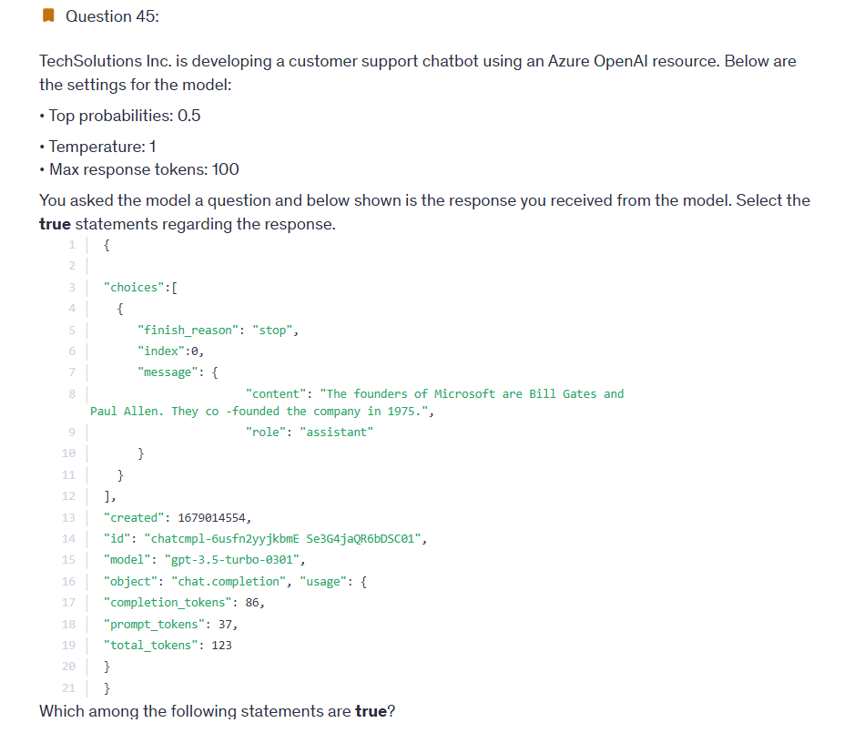
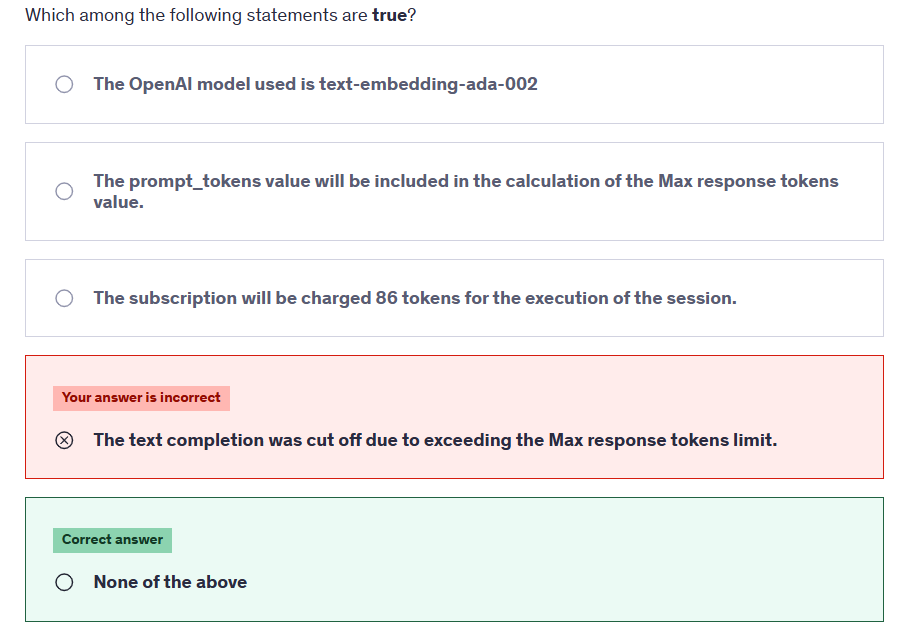

---

**✅ The answer:**
**None of the above**

---

**🤔 Why This Is the Best Answer:**

Let’s break down the statements and explain why **each one is false** based on the response JSON and model settings:

---

🔍 Statement: _"The OpenAI model used is text-embedding-ada-002"_

**❌ False!**

- The model clearly specified in the response is:
  `"model": "gpt-3.5-turbo-0301"`
- `text-embedding-ada-002` is used **only for embeddings**, not for chat or completions.

---

🔍 Statement: _"The prompt_tokens value will be included in the calculation of the Max response tokens value."_

**❌ False!**

- `max_tokens` (or max response tokens) applies **only to the output tokens** (completion).
- The prompt (input) token count is not included in this cap.
  👉 In this case:

  - `prompt_tokens = 37`
  - `completion_tokens = 86`
  - `max_response_tokens = 100` → the model was allowed to generate up to 100 **output** tokens.

---

🔍 Statement: _"The subscription will be charged 86 tokens for the execution of the session."_

**❌ False!**

- Billing in Azure OpenAI is based on **total tokens** used:

  - `prompt + completion = 37 + 86 = 123 tokens`

- So you are charged for **123 tokens**, not just the output.

---

🔍 Statement: _"The text completion was cut off due to exceeding the Max response tokens limit."_

**❌ False!**

- The setting allows for up to **100 response tokens**, and the model only used **86**, well within the limit.
- Also, the `"finish_reason": "stop"` confirms the model ended naturally.
  If it had hit the max token cap, it would’ve said: `"finish_reason": "length"`

---

**✅ Summary:**
None of the options are true based on the model used, token accounting, billing logic, or how completions are handled.

---

📘 **Pro Tip (AI-102 or devs):**
To avoid surprises in billing and truncation:

- Always monitor both `prompt_tokens` and `completion_tokens`
- Use `"finish_reason"` to programmatically handle truncated responses.

---

## ✅ Question 46

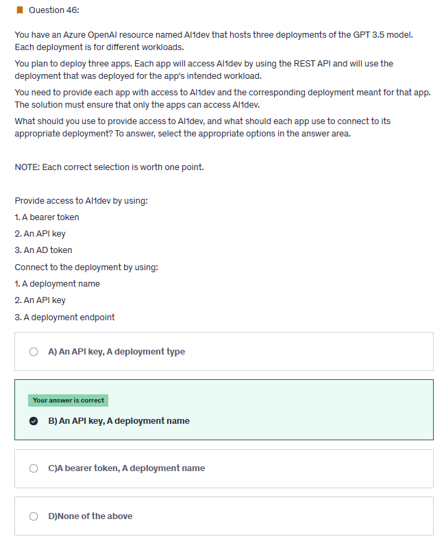

---

**✅ The answer:**
**B) An API key, A deployment name**

---

**🤔 Why This Is the Best Answer:**

To allow three different apps to access **three separate deployments** of the GPT-3.5 model under the same Azure OpenAI resource, the setup should be:

---

### 🔐 **1. Provide access to AIDev by using: An API key**

- ✅ Azure OpenAI uses **API keys** for authenticating requests made via REST API.
- Each request must include this key in the `Ocp-Apim-Subscription-Key` header.
- This enables easy control and avoids needing Azure AD integration for typical use.

🛑 **Why others are wrong:**

- **Bearer token / AD token:** These are used for **Azure AD-based** access, not commonly required or configured for OpenAI resources unless using RBAC and managed identities, which isn’t the default method for REST-based access.

---

### 🔗 **2. Connect to the deployment by using: A deployment name**

- ✅ Even though all three deployments share the same **resource endpoint**, each one has a unique **deployment name** (e.g., `gpt-chat-support`, `gpt-recommendation`, `gpt-content-gen`).
- You must include this **deployment name** in the request URI to target the right deployment:

  ```http
  POST https://<your-openai-resource>.openai.azure.com/openai/deployments/<deployment-name>/chat/completions?api-version=2024-05-01
  ```

🛑 **Why others are wrong:**

- **API key** is for authentication, not routing.
- **Deployment endpoint**: All deployments share the **same base endpoint** (your OpenAI resource endpoint). The **deployment name** differentiates them.

---

📘 **Summary:**

| Purpose                   | Correct Option     |
| ------------------------- | ------------------ |
| Authentication            | ✅ API key         |
| Routing to specific model | ✅ Deployment name |

This setup ensures each app:

- Is authenticated securely.
- Connects only to the model intended for its workload.

---

## ❌ Question 47

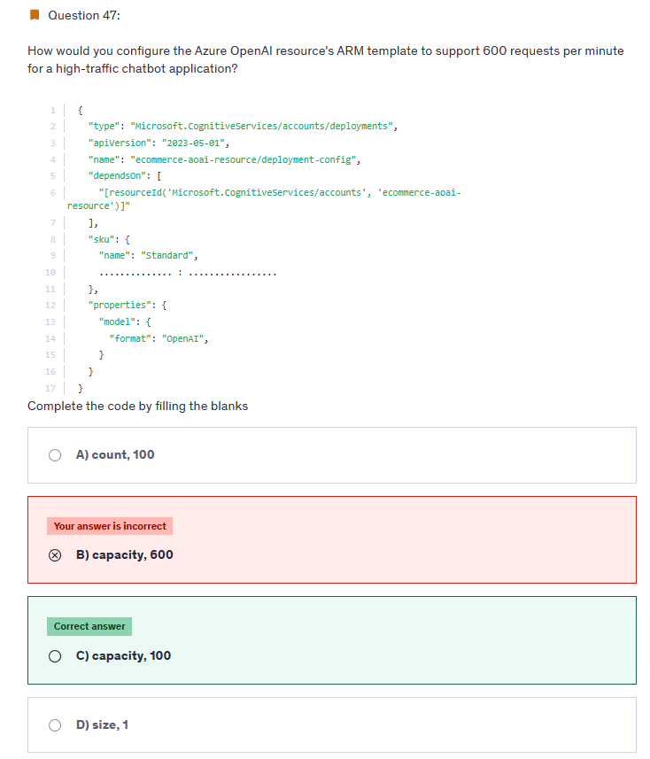

---

### 🧠 Basic Conversion Rules

- ✅ **1 capacity = 1,000 TPM**
- ✅ **6 RPM = 1,000 TPM**

---

### ❓ So...

**✅ 1 capacity = 6 RPM!**

---

## ❌ Question 48


---

**✅ The answer:**
**B. `"enabled": false`**

---

**🤔 Why This Is the Best Answer:**
To exclude a **custom brand** (like `"ITFirm"`) from being detected by **Azure Video Indexer's Brands model**, you must set:

```json
"enabled": false
```

This flags the brand for **exclusion** in the REST API configuration — meaning Azure Video Indexer will **skip it during automatic detection**.

According to Microsoft’s documentation:

> Setting `"enabled": false` places the brand in the **Exclude list**.

---

**❌ Why Other Options Are Wrong:**

- ❌ **A. `"enabled": true`**
  This puts the brand into the **Include list**, so it will **be detected**, not excluded.

- ❌ **C. `"state": "Excluded"`**
  `"state"` is **not a valid parameter** for brand exclusion in the API.

- ❌ **D. `"tags": ["CustomBrand"]`**
  Tags are metadata for categorization, not control switches for detection or exclusion.

- ❌ **E. `"useBuiltIn": false`**
  This disables detection from **Bing’s built-in brand database**, but it’s unrelated to excluding a **custom brand** like `"ITFirm"`.

---

📘 **Source Reference:**
[Customize the Brands Model – Azure Video Indexer](https://learn.microsoft.com/en-us/azure/azure-video-indexer/customize-brands-model-how-to?tabs=customizeapi#prerequisites)

---

✅ So remember:
To **exclude** a custom brand from detection in Azure Video Indexer → use

```json
"enabled": false
```

---

## ❌ Question 53

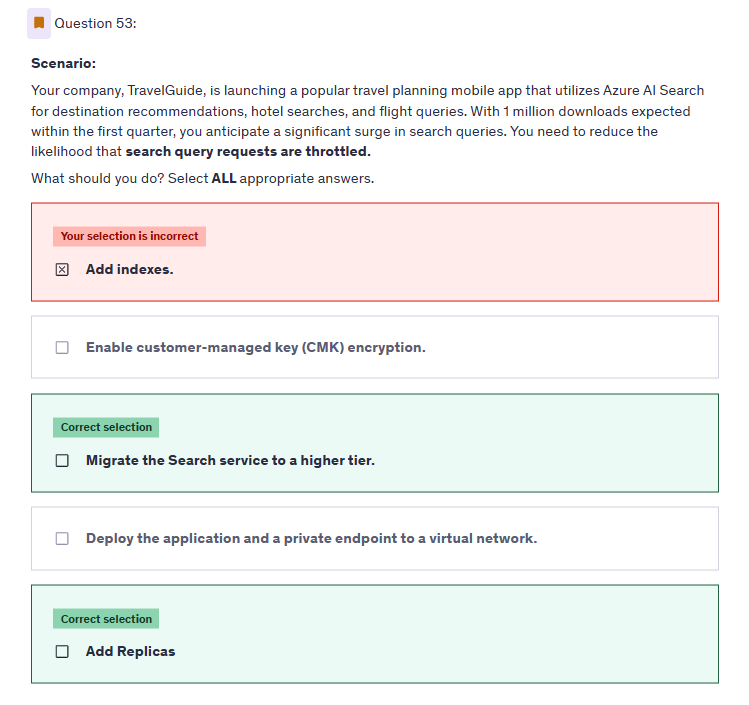

---

**✅ The correct answers:**

- ✅ **Migrate the Search service to a higher tier**
- ✅ **Add Replicas**

---

**🤔 Why These Are the Best Answers:**

### ✅ **1. Migrate to a Higher Tier**

- Higher tiers (like _Standard S2/S3_) offer:

  - **More throughput per unit**
  - **Higher limits** on requests per second
  - **Greater storage and compute capacity**

- This helps **absorb traffic spikes** from your travel app’s 1M+ users.

### ✅ **2. Add Replicas**

- **Replicas = Query capacity**
- Each replica can handle **a set number of search requests in parallel**
- Adding more replicas helps **scale read operations**, reducing the chance of **throttling due to high query volume**

---

**❌ Why Other Options Are Wrong:**

- ❌ **Add Indexes**

  - Indexes structure your data but do **not affect query throughput or throttling**
  - You can still get throttled even with multiple indexes if capacity is low

- ❌ **Enable customer-managed key (CMK) encryption**

  - CMK is for **data security**, not performance
  - It has **no effect** on request limits or query throttling

- ❌ **Deploy the app and private endpoint to a VNet**

  - This enhances **security** and **network isolation**, not performance
  - Throttling is due to **service capacity**, not network access

---

## ❌ Question 54

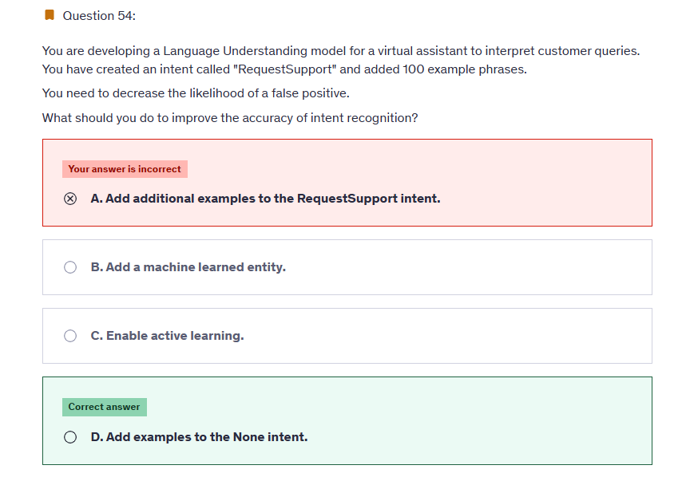

---

**✅ The answer:**
**D. Add examples to the None intent**

---

**🤔 Why This Is the Best Answer:**
The **"None" intent** is used to catch utterances that **do not match any of your defined intents**. If you don’t train it well, the model may **misclassify irrelevant input** as something meaningful — leading to **false positives**.

By adding **good examples of unrelated or out-of-scope phrases** to the **"None"** intent, you help the model:

- Recognize when the user’s message **doesn’t match any real intent**
- Avoid **incorrectly assigning** those queries to the "RequestSupport" or other active intents
- Reduce the chance of misclassification = **fewer false positives**

---

**❌ Why Other Options Are Wrong:**

- ❌ **A. Add additional examples to the RequestSupport intent**

  - This improves generalization **within the intent**, but doesn’t solve the problem of misclassifying **unrelated inputs** as “RequestSupport.” In fact, adding too many similar examples can even make the model **overfit**.

- ❌ **B. Add a machine learned entity**

  - Entities help **extract information** from within an utterance (e.g., “account number”), but don’t directly affect **intent classification** accuracy.

- ❌ **C. Enable active learning**

  - Active learning suggests **improvement data based on real usage**, but it won’t immediately reduce false positives unless you retrain with better-balanced data — especially for the “None” intent.

---

📘 **Quick Tip for CLU / LUIS Training:**

| Strategy              | Effect                       |
| --------------------- | ---------------------------- |
| Add to RequestSupport | Better generalization        |
| Add to None           | ❗ Fewer false positives ✅  |
| Add entities          | More precise data extraction |
| Use active learning   | Iterative refinement         |

---

✅ **Final Advice:**
For **intent precision**, always include a **strong “None” intent** with 50–100+ unrelated phrases. It’s **essential** in virtual assistant design to avoid confusion.

---

## ❌ Question 56
