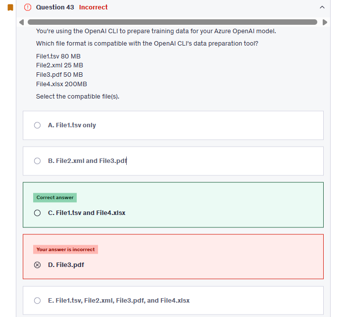

# Exam 2

## ❌ Q5

---

Great question — and no, it's **not outdated**. This is a **valid and exam-relevant AI-102 topic** from the **Azure AI Language Service**, specifically under **Custom Question Answering** + **Chit-Chat integration**.

Let’s break it down 👇

---

**🧠 Scenario Recap:**

You're building **EcoGuide**, a conversational assistant using **Azure AI Language** → **Custom Question Answering**.

The issue:

- The bot gives **informal or friendly responses** to irrelevant/spurious questions like “Tell me a joke” or “How are you?”
- You want it to respond **formally and professionally**, e.g., "I'm here to help with environmental queries. Please rephrase your question."

---

✅ Correct Answer:

> **"From Language Studio, you change the chit-chat source to `qna_chitchat_professional.tsv`, and then retrain and republish the model."**

---

💡 Why is that the correct solution?

Azure provides two **pre-built chit-chat personalities** you can add to your **Custom QnA project**:

| Chitchat File                   | Personality Style    |
| ------------------------------- | -------------------- |
| `qna_chitchat_friendly.tsv`     | Casual, friendly     |
| `qna_chitchat_professional.tsv` | Formal, professional |

When irrelevant questions are asked, the bot **falls back to chitchat**.

If you want **formal behavior**, you need to:

1. Go to **Language Studio**
2. Replace the current chit-chat source (probably `friendly`) with `qna_chitchat_professional.tsv`
3. **Retrain and republish** your QnA project

---

🧠 What You Should Learn

- You can **add chit-chat** to Custom QnA for handling small talk
- You can choose **friendly** or **professional** tone
- You must **retrain and republish** after changing the chitchat style

---

📚 Official Docs:

- [Add chit-chat to your Azure Language QnA project](https://learn.microsoft.com/en-us/azure/ai-services/language-service/question-answering/faq#how-do-i-add-chitchat)
- [Download `qna_chitchat_professional.tsv`](https://github.com/microsoft/BotBuilder-Samples/tree/main/experimental/generation/generation-csharp/qnamaker/docs/chitchat)

---

## ❌ Q7

---

## ❌ Q43

--

| Feature                  | Details                                    |
| ------------------------ | ------------------------------------------ |
| ✅ **Supported Formats** | `.csv`, `.tsv`, `.xlsx`, `.json`, `.jsonl` |
| 📌 **Key Requirement**   | Must include `prompt` and `completion`     |
| 📦 **Max Upload Size**   | \~100 MB (after gzip)                      |
| 📥 **Output Format**     | `.jsonl` (for fine-tuning input)           |

---

## ❌ Q52

---

To create a custom neural voice and use it in kiosk system following steps has to followed:

1. Create a profesional voice project.
2. Add voice talent consent to your project.
3. Add training dataset.
4. Train your voice model.
5. Deploy and use your voice model.

---

## ❌ Q55

---

- generate code -> completion
- chat conversation -> chat completion
- embeddings -> embeddings

---

## ❌ Q57

---

## ❌ Q66

---

A glossary is a list of terms with definitions that you create for the Document Translation service to use during the translation process. The glossary provides the expected translation for each word in the file to help ensure accuracy. In this case the glossary file it will be from German to French in .tsv format. You can put the file in any container, just provide the correct URL in the request. Since the file is from German to French and French container is typically used as output container it makes sense to upload a glossary file to the container for German files.

---

## ❌ Q72

---

## ❌ Q78

---

## ❌ Q81

---

## ❌ Q82

---

When you tag images for a Custom Vision model, the service uses the latest trained iteration of the model to predict the labels of new images. It shows these predictions as suggested tags in the UI, based on the selected confidence threshold and prediction uncertainty. You can then either confirm or change the suggestions. This speeds up the process of manually tagging the images for training.

---

## ❌ Q85

---

## ❌ Q86

---

`A suggester`: is used to implement autocomplete or typeahead functionality in your search solution. By adding a suggester to your index, you can enable users to enter partial search terms, and the user interface will automatically suggest completions based on the indexed data.

`A synonym map`: This is used to define alternative terms that are considered equivalent (e.g., "car" and "automobile"), but it does not provide autocomplete or suggestions based on partial input.
