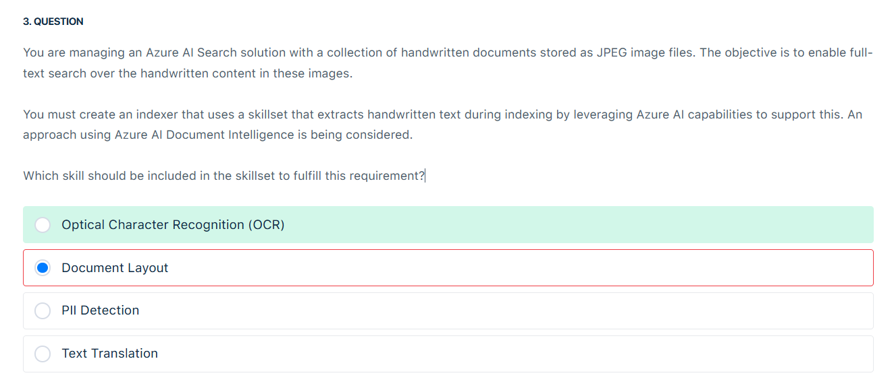
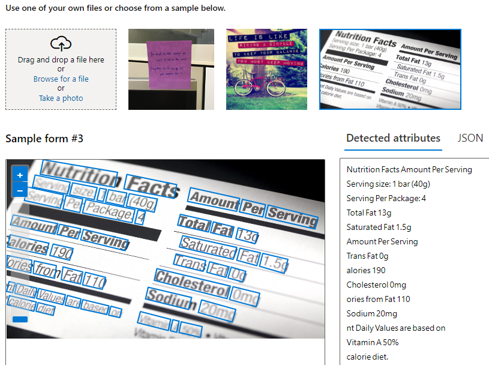
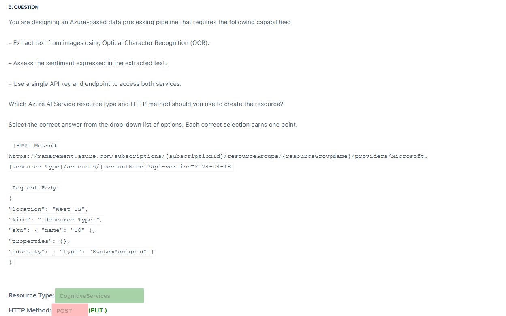

# 🧙🏻‍♂️ Plan and Manage Azure Solutions Questions

## ❌ Q3

    

**Optical Character Recognition (OCR)** is a technology that converts various types of documents, such as scanned paper documents, PDFs, or images captured by a camera, into editable and searchable digital data. It extracts text from physical documents and transforms it into a digital format, making it easier to edit, search, and store.

    

---

## ❌ Q4

    

### ❌ Your Answer:

| Task                                       | Your Selection |
| ------------------------------------------ | -------------- |
| Identify the language of the incoming text | Translator     |
| Reply in the language spoken by the caller | Speech         |

### ✅ Correct Answer (per exam/official structure):

| Task                                       | Correct Azure AI Service |
| ------------------------------------------ | ------------------------ |
| Identify the language of the incoming text | **Language**             |
| Reply in the language spoken by the caller | **Translator**           |

---

### 💡 Why Your Answer Is Marked Incorrect:

#### 1. **"Identify the language" → Language Service, not Translator**

- **Translator** focuses on **translating known languages**, not **detecting unknown ones**.
- **Language Detection** is an explicit feature under the **Azure AI Language service**, which analyzes text to say: “This is French” or “This is English.”

✅ **Correct: Language service**
❌ **Translator is incorrect** because it assumes the language is already known.

---

#### 2. **"Reply in the caller’s language" → Translator not Speech**

- The **Azure AI Translator** service provides **real-time text translation**.
- It lets your app **translate a response** from your language **back into the caller’s language**.

✅ **Correct: Language service**
❌ **Speech is incorrect** because it Converts spoken words ↔ text, but doesn't handle translation alone.

---

## ❌ Q5

    

### 🌀 **Multi-Service Resource** (`Azure AI services`)

- Think of this as an **"all-in-one" subscription**.
- **Single endpoint + single key** gives you access to multiple Azure AI services:

  - Vision
  - Language
  - Speech
  - OpenAI (optional, if added)
  - etc.

- **Benefits**:

  - ✅ One set of credentials for all services
  - ✅ Unified billing across services
  - ✅ Easier to manage access/permissions

- **Use case**: Ideal for apps using multiple services (e.g., OCR + translation + speech).

### ❌ POST is incorrect:

because while POST is commonly used for creating resources, Azure typically uses PUT for provisioning AI Services accounts. POST would be more appropriate for submitting data to an existing resource rather than creating it.
