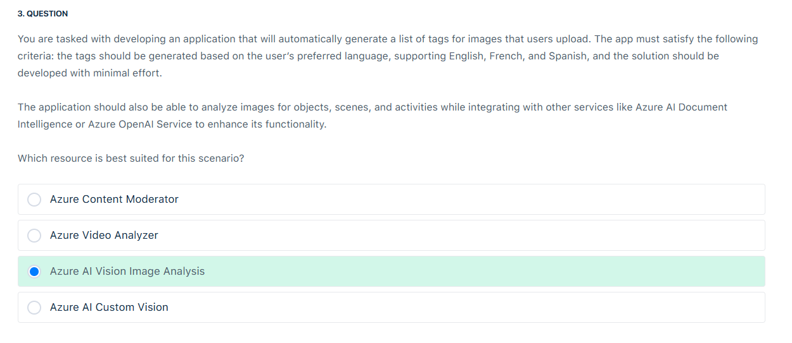

# 🧞 GenAi Questions

## ✅ Q3

    

✅ **Correct Answer: Azure AI Vision Image Analysis**

### 💡 Simple Explanation:

You need an app that:

- ✅ Automatically **tags images** with **objects, scenes, and activities**
- ✅ Supports **multiple languages** (English, French, Spanish)
- ✅ Requires **minimal development**
- ✅ Can **integrate with other Azure services** like Document Intelligence or OpenAI

👉 The best fit is **Azure AI Vision – Image Analysis** (formerly part of Computer Vision), which:

- Provides **prebuilt image tagging**, object detection, and scene recognition
- Supports **multi-language tagging output**
- Is easy to integrate using **REST API** or SDK
- Can be combined with other services to expand functionality

### 🧠 Why the others are incorrect:

- ❌ **Azure Content Moderator**: Focuses on **flagging adult/racy/offensive content**, not tagging or scene understanding.
- ❌ **Azure Video Analyzer**: Designed for **video stream analysis**, overkill for simple image uploads.
- ❌ **Azure AI Custom Vision**: Requires **manual training and labeling**, which means more development work — not minimal effort.

📌 Tip:
Use **Image Analysis v4.0** for improved tagging, captioning, OCR, and spatial understanding. You can even set the `language` parameter to `"fr"` or `"es"` for French/Spanish output. 🖼️🌍🧠
