# Exams 1 - Randomized Test

## ⚠️ Q1

`No, the Microsoft Bot Framework is no longer included in the AI-102 exam`

## ❌ Q2

<div style="text-align: center;">
    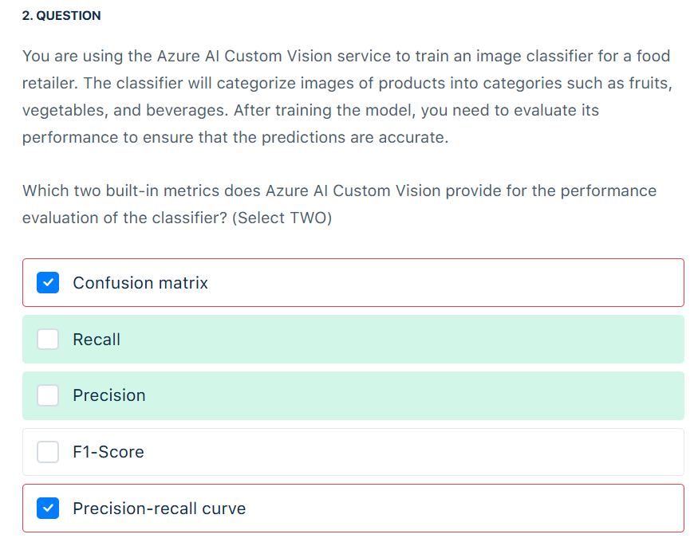
</div>

### 🎯 Answer

**The key metrics that are used to determine the classifier’s effectiveness are the following:**

1. Precision measures how many of the instances predicted as positive are actually positive, and it is especially important when minimizing false positives.
2. Recall measures how many positive instances were correctly identified, helping to understand how well the classifier detects positive cases.
3. Mean average precision (mAP) is used for multi-class and multi-label problems

### 🔑 Key Takeaways

> **F1-score** is incorrect because while the F1-score combines precision and recall into a single value, it is simply not a directly available metric in the Azure AI Custom Vision evaluation interface.  
> **Confusion matrix** is incorrect. Although it is primarily useful for understanding performance across classes, it is also not directly available as a metric in the Azure AI Custom Vision evaluation interface.

---

## ⚠️ Q3

`No, the Microsoft Bot Framework is no longer included in the AI-102 exam`

---

## ❌ Q7

<div style="text-align: center;">
    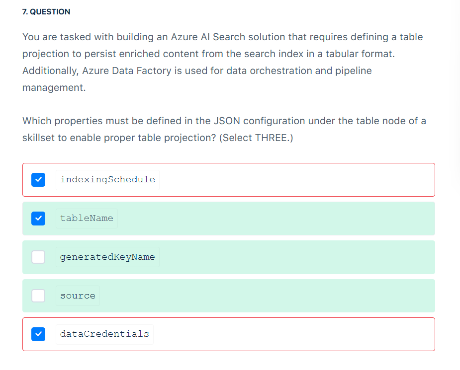
</div>

### 🎯 Answer

- **Azure AI Search** is a fully managed search-as-a-service offered by Microsoft Azure. It allows developers to easily integrate advanced search functionality into applications without needing to handle infrastructure or build complex search algorithms manually.

- A **skillset** is a collection of cognitive skills that enrich data with AI transformations like entity recognition and key phrase extraction. It can optionally create an external knowledge store in Azure Storage.

- An **indexer** references a skillset, which runs to import data, apply the skillset’s enrichment, and map outputs to a search index. Skillsets are reusable and operate only during indexer execution.

---

<div style="text-align: center;">
    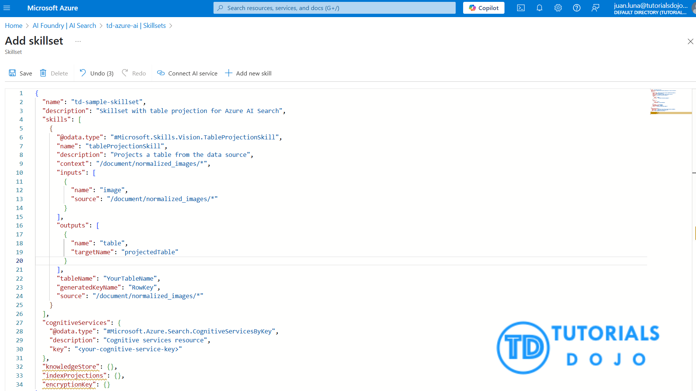
</div>

---

1. **tableName** – Specifies the table’s name in the data source the skillset will project. It tells the skillset exactly which table to extract and process data from.

2. **generatedKeyName** – Defines the name of the key field generated by the table projection. This key uniquely identifies each row, enabling proper indexing, updates, and deletions.

3. **source** – Indicates the input node or data origin for the table projection skill. It links the table projection to previous enrichment steps or the data source output.

---

## ❌ Q12

<div style="text-align: center;">
    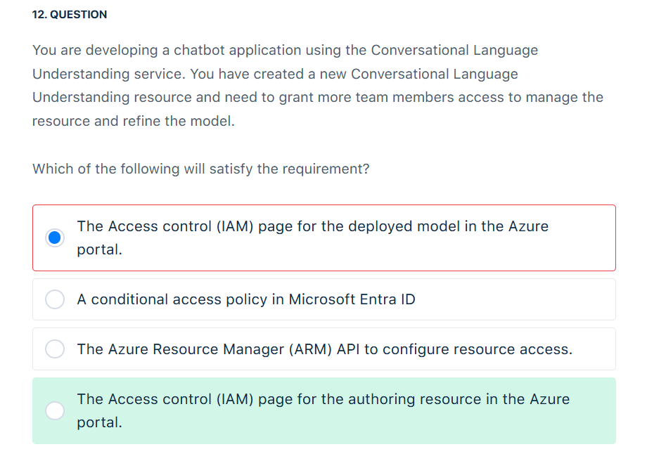
</div>

### 🎯 Answer

**Access control (IAM):** `for Azure resources` allows you to manage who has access to your resources and what they can do with those resources. In Azure, Identity and Access Management (IAM) provides fine-grained control over resource access through roles such as Owner, Contributor, and Reader. This allows you to define who can perform actions on your resources and ensures security and proper access levels for your teams.

---

<div style="text-align: center;">
    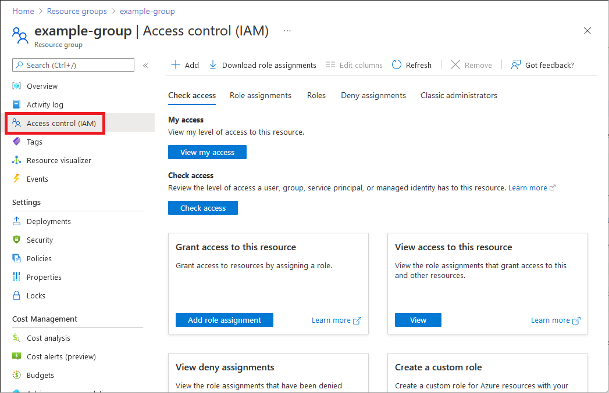
</div>

---

To meet this requirement, you will use the Access Control (IAM) page in the Azure portal for the authoring resource. This page allows you to assign roles to users and grant them access to modify, manage, or view the authoring resource, which is where the training and model management take place.

---

## ❌ Q13

<div style="text-align: center;">
    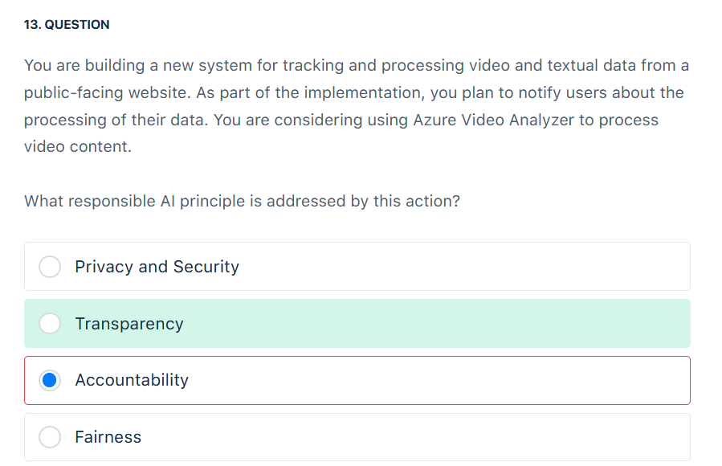
</div>

### 🎯 Answer

**Transparency** is the principle that ensures users are informed about how an AI system works, how their data is processed, and its intended use. By notifying users that their data (both video and textual) is being processed, the system promotes transparency, providing visibility into the actions taken on their data. This fosters trust, helps users understand the purpose of data processing, and enables informed consent. Transparency is fundamental to responsible AI, preventing confusion and building confidence among users.

---

## ❌ Q14

<div style="text-align: center;">
    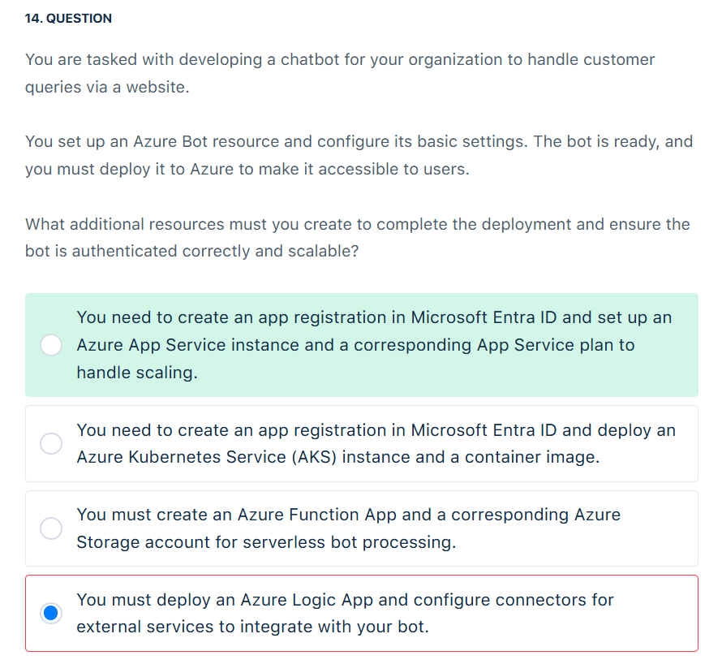
</div>

## ✅ Q16

<div style="text-align: center;">
    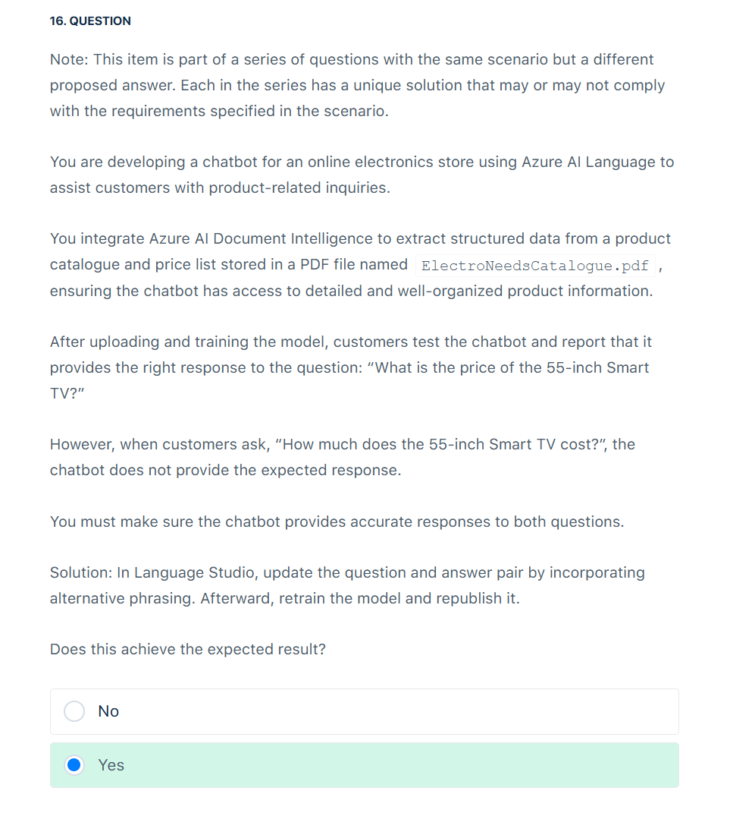
</div>

### 🎯 Answer

In Language Studio, users can enhance the model’s flexibility by adding alternative phrasing to question-answer pairs. This enables the model to recognize different ways of asking the same question, improving its ability to handle a wider range of user queries. By incorporating alternative phrasing, the model becomes more adaptable, ensuring it can respond accurately regardless of how a user phrases their question.

---

<div style="text-align: center;">
    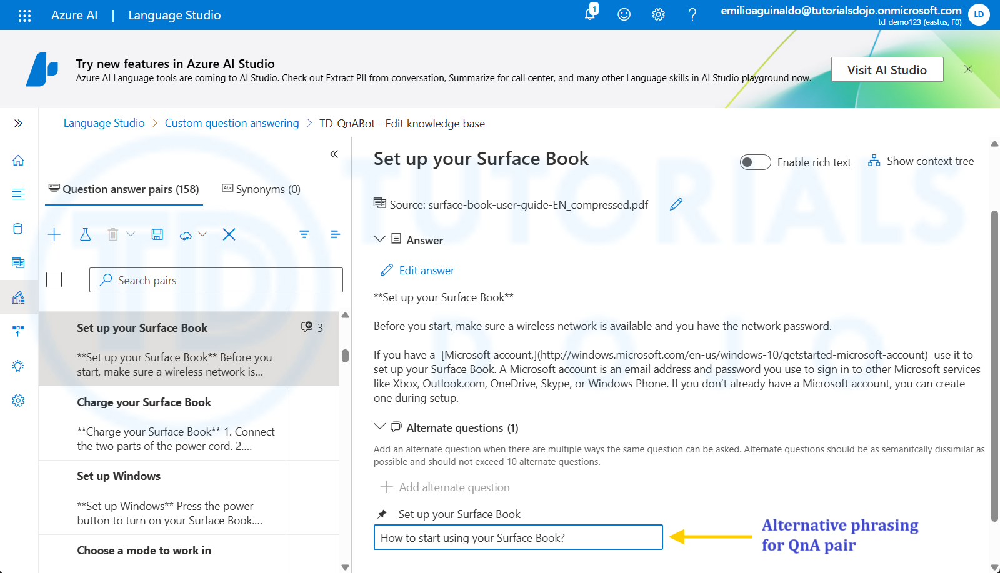
</div>

--

Once alternative phrasing is added, the model needs to be retrained to integrate the new data. Retraining updates the model’s understanding of the variations in phrasing and improves its accuracy. After retraining, the model is republished to make the updated version available for real-time use. This continuous process of updating, retraining, and republishing ensures that the model’s performance is consistently enhanced.

---

## ❌ Q17

<div style="text-align: center;">
    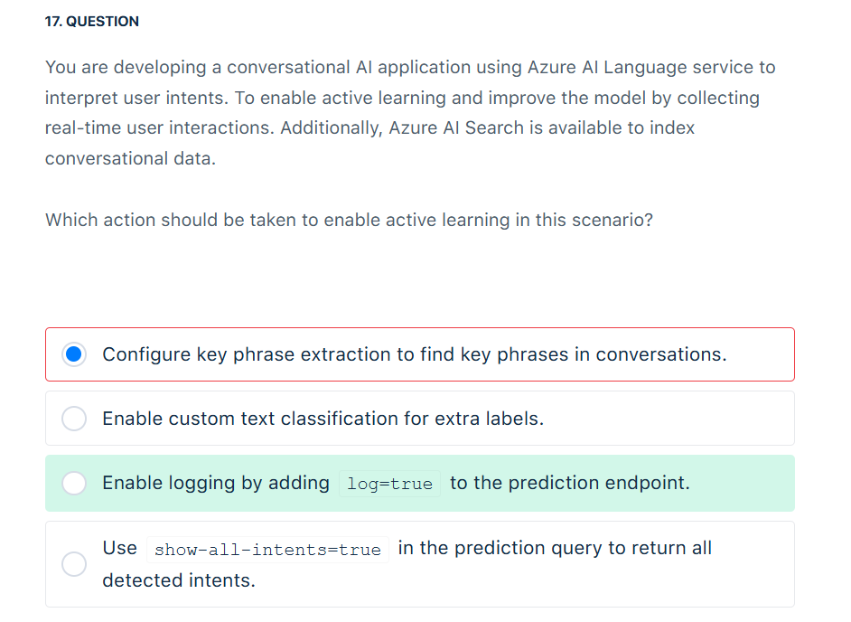
</div>

### 🎯 Simple Explanation:

✅ **Correct Answer: Enable logging by adding `log=true` to the prediction endpoint.**

To enable **active learning**, your app must **log real user interactions** so Azure can **analyze** and **improve** the model based on how users actually speak.

By adding `log=true` to your **prediction API call**, Azure saves the interaction data. This logged data can be used later in **Language Studio** to improve intent detection.

### 🧠 Why the others are wrong:

- ❌ **Key phrase extraction** = finds important words, not for active learning.
- ❌ **Custom text classification** = adds labels, not about logging or learning.
- ❌ **show-all-intents=true** = shows multiple intents, helpful for testing, but doesn’t log data.

---

## ❌ Q18

<div style="text-align: center;">
    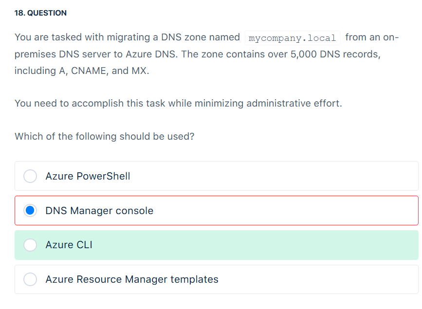
</div>

### 💡 Simple Explanation:

✅ **Correct Answer: Azure CLI**

You need to **migrate a large DNS zone (5,000+ records)** to **Azure DNS** with **minimal administrative effort**.

**Azure CLI** is the best choice because:

- It supports **automation scripts** for bulk DNS record creation.
- You can use tools or scripts with Azure CLI to **import `.dns` zone files** or migrate records efficiently.
- It is **cross-platform** and widely used in DNS automation scenarios.

### 🧠 Why the others are not ideal:

- ❌ **Azure PowerShell**: While it can manage DNS records, it **does not support direct zone file import**. Custom scripting is required.
- ❌ **DNS Manager console**: Used only for **on-prem DNS**, not compatible with **Azure DNS**.
- ❌ **Azure Resource Manager (ARM) templates**: Designed for **static deployments**; not suitable for importing large or dynamic DNS zones.

📌 Tip: You can use Azure CLI with scripting (like a Bash + BIND parser) to loop through zone files and **automate record creation** with `az network dns record-set`. Let me know if you want a ready-made script! 🛠️📂

---

## ❌ Q19

<div style="text-align: center;">
    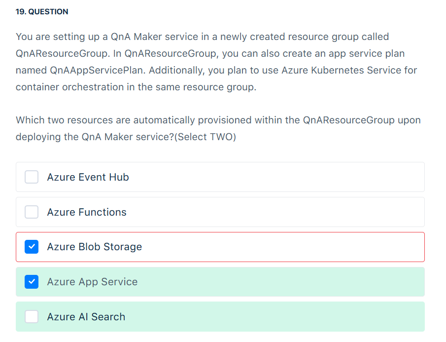
</div>

---

### 💡 Simple Explanation:

✅ **Correct Answers: Azure App Service and Azure AI Search**

When you deploy a **QnA Maker** service (now part of **Azure AI Language Service** legacy tools), Azure **automatically creates** several resources behind the scenes to support it.
Out of the options given, the **two that are always created automatically** are:

- ✅ **Azure App Service** – Hosts the QnA Maker endpoint (your HTTP API).
  - **Azure App Service** is a fully managed platform-as-a-service (PaaS) provided by Microsoft Azure, enabling developers to build, deploy, and scale web applications, APIs, and mobile backends. It simplifies application hosting by automatically handling infrastructure management, scaling, patching, and load balancing.
- ✅ **Azure AI Search** – Stores and indexes your knowledge base data for fast question answering.
  - **Azure AI Search** is a powerful, enterprise-grade information retrieval system for heterogeneous content. It allows you to ingest content into a search index and make it accessible to users through queries and applications. With a wide range of advanced search technologies, it is built to support high-performance applications at any scale.

---

<div style="text-align: center;">
    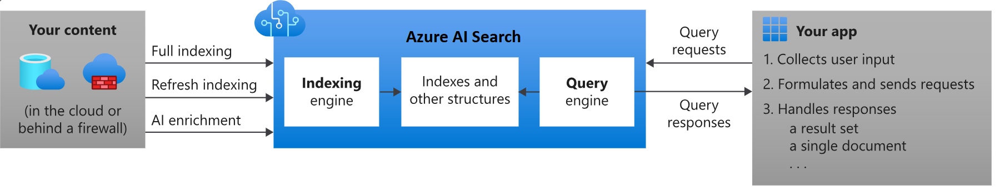
</div>

<div style="text-align: center;">
    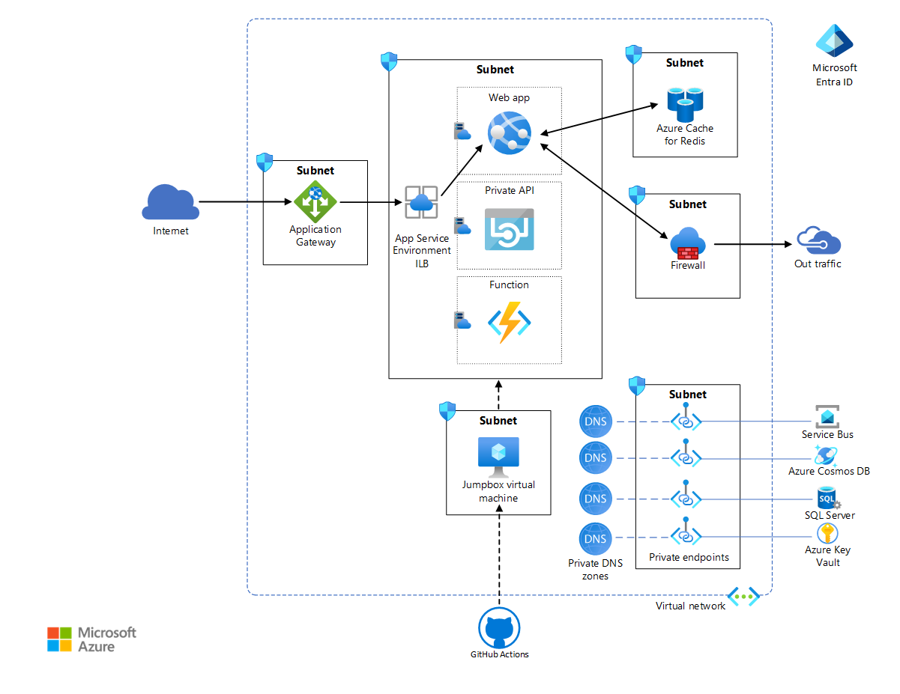
</div>

---

### 🧠 Why the others are incorrect:

- ❌ **Azure Blob Storage**: Not created automatically by QnA Maker, although it may be used for some data tasks if explicitly configured.
- ❌ **Azure Functions**: Not used in QnA Maker architecture.
- ❌ **Azure Event Hub**: Not related to QnA Maker at all.

---

📌 Tip: When setting up QnA Maker, remember it **requires**:

- App Service
- Azure AI Search
- (Sometimes) an App Insights resource
  These are provisioned automatically unless you bring your own.

---

## ❌ Q24

<div style="text-align: center;">
    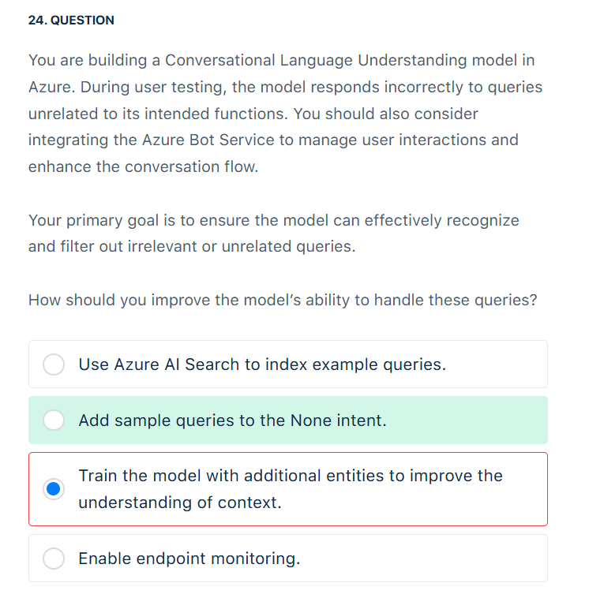
</div>

### 💡 Simple Explanation:

✅ **Correct Answer: Add sample queries to the None intent**

When your **Conversational Language Understanding** model gives **wrong responses to unrelated questions**, the best way to fix it is to **train the model on what “not relevant” looks like**.

👉 You do this by adding **example queries** to the **`None` intent** — a special intent that catches **irrelevant or out-of-scope input**.

For example:

- “What’s the weather today?”
- “Tell me a joke.”
- “Play music.”

These have nothing to do with your app's actual purpose, so they help train the model to say, **"I don't understand this"** rather than guessing incorrectly.

### 🧠 Why the others are not correct:

- ❌ **Azure AI Search**: Good for retrieving documents, not for **intent filtering**.
- ❌ **Training with more entities**: Helps understand **details** (like dates, names) but not for **intent relevance**.
- ❌ **Endpoint monitoring**: Used to track model health and usage, **not to improve accuracy**.

📌 Tip: Always include 10–20 realistic **irrelevant examples** in your `None` intent to boost precision and reduce false positives! 🚫🗣️

---

## ✅ Q26

<div style="text-align: center;">
    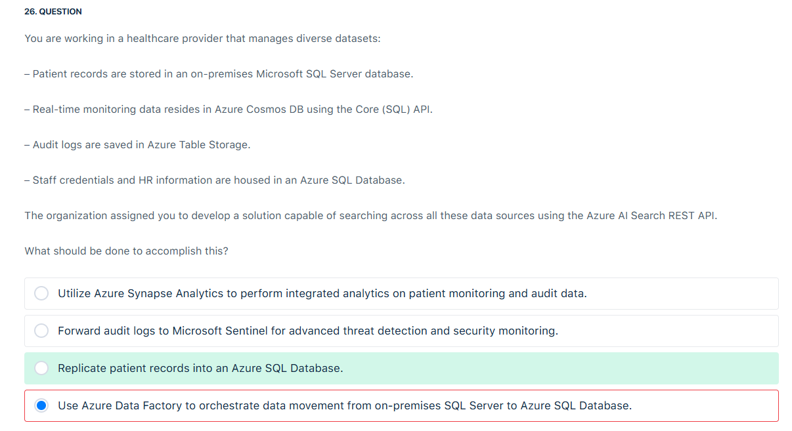
</div>

✅ **Correct Answer: Use Azure Data Factory to orchestrate data movement from on-premises SQL Server to Azure SQL Database**

### 💡 Simple Explanation:

To use **Azure AI Search REST API**, your data must be in **searchable data sources** like **Azure SQL**, **Blob Storage**, or **Cosmos DB**.

Since **patient records** are stored **on-premises** in **SQL Server**, you need to **move them into a cloud-accessible format** — such as **Azure SQL Database** — so they can be indexed by **Azure AI Search**.

👉 The best tool for securely and reliably moving data between on-prem and Azure is **Azure Data Factory**.

### 🧠 Why the others are incorrect:

- ❌ **Azure Synapse Analytics**: Great for analytics, but not needed just for making data searchable.
- ❌ **Microsoft Sentinel**: Focused on **security monitoring**, not data integration or search indexing.
- ❌ **Replicating manually to Azure SQL Database**: Technically works, but **lacks orchestration**, automation, and monitoring — Data Factory is the correct Azure-native tool for this job.

📌 Tip: Once all data sources (SQL, Cosmos DB, Table Storage) are accessible in Azure, you can create **indexers in Azure AI Search** to crawl and make them searchable. Let me know if you want help building that indexer! 🔍🧩

---

## ❌ Q27

<div style="text-align: center;">
    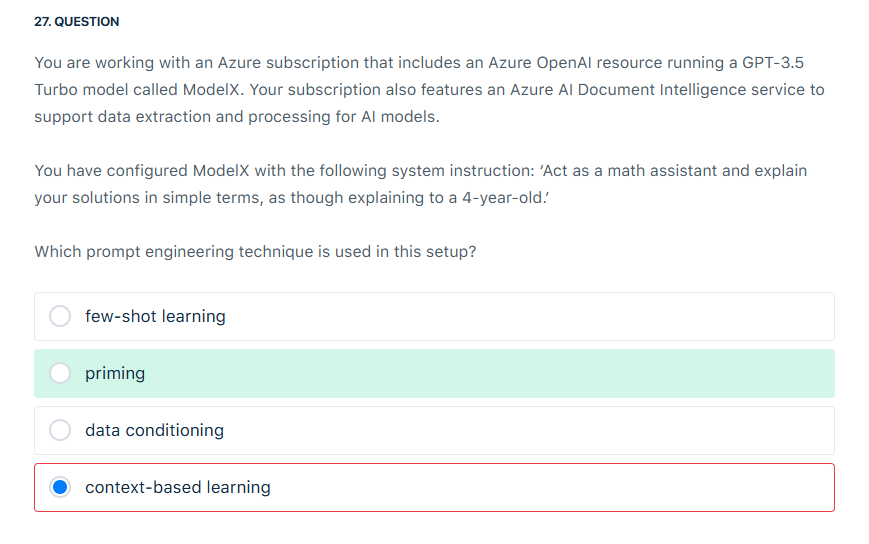
</div>

✅ **Correct Answer: priming**

### 💡 Simple Explanation:

When you give a **system instruction** like:

> _"Act as a math assistant and explain your solutions in simple terms, as though explaining to a 4-year-old,"_

…you are **priming** the model — setting its **tone, behavior, or persona** **before** it sees any user input.

This is a classic example of **priming** in prompt engineering: you guide the model's responses by setting up its role or instructions ahead of time.

### 🧠 Why the others are incorrect:

- ❌ **Few-shot learning**: Involves giving **examples** in the prompt to teach the model what kind of answers you expect.
- ❌ **Data conditioning**: Means **preprocessing or transforming training data** — not prompt-related.
- ❌ **Context-based learning**: Refers to learning within a **dynamic conversation**, using context from previous turns — not setting a fixed behavior upfront.

📌 Tip: Use **priming** for consistent tone or personality. Combine it with **few-shot** for better structure, especially in Azure OpenAI deployments! 🤖🧠

---

## ❌ Q32

<div style="text-align: center;">
    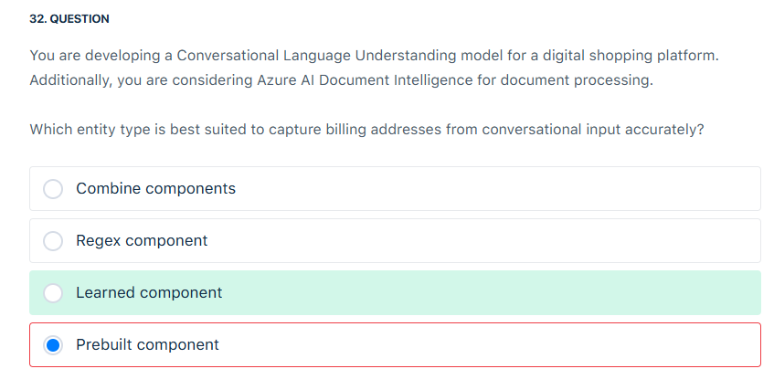
</div>

References:

<https:/>/learn.microsoft.com/en-us/azure/ai-services/language-service/conversational-language-understanding/concepts/entity-components>

<https:/>/learn.microsoft.com/en-us/azure/ai-services/language-service/conversational-language-understanding/overview>

Check out this Azure AI Cheat Sheet:

<https:/>/tutorialsdojo.com/azure-cheat-sheets-ai/>

---

## ❌ Q34

<div style="text-align: center;">
    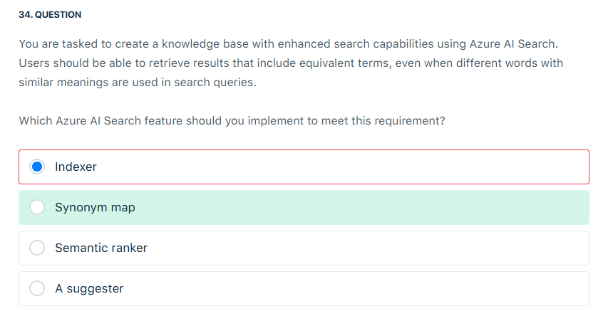
</div>

✅ **Correct Answer: Synonym map**

### 💡 Simple Explanation:

<div style="text-align: center;">
    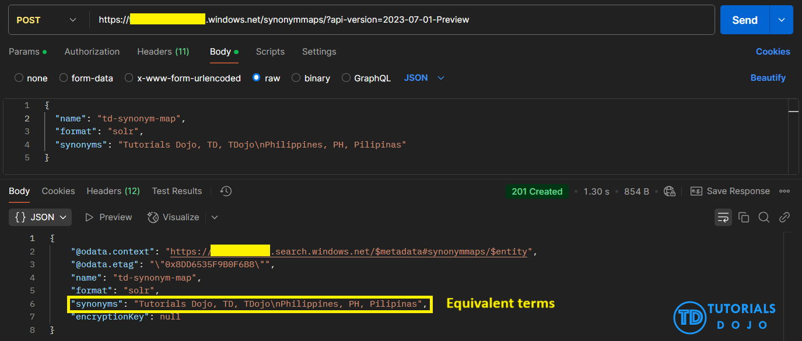
</div>

You want users to find results **even if they use different words with the same meaning** (e.g., “car” = “automobile”).

🔁 That’s exactly what a **Synonym map** does in **Azure AI Search** — it maps **equivalent terms** so that searches return **relevant matches**, even if the query uses different words.

### 🧠 Why the others are incorrect:

- ❌ **Indexer**: Brings data into the search index — doesn’t handle search logic like synonyms.
- ❌ **Semantic ranker**: Improves **relevance based on meaning**, but **doesn't replace or match synonyms directly** unless paired with other features.
- ❌ **Suggester**: Helps with **auto-complete** as the user types, not semantic matching.

📌 Tip: Use **synonym maps** for domain-specific terms, acronyms, or regional language variations. You can manage them directly in the Azure portal or via REST API! 🔎🔄

---

## ❌ Q37

<div style="text-align: center;">
    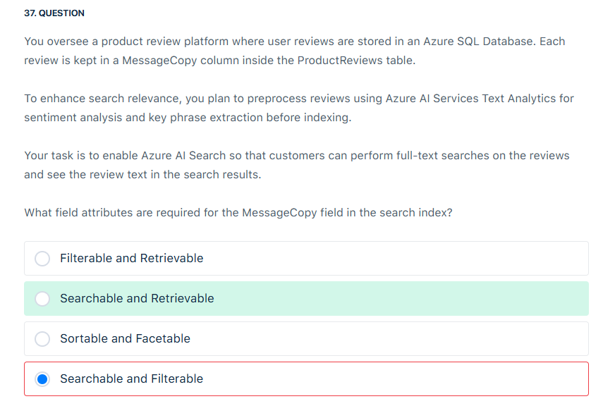
</div>

✅ **Correct Answer: Searchable and Retrievable**

### 💡 Simple Explanation:

You want users to:

1. **Search inside the review text** (e.g., find "great camera" or "poor battery").
2. **See the review content** in the search results.

To do that in **Azure AI Search**, the `MessageCopy` field must be:

- ✅ **Searchable** → so full-text queries match words inside the review.
- ✅ **Retrievable** → so the review text can be included in the returned results.

### 🧠 Why the others are incorrect:

- ❌ **Filterable and Retrievable**: Filtering is used for **exact matches**, not full-text search.
- ❌ **Sortable and Facetable**: These are for sorting results or grouping (facets), not searching text.
- ❌ **Searchable and Filterable**: You won’t see the content unless it’s also **retrievable**.

📌 Tip: In your search index schema, set `MessageCopy` like this:

```json
{
  "name": "MessageCopy",
  "type": "Edm.String",
  "searchable": true,
  "retrievable": true
}
```

---

## ❌ Q48

<div style="text-align: center;">
    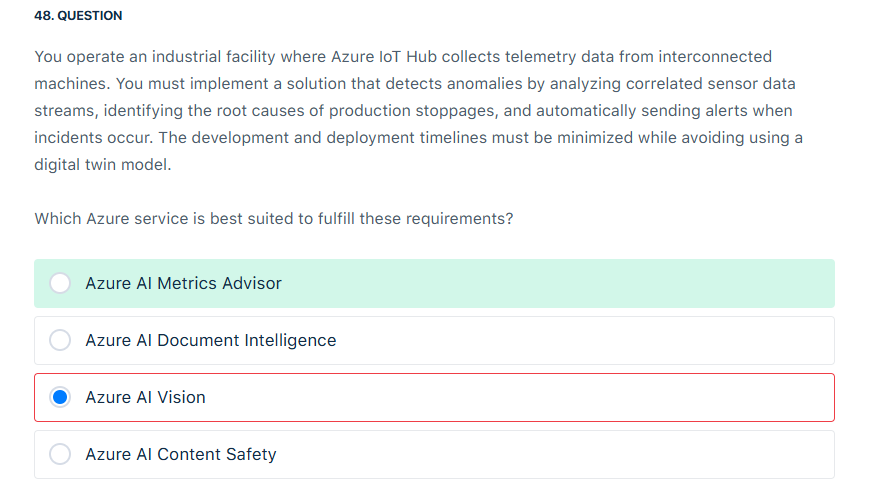
</div>

✅ **Correct Answer: Azure AI Metrics Advisor**

---

### 💡 Simple Explanation:

You're dealing with **telemetry data from machines**, and you need to:

- Detect **anomalies in real-time**
- Analyze **correlated sensor data streams**
- Identify **root causes**
- **Send alerts** when issues occur
- **Avoid building complex models like Digital Twins**
- **Minimize development time**

👉 **Azure AI Metrics Advisor** is **specifically designed** for this:

---

<div style="text-align: center;">
    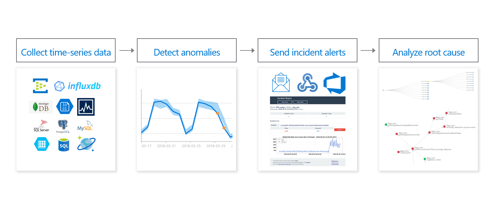
</div>

---

- Built for **time-series anomaly detection**
- Supports **multivariate analysis** (correlated sensors)
- Provides **automatic diagnostics and root cause analysis**
- Integrates easily with **IoT Hub**
- Has built-in alerting

---

### 🧠 Why the others are incorrect:

- ❌ **Azure AI Document Intelligence**: Used for **extracting text from documents**, not telemetry data or sensors.
- ❌ **Azure AI Vision**: Deals with **images/video**, not sensor data.
- ❌ **Azure AI Content Safety**: Filters **text and image content for harmful material**, irrelevant for IoT telemetry.

---

📌 Tip: Azure AI Metrics Advisor is ideal for **factories, IoT, finance, and energy** — anywhere you need to monitor changing values over time for **anomalies and trends**. ⚙️📈📊

---

## ❌ Q49

<div style="text-align: center;">
    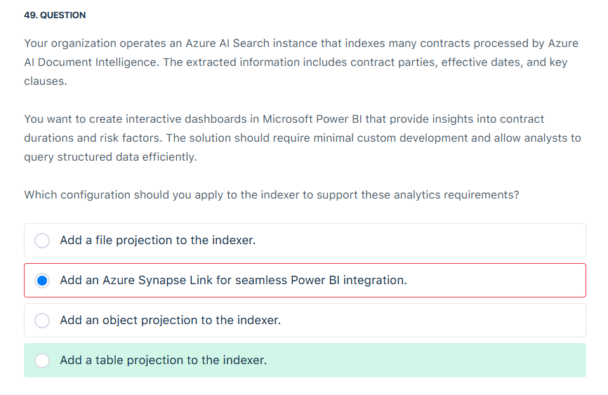
</div>

✅ **Correct Answer: Add a **table projection** to the indexer**

---

### 💡 Simple Explanation:

You want to:

- Use **Azure AI Search** data (from **contracts**)
- Create **Power BI dashboards**
- Enable analysts to **query structured data like durations, risk factors, etc.**
- Avoid writing lots of custom code

👉 You need to convert unstructured document data into **structured, table-like formats** — and **table projections** do exactly that.

📊 **Table projection** in Azure AI Search turns extracted fields (like parties, dates, clauses) into rows and columns — perfect for tools like **Power BI** to consume.

---

### 🧠 Why the others are incorrect:

- ❌ **File projection**: Outputs raw files (PDFs, images), not useful for analytics.
- ❌ **Object projection**: Outputs nested JSON objects — too complex for direct use in Power BI.
- ❌ **Azure Synapse Link**: Works with Cosmos DB and Dataverse, **not Azure AI Search**.

---

📌 Tip: After setting up **table projection**, you can **export the index to Azure Data Lake or Azure SQL** and **connect Power BI** to build beautiful dashboards. 📈✨

---

## ❌ Q52

<div style="text-align: center;">
    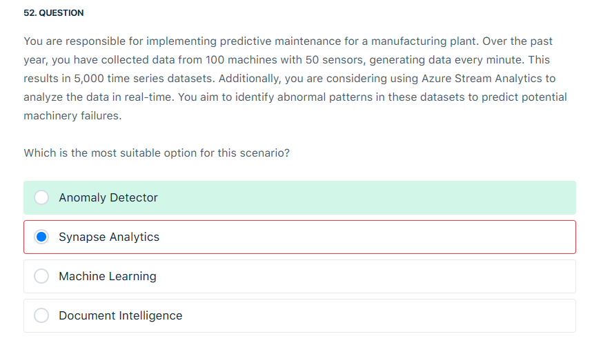
</div>

### 💡 Simple Explanation:

✅ **Correct Answer: Anomaly Detector**

You're dealing with **real-time sensor data** (5,000 time series) and want to:

- **Detect abnormal patterns**
- **Predict failures (predictive maintenance)**
- Analyze data **as it streams from machines**

👉 **Azure Anomaly Detector** is **purpose-built** for this:

Azure Anomaly Detector is a fully managed Azure service that automatically identifies anomalies (unusual patterns or outliers) in time-series data. As part of the Azure AI Services suite, it is specifically built to detect abnormal patterns in large datasets, such as those generated by IoT sensors, server logs, financial transactions, and other continuous data streams.

- Works with **time series data**
- Can handle **high-volume telemetry** (like sensor data every minute)
- Integrates easily with **Azure Stream Analytics**
- Requires **minimal ML expertise** and is fast to deploy

### 🧠 Why the others are incorrect:

- ❌ **Synapse Analytics**: Great for big data **batch analytics**, not real-time anomaly detection.
- ❌ **Machine Learning**: Can do this, but requires **custom models, training, and more dev effort**.
- ❌ **Document Intelligence**: Used for **extracting data from documents**, not for sensor or time series data.

📌 Tip: Use **Azure Stream Analytics** to ingest the data, and connect it to **Azure Anomaly Detector API** to flag unusual sensor patterns in real time. ⚙️📉🔍
