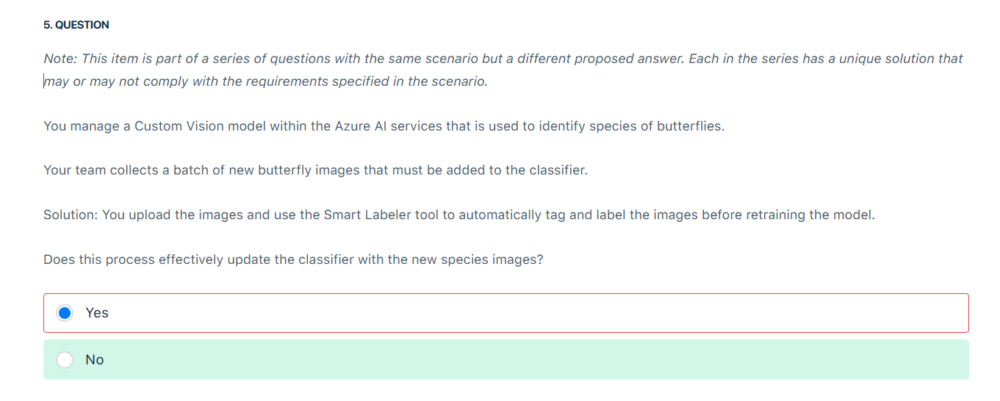
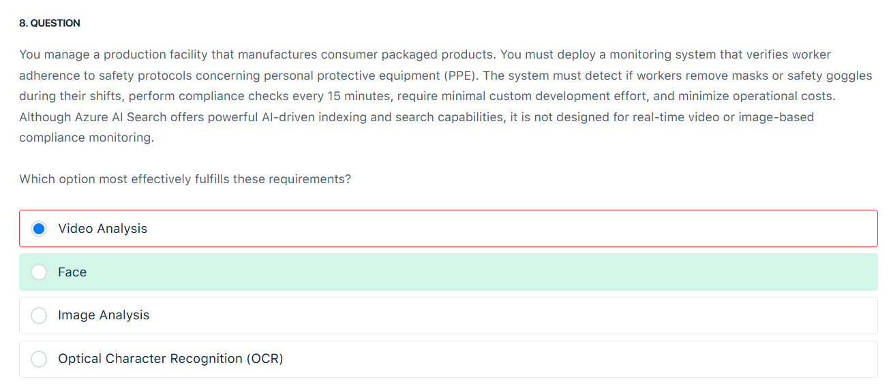

# 👁️ Computer Vision Questions

## ❌ Q5

<div style="text-align: center;">
    
</div>

Yes is incorrect because simply uploading images and using the Smart Labeler to tag them does not automatically retrain or update the Custom Vision model. The Smart Labeler only assists with labeling the images by providing automated suggestions based on the existing model, which can help streamline the data preparation process. However, this step prepares the new data for training; it does not initiate a retraining process. The model remains unchanged until you explicitly start a new training run with the updated dataset. This process is typically a manual step in the Azure AI Custom Vision workflow to ensure that the model integrates the newly labeled images effectively. Therefore, relying solely on the Smart Labeler to update the classifier is insufficient and does not satisfy the requirements for refreshing the model with new species images.

---

## ❌ Q8

<div style="text-align: center;">
    
</div>

Thank you for the clarification — let’s re-evaluate the question using the correct lens. 👇

✅ **Correct Answer: Face**

### 💡 Simple Explanation:

You need to detect **facial PPE compliance** (like **masks** and **goggles**) in a **low-cost, low-effort** way and **don't need full video stream processing**.

👉 The **Azure Face service** is the best fit because:

- It detects **facial landmarks and features**, like **mask presence**, glasses, head pose, etc.
- It supports compliance checks with **prebuilt attributes** (e.g., `mask`, `occlusion`, `accessories`)
- It’s **simpler and cheaper** than full **Video Analysis** pipelines
- You can run checks **on snapshots or periodic images** every 15 minutes

---

### 🧠 Why the others are incorrect:

- ❌ **Optical Character Recognition (OCR)**: Extracts **text**, not useful for PPE detection.
- ❌ **Image Analysis**: Detects objects and scenes, but **doesn’t offer detailed facial attribute detection** like mask usage — needs extra logic or training.
- ❌ **Video Analysis**: Too **complex and costly** for a task that can be handled by checking facial features in static images.

📌 Tip: Use **Azure Face API** to analyze periodic photos or camera snapshots for attributes like:

```json
"mask": {
  "type": "faceMask",
  "noseAndMouthCovered": true
}
```
