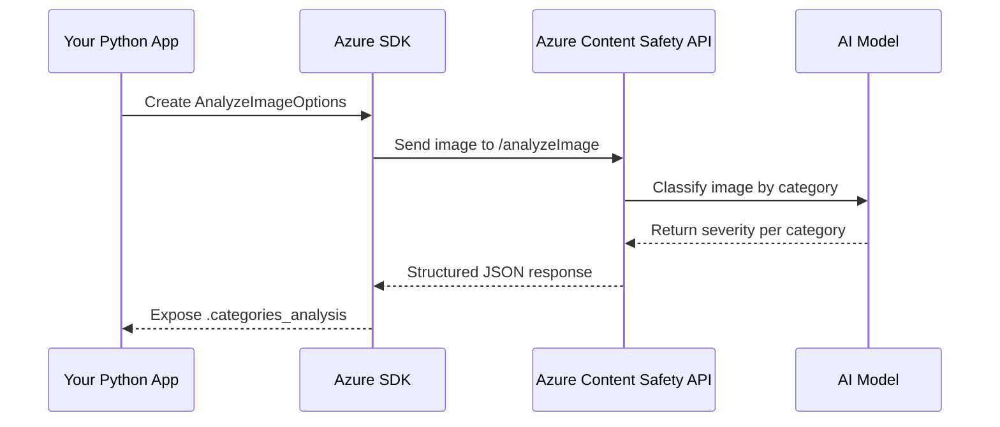

# 🖼️ Azure AI Content Safety – Image Analysis with Python

## 🧯 Why Bother Moderating Images?

You let users upload images on your platform?
Congrats, you also opened the door to 🔞 memes, 🧨 hate symbols, 🩸 gore, and all sorts of digital chaos.
That’s why **image moderation** is critical — for **trust**, **compliance**, and **user safety**.

Luckily, Azure gives you a **fully managed AI solution** to detect:

| Category         | Examples                                               |
| ---------------- | ------------------------------------------------------ |
| 🧨 **Hate**      | Racist flags, hate speech in images, offensive symbols |
| 🩸 **Self-harm** | Razor blades, blood, self-injury photos                |
| 🍑 **Sexual**    | Nudity, adult content, sexually suggestive imagery     |
| ⚔️ **Violence**  | Guns, fights, blood, injuries                          |

Each detection comes with a **severity level from 0 (safe) to 6 (extreme)**.

---

## ⚙️ What You Need Before Coding

✅ Azure subscription
✅ A **Content Safety** resource (create from Azure Portal)
✅ Access to its `key` and `endpoint`
✅ Install the SDK locally:

```bash
pip install azure-ai-contentsafety
```

---

## 🧪 Full Working Code – Analyze Any Image

Here's the complete Python script using Azure's SDK to analyze image content:

```python
# Azure AI ContentSafety Image Analysis
# pip install azure-ai-contentsafety

import os
from azure.ai.contentsafety import ContentSafetyClient
from azure.ai.contentsafety.models import (
    ImageCategory, AnalyzeImageOptions, ImageData
)
from azure.core.credentials import AzureKeyCredential
from azure.core.exceptions import HttpResponseError

# 🔐 Your real Azure AI key + endpoint
key = "f7324ffadc7e4da0b5b253230a44a849"
endpoint = "https://azure-content-safety-demo-345.cognitiveservices.azure.com/"

# 📸 Image path (local file)
image_path = os.path.abspath(
    os.path.join(os.path.abspath(__file__), "..", "./sample_data/756692568a236c94619b202e9b68687a.jpg")
)

# 🧠 Create the Content Safety client
client = ContentSafetyClient(endpoint, AzureKeyCredential(key))

# 🧾 Read and prepare image for API
with open(image_path, "rb") as file:
    request = AnalyzeImageOptions(image=ImageData(content=file.read()))

# 🔍 Analyze the image
try:
    response = client.analyze_image(request)
except HttpResponseError as e:
    print("Analyze image failed.")
    if e.error:
        print(f"Error code: {e.error.code}")
        print(f"Error message: {e.error.message}")
    raise

# 📊 Extract and display results
hate_result = next(item for item in response.categories_analysis if item.category == ImageCategory.HATE)
self_harm_result = next(item for item in response.categories_analysis if item.category == ImageCategory.SELF_HARM)
sexual_result = next(item for item in response.categories_analysis if item.category == ImageCategory.SEXUAL)
violence_result = next(item for item in response.categories_analysis if item.category == ImageCategory.VIOLENCE)

if hate_result:
    print(f"🧨 Hate severity: {hate_result.severity}")
if self_harm_result:
    print(f"🩸 SelfHarm severity: {self_harm_result.severity}")
if sexual_result:
    print(f"🍑 Sexual severity: {sexual_result.severity}")
if violence_result:
    print(f"⚔️ Violence severity: {violence_result.severity}")

if __name__ == "__main__":
    analyze_image()
```

---

## 📈 Sample Output

Let’s say the image was a mildly suggestive political meme. You might see:

```ini
🧨 Hate severity: 1
🩸 SelfHarm severity: 0
🍑 Sexual severity: 3
⚔️ Violence severity: 0
```

Now **you can decide**:

- **0–1**: Auto-approve ✅
- **2–4**: Send for human review 🕵️‍♀️
- **5–6**: Block or report 🚨

---

## 📽️ Behind-the-Scenes Flow (Mermaid Diagram)

<div align="center">



</div>

---

## 🧵 Explanation of Key Parts

| Line/Concept               | Description                                    | Emoji    |
| -------------------------- | ---------------------------------------------- | -------- |
| `AnalyzeImageOptions`      | Tells API what image to check                  | 📤       |
| `ImageData(content=...)`   | Encodes image binary data into payload         | 🧾       |
| `client.analyze_image()`   | Main function call to Content Safety API       | 🤖       |
| `ImageCategory.HATE`, etc. | Enum values to filter result categories        | 🧨🩸🍑⚔️ |
| `item.severity`            | Score between 0–6 indicating content intensity | 🔥       |

---

## 💡 Smart Usage Tips

- 🛑 Don't hard-block based only on **keywords or tags** — use severity + business logic.
- 🧪 Test with real-world uploads from your users — memes, screenshots, camera photos.
- 🔒 Store flagged images temporarily for **human review or appeal**.
- 🚀 Use this in a background moderation pipeline or even **serverless with Azure Functions**.
- 🧼 Combine with **text moderation**, profanity filters, or LLM-based content summarizers.

---

## 📊 Summary Table

| Feature              | Value                                    |
| -------------------- | ---------------------------------------- |
| Supported formats    | JPG, PNG, BMP, TIFF                      |
| Max file size        | 4MB                                      |
| Categories supported | Hate, Self-Harm, Sexual, Violence        |
| Severity scale       | `0` (safe) → `6` (extreme content)       |
| SDK                  | `azure-ai-contentsafety`                 |
| Call type            | Sync (`analyze_image()`)                 |
| Result format        | `.categories_analysis`                   |
| Cost                 | Pay-per-API-call, Free tier available 💰 |

---

## 📎 Official Resources

- [📖 Azure Docs – Analyze Image](https://learn.microsoft.com/en-us/azure/ai-services/content-safety/how-to/image-moderation)
- [🔧 REST API Reference](https://learn.microsoft.com/en-us/rest/api/cognitiveservices/content-safety/analyze-image)
- [🧰 SDK on PyPI](https://pypi.org/project/azure-ai-contentsafety/)
- [🧠 Responsible AI Guidelines](https://learn.microsoft.com/en-us/azure/responsible-ai/overview)
