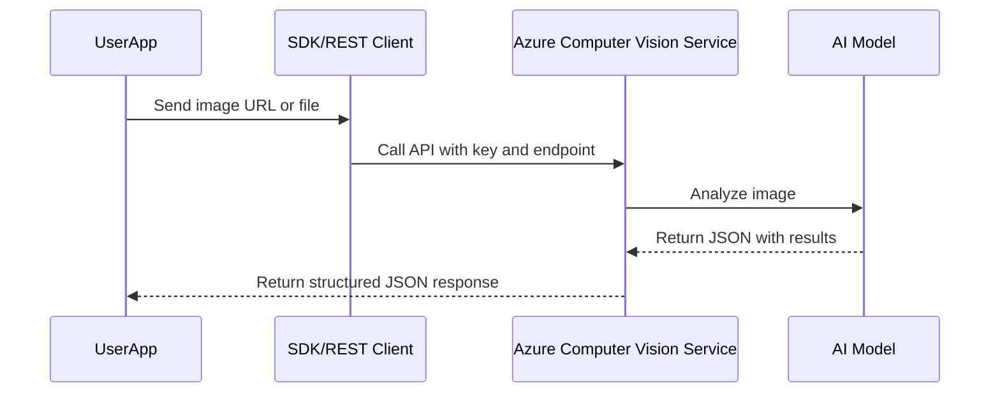

# 👁️ Azure Computer Vision - Azure AI Vision

## 📜 Official Definition

> **Azure Computer Vision** is a cloud-based service that provides powerful pre-trained AI algorithms to process images and return information. It can analyze visual content in different ways, depending on the chosen features.

---

## 🧠 What Can It Do? (Capabilities)

Here’s a rundown of **Computer Vision 3.x & 4.x** core capabilities:

`ALBT SOCC`

| Feature                  | What It Does                                 | Exam-Ready Hint               |
| ------------------------ | -------------------------------------------- | ----------------------------- |
| 🖼️ `Image Analysis`      | Detects objects, tags, captions, and more    | Most popular feature          |
| 🏛️ `Landmark Detection`  | Identifies well-known landmarks              | Domain-specific model         |
| 🧢 `Brand Detection`     | Recognizes logos in images                   | Needs high-quality logos      |
| 🧠 `Image Captioning`    | Generates smart, descriptive captions        | Like: "A dog on a beach"      |
| 🏷️ `Tagging`             | Returns list of tags based on visual content | Ex: `beach`, `dog`, `outdoor` |
| 🔍 `OCR (Read API)`      | Extracts printed and handwritten text        | Better than older OCR         |
| ✂️ `Smart Cropping`      | Suggests focus areas for thumbnails          | Useful in media galleries     |
| 👤 `Celebrity Detection` | Recognizes famous faces                      | Gated—needs special access    |

---

## ☁️ How Does It Work? (Architecture)

<div align="center">



</div>

---

## 🔑 Setup in Azure Portal (Quick Summary)

1. Go to Azure Portal → Create a **Computer Vision** resource
2. Choose your region, pricing tier (F0 = Free), and resource group
3. After creation, note:

   - **Endpoint URL**
   - **Key (API key)**

💡 Optional: Use **Vision Studio** (no code) to try features visually before coding.

---

## 📸 Exam-Important Feature Walkthroughs

### 🖼️ 1. Image Analysis

- Identifies: objects, people, text, smart crop zones, colors, and image types.
- Returns a full **JSON** with:

  - Tags
  - Captions (with confidence score)
  - Object locations
  - Smart crop bounding boxes

- API versions: 4.0 (new), 3.2 (older)

⛳ **Exam Hint:** This is the “everything-in-one” API!

---

### 🧢 2. Brand Detection

- Detects **brand logos** (e.g., Apple, Nike) in an image
- Works with local image or URL
- High confidence = accurate brand match
- Good for **retail** and **marketing** use cases

🧠 Example Return:

```json
{
  "brand": "Apple",
  "confidence": 0.91,
  "rectangle": { "x": 50, "y": 50, "w": 150, "h": 50 }
}
```

🛑 **Gated?** No, but accuracy depends on logo clarity

---

### 🏛️ 3. Landmark Detection

- Recognizes **famous places** (Taj Mahal, Eiffel Tower, etc.)
- Uses `analyzeImageByDomain(domain="landmarks")`
- Needs proper **angle and quality** for success

⚠️ Example failure: London Bridge may not be detected from poor angles

⛳ **Exam Hint:** Works only for **pre-trained landmarks**; limited coverage.

---

### 👩‍🎤 4. Celebrity Detection

- Identifies celebrities using `domain="celebrities"`
- API is **gated** due to privacy/security concerns
- You’ll get a 403 or "access denied" error unless approved

⛳ **Exam Hint:** Mentioned in **ethics and responsible AI** questions.

---

### 🏷️ 5. Tags and Captions

- Tags are keywords (e.g., `person`, `dog`, `road`)
- Captions are generated descriptions
- Output includes **confidence scores**

🧠 Captions look like:

> `"A man riding a bike down the street." (0.85 confidence)`

⛳ **Exam Hint:** Captions are **language-sensitive** and customizable.

---

### 📖 6. OCR & Read API

🧾 **Read API** (v3.2) is the latest, better than legacy OCR.

- Works with printed and handwritten text
- Asynchronous API:

  1. Call `read()`
  2. Get `operation-location`
  3. Poll to `get_read_result(operationId)`

- Supports:

  - Languages
  - Layout detection
  - Handwriting

⛳ **Exam Hint:** Most accurate for text in noisy/complex images.

---

### ✂️ 7. Smart Cropping

- Helps find the **focus area** of an image
- Great for generating **thumbnails**
- Returns a bounding box for crop suggestion

🧠 Example: For Taj Mahal photo, it suggests cropping around the domes.

⛳ **Exam Hint:** Related to media and UX/image gallery optimization.

---

## ⚠️ Gated Features & Rate Limits

Some features like **celebrity detection** and **captcha resolution** may be **gated** or restricted due to:

- Ethical concerns
- Legal compliance
- Abuse prevention (e.g., bypassing captchas)

🛑 Microsoft requires **request justification** for access to gated features.

---

## 🧾 Azure AI Vision – `imageanalysis:analyze` Request Breakdown

> `/computervision/imageanalysis:analyze` is the **latest endpoint** for Azure AI Vision (as of 2025), replacing older operations like `analyze`, `ocr`, and `describe`.

It supports **multiple visual features in a single call**, simplifying image analysis workflows.

---

### 🌐 Endpoint Format

```http
POST https://<your-region>.api.cognitive.microsoft.com/computervision/imageanalysis:analyze
```

- 🔑 **Authentication:** Use `Ocp-Apim-Subscription-Key` and `Ocp-Apim-Subscription-Region` headers.
- 📦 **Content-Type:** Depends on input type (image URL or binary).
- 📍 **Query String Parameters:**

  - `features` – REQUIRED: comma-separated list of visual features
  - `language` – OPTIONAL: e.g., `en`, `fr`
  - `genderNeutralCaption` – OPTIONAL: `true` or `false`

---

### ⚙️ Visual Features You Can Request

| Feature         | Description                                   |
| --------------- | --------------------------------------------- |
| `caption`       | Natural language caption describing the image |
| `denseCaptions` | Captions for multiple image regions           |
| `tags`          | Tags describing objects, actions, context     |
| `objects`       | Object detection with bounding boxes          |
| `people`        | Detects people in the image                   |
| `smartCrops`    | Suggested crops focused on important areas    |
| `read`          | OCR – reads text from images                  |

---

### 📦 1. JSON Request with Image URL

#### ✅ Use When:

- Image is hosted online
- You prefer `application/json`

#### ✅ Request Format

```http
POST https://<endpoint>/computervision/imageanalysis:analyze?features=caption,tags,read
Content-Type: application/json
Ocp-Apim-Subscription-Key: <your-key>
Ocp-Apim-Subscription-Region: <your-region>
```

```json
{
  "url": "https://example.com/image.jpg"
}
```

---

### 🖼️ 2. Binary Request with Image File

#### ✅ Use When:

- You’re uploading a local image
- Want faster processing (no image hosting needed)

#### ✅ Request Format

```http
POST https://<endpoint>/computervision/imageanalysis:analyze?features=caption,objects
Content-Type: application/octet-stream
Ocp-Apim-Subscription-Key: <your-key>
Ocp-Apim-Subscription-Region: <your-region>
```

```ini
<image binary goes here>
```

---

### 🚫 What You **Cannot Do**

| ❌ Mistake                         | 🧠 Why It's Wrong                             |
| ---------------------------------- | --------------------------------------------- |
| Passing `features` in request body | Must be in query string                       |
| Mixing image `url` with binary     | Choose one: either URL (JSON) or raw binary   |
| Using old `analyze` endpoint       | Deprecated – use `/imageanalysis:analyze` now |

---

### ✅ Example Response (caption + tags)

```json
{
  "modelVersion": "2024-02-01",
  "captionResult": {
    "text": "A dog jumping over a hurdle",
    "confidence": 0.95
  },
  "tagsResult": {
    "values": [
      { "name": "dog", "confidence": 0.99 },
      { "name": "jumping", "confidence": 0.87 },
      { "name": "outdoors", "confidence": 0.85 }
    ]
  }
}
```

---

### 🧪 Best Practices

- ✅ Always **include only the features you need** – it saves cost and improves speed.
- ✅ Prefer **binary input** when the image is local.
- ✅ Use `read` when you expect **text** in images (OCR).
- ✅ Use `smartCrops` for cropping UIs or thumbnail generation.
