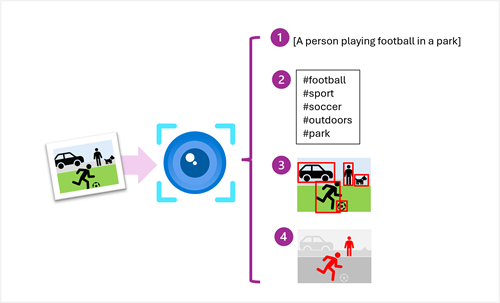

# Image Analysis



As shown in this conceptual diagram, the Azure AI Vision service provides services that you can use to analyze images and:

1. Generate a caption for an image based on its contents.
1. Suggest appropriate tags to associate with an image.
1. Detect and locate common objects in an image.
1. Detect and locate people in an image.

## Provisioning an Image Analysis Resource

1. Create an Azure AI Foundry project and an associated hub. By default, an Azure AI Foundry hub includes an Azure AI services multi-service resource, which includes Azure AI Vision. Azure AI Foundry projects are recommended for development of AI solutions on Azure that combine generative AI, agents, and pre-built Azure AI services, or which involve collaborative development by a team of software engineers and service operators.
1. If you don't need all of the functionality in an Azure AI Foundry hub, you can create an Azure AI services multi-service resource in your Azure subscription. You can then use this resource to access Azure AI Vision services and other AI services through a single endpoint and key.
1. If you only need to use Azure AI Vision functionality, or you're just experimenting with the service, you can create a standalone Computer Vision resource in your Azure subscription. One benefit of this approach is that the standalone service provides a free tier that you can use to explore the service at no cost.

## Connecting to your resource

After you've deployed your resource, you can use the Azure AI Vision REST API or a language-specific SDK (such as the Python SDK or Microsoft .NET SDK) to connect to it from a client application.

Every Azure AI Vision resource provides an endpoint to which client applications must connect. You can find the endpoint for your resource in the Azure portal, or if you're working in an Azure AI Foundry project, in the Azure AI Foundry portal. The endpoint is in the form of a URL, and typically looks something like this:

Copy
https://<resource_name>.cognitiveservices.azure.com/
To connect to the endpoint, client applications must be authenticated. Options for authentication include:

Key-based authentication: Client applications are authenticated by passing an authorization key (which you can find and manage in the portal).
Microsoft Entra ID authentication: Client applications are authenticated by using a Microsoft Entra ID token for credentials that have permission to access the Azure AI Vision resource in Azure.
When developing and testing an application, it's common to use key-based authentication or Microsoft Entra ID authentication based on your own Azure credentials. In production, consider using Microsoft Entra ID authentication based on a managed identity for your Azure application or use Azure Key Vault to store authorization keys securely.

Note

When using an Azure AI services resource in an Azure AI Foundry project, you can use the Azure AI Foundry SDK to connect to the project using Microsoft Entra ID authentication, and then retrieve the connection information for your Azure AI services resource, including the authorization key, from the project.

## Analyze an image

Note the following requirements for image analysis:

- The image must be presented in `JPEG, PNG, GIF, or BMP format.`
- The file size of the image must be less than `4 megabytes (MB)`.
- The dimensions of the image must be greater than `50 x 50 pixels.`

```curl

```

```python
from azure.ai.vision.imageanalysis import ImageAnalysisClient
from azure.ai.vision.imageanalysis.models import VisualFeatures
from azure.core.credentials import AzureKeyCredential

client = ImageAnalysisClient(
    endpoint="<YOUR_RESOURCE_ENDPOINT>",
    credential=AzureKeyCredential("<YOUR_AUTHORIZATION_KEY>")
)

result = client.analyze(
    image_data=<IMAGE_DATA_BYTES>, # Binary data from your image file
    visual_features=[VisualFeatures.CAPTION, VisualFeatures.TAGS],
    gender_neutral_caption=True,
)
```

```c#

```

> Note:
>
> In this code example, the client app uses key-based authentication. To use Microsoft Entra ID authentication, you can use a `TokenCredential` instead of an `AzureKeyCredential`.
>
> The code example submits the image data as a binary object (which would typically be read from an image file). You can also analyze an image based on a URL by using the analyze_from_url method.

Available visual features are contained in the VisualFeatures enumeration:

- `VisualFeatures.TAGS`: Identifies tags about the image, including objects, scenery, setting, and actions
- `VisualFeatures.OBJECTS`: Returns the bounding box for each detected object
- `VisualFeatures.CAPTION`: Generates a caption of the image in natural language
- `VisualFeatures.DENSE_CAPTIONS`: Generates more detailed captions for the objects detected
- `VisualFeatures.PEOPLE`: Returns the bounding box for detected people
- `VisualFeatures.SMART_CROPS`: Returns the bounding box of the specified aspect ratio for the area of interest
- `VisualFeatures.READ`: Extracts readable text
