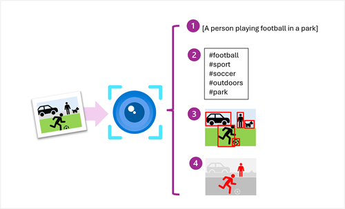

# 🖼️ Azure AI Vision – Image Analysis

Azure AI Vision's **Image Analysis** feature provides a powerful REST API and SDKs to extract meaningful insights from images, including:

**🧠 What It Can Do:**

1. 📝 **Generate captions** based on image content
2. 🏷️ **Suggest relevant tags** (objects, scenery, actions)
3. 📦 **Detect and locate objects** with bounding boxes
4. 👥 **Detect people** and return bounding boxes

---

<div style="text-align: center;">
    
</div>

---

## 🏗️ Provisioning Image Analysis Resources

You can access Azure AI Vision via one of three resource types:

| Option                        | Description                                                                | Best For                    |
| ----------------------------- | -------------------------------------------------------------------------- | --------------------------- |
| 🧱 **AI Foundry Project**     | Includes a multi-service Azure AI resource bundled in a Foundry project    | GenAI apps, agent workflows |
| 🧩 **Multi-Service Resource** | A shared endpoint that supports Vision, Language, Translator, OpenAI, etc. | Full-featured apps          |
| 🧪 **Standalone Vision (F0)** | Only Computer Vision, with free tier (F0 SKU)                              | Experimentation, learning   |

---

## 🔌 Connecting to Your Resource

After provisioning, you’ll need:

- 📍 **Endpoint**
  Format: `https://<resource-name>.cognitiveservices.azure.com/`

- 🔐 **Authentication Method**
  Choose one:

| Auth Method              | Description                                                              |
| ------------------------ | ------------------------------------------------------------------------ |
| 🔑 **Key-based**         | Pass `Ocp-Apim-Subscription-Key` header with a secret key                |
| 🪪 **Microsoft Entra ID** | Use a `TokenCredential` (e.g., `DefaultAzureCredential`) for secure auth |
| 🛡️ **Managed Identity**  | Best for production Azure-hosted apps (uses Azure identity services)     |

> 💡 When using **Azure AI Foundry**, you can retrieve the endpoint/key securely via the **Foundry SDK**.

---

## 🖼️ Analyze an Image

### 📋 Requirements

| Constraint     | Value                       |
| -------------- | --------------------------- |
| Formats        | `JPEG`, `PNG`, `GIF`, `BMP` |
| Max Size       | `4 MB`                      |
| Min Dimensions | `50 x 50` pixels            |

---

### ⚙️ Available Visual Features

Use the `VisualFeatures` enum to specify what to analyze:

| Feature          | Description                               |
| ---------------- | ----------------------------------------- |
| `CAPTION`        | Natural language caption of the image     |
| `DENSE_CAPTIONS` | Detailed captions per detected object     |
| `TAGS`           | Tags for objects, scenes, actions         |
| `OBJECTS`        | Object detection with bounding boxes      |
| `PEOPLE`         | Detects people and their locations        |
| `SMART_CROPS`    | Suggests crops that focus on key regions  |
| `READ`           | OCR: Extract readable text from the image |

---

## 📡 cURL Example – Image via URL

```bash
curl -X POST "https://<resource-name>.cognitiveservices.azure.com/computervision/imageanalysis:analyze?api-version=2023-10-01&features=caption,tags,objects" \
  -H "Ocp-Apim-Subscription-Key: <YOUR_KEY>" \
  -H "Content-Type: application/json" \
  --data '{
    "url": "https://aka.ms/azure-vision-sample"
  }'
```

✅ This will return captions, tags, and detected objects from the image.

---

## 🐍 Python SDK Example

```python
from azure.ai.vision.imageanalysis import ImageAnalysisClient
from azure.ai.vision.imageanalysis.models import VisualFeatures
from azure.core.credentials import AzureKeyCredential

client = ImageAnalysisClient(
    endpoint="https://<your-resource>.cognitiveservices.azure.com/",
    credential=AzureKeyCredential("<your-key>")
)

with open("my-image.jpg", "rb") as image_file:
    image_bytes = image_file.read()

result = client.analyze(
    image_data=image_bytes,
    visual_features=[VisualFeatures.CAPTION, VisualFeatures.TAGS, VisualFeatures.OBJECTS],
    gender_neutral_caption=True,
)

# Output sample
print("Caption:", result.caption_result.text)
for tag in result.tags_result.tags:
    print(f"Tag: {tag.name} ({tag.confidence:.2f})")
```

---

## 💻 C# SDK Example

```csharp
using Azure;
using Azure.AI.Vision.ImageAnalysis;
using System.IO;

var client = new ImageAnalysisClient(
    new Uri("https://<your-resource>.cognitiveservices.azure.com/"),
    new AzureKeyCredential("<your-key>")
);

using var imageStream = File.OpenRead("my-image.jpg");

var result = await client.AnalyzeAsync(new ImageAnalysisOptions
{
    Image = BinaryData.FromStream(imageStream),
    Features = { VisualFeature.Caption, VisualFeature.Tags, VisualFeature.Objects },
    GenderNeutralCaption = true
});

Console.WriteLine($"Caption: {result.CaptionResult.Text}");
foreach (var tag in result.TagsResult.Tags)
    Console.WriteLine($"Tag: {tag.Name} ({tag.Confidence:P1})");
```

---

## 🔐 Note on Authentication (SDKs)

- `AzureKeyCredential("<your-key>")` is used for **key-based** auth

- To use **Entra ID**, replace with:

  ```python
  from azure.identity import DefaultAzureCredential
  credential = DefaultAzureCredential()
  ```

- In production, prefer:

  - ✅ `DefaultAzureCredential()` for secure identity
  - 🔐 Store keys in Azure Key Vault

---

## 📦 Summary Table

| Task                          | Feature Used                 | Output Example                            |
| ----------------------------- | ---------------------------- | ----------------------------------------- |
| Generate description          | `VisualFeatures.CAPTION`     | `"a group of people standing outdoors"`   |
| Auto-tag objects              | `VisualFeatures.TAGS`        | `["tree", "dog", "cloud"]`                |
| Detect people or faces        | `VisualFeatures.PEOPLE`      | Bounding boxes around people              |
| Crop detection for thumbnails | `VisualFeatures.SMART_CROPS` | Cropping rectangles                       |
| Object detection              | `VisualFeatures.OBJECTS`     | Bounding boxes with labels                |
| Text recognition (OCR)        | `VisualFeatures.READ`        | `["Hello world"]` from signs or documents |
