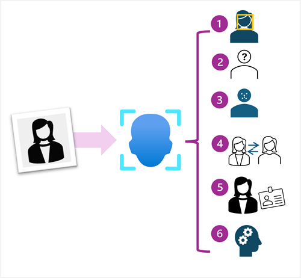
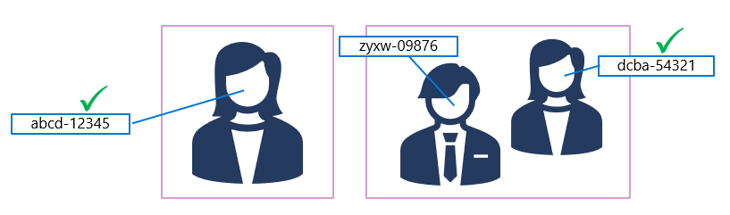

# 👤 Detect, Analyze, and Recognize Faces with Azure AI Vision

Face detection and analysis are common computer vision tasks used in **security**, **personalization**, and **human-computer interaction** systems. With **Azure AI Vision Face API**, you can build intelligent applications that:

- Detect human faces in images 📸
- Analyze facial features and attributes 🎯
- Recognize individuals across images 🧠
- Support liveness and anti-spoofing 🔐

---

## 🧭 What You'll Learn

- Provision and connect to the Face API
- Detect and analyze face attributes
- Compare or verify detected faces
- Train and use a facial recognition model

> ⚠️ **Note:** Access to certain Face API features is restricted due to [Microsoft's Responsible AI Standards](https://learn.microsoft.com/en-us/legal/cognitive-services/face-api/access-and-data-usage). This guide focuses on **unrestricted capabilities**.

---

## 🧠 Face API Capabilities Overview

<div align="center">


---

| Capability                     | Description                                                  |
| ------------------------------ | ------------------------------------------------------------ |
| 🧍‍♂️ **Face Detection**          | Locate faces and get bounding boxes                          |
| 📐 **Face Attribute Analysis** | Head pose, occlusion, glasses, blur, mask, lighting, etc.    |
| 📍 **Facial Landmarks**        | Key points like pupils, eye corners, mouth corners           |
| 🆔 **Face Comparison**         | Check similarity between faces in two images                 |
| ✅ **Face Verification**       | Verify whether two faces belong to the same person           |
| 🧑‍🤝‍🧑 **Face Identification**     | Identify individuals using a trained model (Person Groups)   |
| 🕵️‍♂️ **Face Liveness**           | Detect if the video feed is real vs. spoofed (anti-spoofing) |

</div>

---

## 🧱 Provisioning the Face API

You can provision Face as:

| Resource Type              | Description                                                 |
| -------------------------- | ----------------------------------------------------------- |
| 🧩 **Azure AI Services**   | Multi-service endpoint (Face, Vision, Language, etc.)       |
| 🏗️ **Azure AI Foundry**    | Includes multi-service resource + Prompt Flow, Agents, etc. |
| 🔬 **Standalone Face API** | Dedicated resource for face detection + free tier           |

Once provisioned, you'll get:

- ✅ Endpoint: `https://<your-resource>.cognitiveservices.azure.com/`
- 🔑 Key for key-based authentication or
- 🪪 Token for Entra ID (formerly Azure AD) authentication

---

## 🔎 Detect and Analyze Faces

### 📦 Python SDK Example

```python
from azure.ai.vision.face import FaceClient
from azure.ai.vision.face.models import *
from azure.core.credentials import AzureKeyCredential

face_client = FaceClient(
    endpoint="https://<your-resource>.cognitiveservices.azure.com/",
    credential=AzureKeyCredential("<your-key>")
)

features = [
    FaceAttributeTypeDetection01.HEAD_POSE,
    FaceAttributeTypeDetection01.OCCLUSION,
    FaceAttributeTypeDetection01.ACCESSORIES
]

with open("person.jpg", "rb") as image_data:
    result = face_client.detect(
        image_content=image_data.read(),
        detection_model=FaceDetectionModel.DETECTION01,
        recognition_model=FaceRecognitionModel.RECOGNITION01,
        return_face_id=True,
        return_face_attributes=features,
    )

for face in result:
    print("Head Pose:", face.face_attributes.head_pose)
    print("Accessories:", face.face_attributes.accessories)
```

---

### 🧪 Bash / REST API (Using cURL)

```bash
curl -X POST "https://<resource>.cognitiveservices.azure.com/face/v1.0/detect?returnFaceId=true&returnFaceAttributes=headPose,occlusion,accessories&recognitionModel=recognition_01&detectionModel=detection_01" \
  -H "Ocp-Apim-Subscription-Key: <YOUR_KEY>" \
  -H "Content-Type: application/octet-stream" \
  --data-binary "@person.jpg"
```

✅ Returns face metadata including pose, occlusion, and face ID.

---

### 💻 C# SDK Example

```csharp
using Azure.AI.Vision.Face;
using Azure;

var faceClient = new FaceClient(
    new Uri("https://<your-resource>.cognitiveservices.azure.com/"),
    new AzureKeyCredential("<your-key>")
);

var options = new DetectFaceOptions
{
    ReturnFaceAttributes = {
        FaceAttributeTypeDetection01.HeadPose,
        FaceAttributeTypeDetection01.Occlusion,
        FaceAttributeTypeDetection01.Accessories
    },
    RecognitionModel = FaceRecognitionModel.Recognition01,
    DetectionModel = FaceDetectionModel.Detection01,
    ReturnFaceId = true
};

using var image = File.OpenRead("person.jpg");

var faces = await faceClient.DetectAsync(image, options);

foreach (var face in faces)
{
    Console.WriteLine($"Pitch: {face.FaceAttributes.HeadPose.Pitch}");
}
```

---

## 📄 Sample JSON Response (Face Attributes)

```json
[
  {
    "faceRectangle": { "top": 174, "left": 247, "width": 246, "height": 246 },
    "faceAttributes": {
      "headPose": { "pitch": 3.7, "roll": -7.7, "yaw": -20.9 },
      "accessories": [{ "type": "glasses", "confidence": 1.0 }],
      "occlusion": {
        "foreheadOccluded": false,
        "eyeOccluded": false,
        "mouthOccluded": false
      }
    }
  }
]
```

---

## ✅ Verifying Faces

Each detected face gets a **temporary face ID** (valid for 24 hours).
You can compare it to another face ID:

---

<div style="text-align: center;">
    
</div>

---

### 🔄 Use Case: "Is this the same person in two photos?"

- Use `verify(faceId1, faceId2)`
- Doesn't require identity — compares **facial features only**

### 🧠 Example Scenario:

🔒 **Entry-exit verification in secure buildings**
📷 Compare entrance photo to exit photo
🧾 Ensure only authorized faces exit the area

---

## 🧑‍💼 Identifying Faces

To **persistently recognize known individuals**, follow this process:

### 🏗️ Training a Person Group

1. **Create Person Group**
   (e.g., `employees` or `authorized_staff`)
2. **Add Person** to group
   Each person gets a unique `personId`
3. **Add multiple face images** per person
   (Different angles and lighting recommended)
4. **Train the group**

### ✅ What You Can Do After Training:

| Task                        | API Feature                |
| --------------------------- | -------------------------- |
| Identify face from an image | `identify()`               |
| Verify against known person | `verify(faceId, personId)` |
| Match similar face          | `findSimilar()`            |

> 🧠 Persisted faces do not expire like `detect()` face IDs.

---

## 🧠 Summary

| Task                      | Method                      | Notes                                        |
| ------------------------- | --------------------------- | -------------------------------------------- |
| Detect faces + attributes | `detect()`                  | Requires `FaceAttributeTypeDetection01` list |
| Compare 2 faces           | `verify(faceId1, faceId2)`  | No need for person group                     |
| Identify person in photo  | `identify()` after training | Needs person group + persisted faces         |
| Face ID lifespan          | `24 hours` (for detect)     | `∞` when added to person group               |

---

## ✅ Real-World Use Cases

| Use Case                                | API Feature                    |
| --------------------------------------- | ------------------------------ |
| Time tracking with photo login          | `detect()` + `identify()`      |
| Entry-exit verification in secure zones | `verify(faceId1, faceId2)`     |
| Emotion analysis in surveys             | `returnFaceAttributes=emotion` |
| Anti-spoofing in online exams           | `liveness detection`           |
