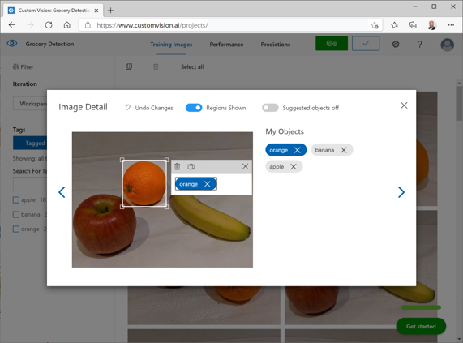
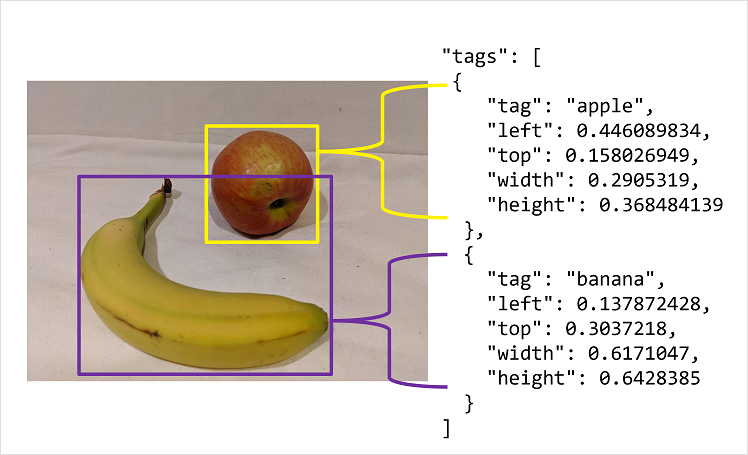

# 🧠 Detect Objects in Images with Azure AI Custom Vision

Azure AI Custom Vision enables you to build **object detection models** that can both **identify** and **locate** multiple objects in images. This is different from image classification, which only tells you _what_ is present, not _where_.

---

## 🚀 What You Need

To build and deploy an object detection solution, you must create **two separate Azure resources**:

| Resource Type     | Purpose                                              |
| ----------------- | ---------------------------------------------------- |
| 🔧 **Training**   | Used to train your model with labeled images         |
| 🎯 **Prediction** | Used to run inference (detect objects in new images) |

✅ Each has its own **endpoint** and **API keys**. You can train in one region and deploy predictions in others for geo-distributed apps.

---

## 🌐 Using the Custom Vision Portal

Head to [https://www.customvision.ai/](https://www.customvision.ai/) to:

- Create projects (classification or object detection)
- Upload and tag images
- Train, test, and publish models
- Monitor performance metrics like precision, recall, and mAP

Each project is linked to your Azure training resource and has a **unique Project ID** used in the SDK or API.

---

## 🏷️ Labeling Images for Object Detection

Unlike classification (which tags the _entire image_), object detection requires:

- A **tag** (label for the object)
- A **bounding box** (location of the object in the image)

### 🔥 Portal Features for Labeling

- You can manually **draw bounding boxes** and assign tags.
- The portal automatically suggests bounding regions to speed up the process.

---

### ✨ Smart Labeler Tool (Game Changer!)

> 📒 **Note**: After tagging an initial batch of images and training your first model, the **Smart Labeler Tool** becomes available. It uses your trained model to:
>
> - Suggest bounding box **regions**
> - Predict **tags** for new images
>
> This dramatically speeds up labeling and improves consistency.

<div style="text-align: center;">
  
</div>

---

## 🛠️ Alternative Labeling Options

You can use third-party tools like **LabelImg**, **VoTT**, or **CVAT** and convert their output into the Custom Vision format.

Bounding boxes must be normalized (values between `0.0` to `1.0`):

```json
{
  "left": 0.1,
  "top": 0.5,
  "width": 0.5,
  "height": 0.25
}
```

Example interpretation:

- Left: 10% from left
- Top: 50% from top
- Width: 50% of image
- Height: 25% of image

<div style="text-align: center;">
  
</div>

---

## 🧠 How Object Detection Works

Your model learns from:

1. 🏷 **What** is in the image (tags like “banana”, “apple”)
2. 📦 **Where** it is (bounding box coordinates)

> At prediction time, you get a **list of objects** with **probability scores** and **location boxes** in image-relative coordinates.

---

## 🤖 Build a Client Application

### 🐍 Python SDK

```python
from msrest.authentication import ApiKeyCredentials
from azure.cognitiveservices.vision.customvision.prediction import CustomVisionPredictionClient

# Authenticate
credentials = ApiKeyCredentials(in_headers={"Prediction-key": "<YOUR_KEY>"})
client = CustomVisionPredictionClient("<ENDPOINT>", credentials)

# Load image
with open("fruit.jpg", "rb") as image:
    result = client.detect_image("<PROJECT_ID>", "<MODEL_NAME>", image.read())

# Process results
for pred in result.predictions:
    if pred.probability > 0.5:
        print(f"{pred.tag_name} ({pred.probability:.2%})")
        print(f"→ Left: {pred.bounding_box.left}, Top: {pred.bounding_box.top}, "
              f"Width: {pred.bounding_box.width}, Height: {pred.bounding_box.height}")
```

---

### 💻 C# SDK

```csharp
using Microsoft.Azure.CognitiveServices.Vision.CustomVision.Prediction;
using System.IO;

var client = new CustomVisionPredictionClient(new ApiKeyServiceClientCredentials("<YOUR_KEY>"))
{
    Endpoint = "<ENDPOINT>"
};

using var imageData = File.OpenRead("fruit.jpg");

var result = client.DetectImage(
    Guid.Parse("<PROJECT_ID>"),
    "<MODEL_NAME>",
    imageData);

foreach (var pred in result.Predictions)
{
    if (pred.Probability > 0.5)
    {
        Console.WriteLine($"{pred.TagName} ({pred.Probability:P1})");
        Console.WriteLine($"→ Left: {pred.BoundingBox.Left}, Top: {pred.BoundingBox.Top}, " +
                          $"Width: {pred.BoundingBox.Width}, Height: {pred.BoundingBox.Height}");
    }
}
```

---

### 🛰️ cURL / Bash (REST API)

```bash
curl -X POST "https://<ENDPOINT>/customvision/v3.0/Prediction/<PROJECT_ID>/detect/iterations/<MODEL_NAME>/image" \
  -H "Prediction-Key: <YOUR_KEY>" \
  -H "Content-Type: application/octet-stream" \
  --data-binary "@fruit.jpg"
```

**Sample JSON Response:**

```json
{
  "predictions": [
    {
      "tagName": "banana",
      "probability": 0.95,
      "boundingBox": {
        "left": 0.13,
        "top": 0.3,
        "width": 0.62,
        "height": 0.64
      }
    }
  ]
}
```

---

## 🧪 Summary Table

| Feature              | Object Detection                                 |
| -------------------- | ------------------------------------------------ |
| 🧠 Output            | Tags + Bounding Boxes                            |
| 🛠️ Labeling required | Tag per region + bounding box                    |
| 🧭 Portal assistance | Auto-boxing, Smart Labeling                      |
| 🧰 Best for          | Multi-object images (e.g., bananas + apples)     |
| 📦 Output Format     | JSON w/ tags, confidence, normalized coordinates |

---

## ✅ Final Tips for AI-102 Exam

- Memorize normalized box structure: `left`, `top`, `width`, `height`
- Know the SDK authentication and API structure
- Expect questions on **differences between classification vs detection**
- Smart Labeler Tool may appear in scenario questions
