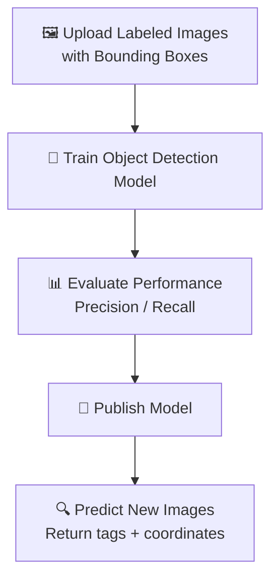

# 🎯 Azure Custom Vision – Object Detection 🧠🔍

## 📦 What is Object Detection?

**Object Detection** not only tells you _what_ is in the image… but also _where_ it is.

It’s like giving your AI **eyes AND a pointing finger** 👆.

> “There's a dog 🐶 at (x=53, y=24, width=120, height=90).”

---

## 🧪 Official Microsoft Definition

> Object detection in **Azure Custom Vision** allows you to **locate and classify multiple objects** within a single image, each with **bounding boxes** and **associated tags**.

---

## 🧠 Classification vs. Object Detection

| Feature         | Image Classification     | Object Detection                          |
| --------------- | ------------------------ | ----------------------------------------- |
| Purpose         | Is this image a cat?     | Where are the cats in this image?         |
| Output          | Tags                     | Tags + bounding box (x, y, width, height) |
| Use Case        | Profile photo moderation | Detect cars in parking lot                |
| SDK Differences | `classify_image()`       | `detect_objects()`                        |

---

## 🎯 Common Use Cases

| Use Case               | Example                                      |
| ---------------------- | -------------------------------------------- |
| 🛍️ Retail              | Detect product placement in shelf            |
| 🚗 Smart Vehicles      | Detect pedestrians or traffic signs          |
| 🏭 Manufacturing       | Detect defects or missing parts in machinery |
| 🐦 Wildlife Monitoring | Detect animals in camera trap images         |

---

## 🧰 Step-by-Step Workflow (Conceptual)

<div align="center">



</div>

---

## 🧱 Setting Up Object Detection Project

When creating the project in the **Custom Vision Portal**:

1. Select **Project Type** → `Object Detection`
2. Choose **Domain** → `General (Object Detection)` or a domain optimized for your scenario
3. Choose **Multiclass** or **Multilabel** (just like classification)

---

## 🖼️ Tagging with Bounding Boxes

You must draw **bounding boxes** around objects manually (or with tools), tagging each one with a relevant label.

Each image must:

- Include **at least one object**
- Be **realistic** in size, angle, and lighting
- Have **diverse examples per tag**

💡 Minimum 15 tagged objects per label is recommended.

---

## 🧪 Training the Model

- Training works just like classification: click **"Train"**
- You'll get a model **iteration**
- Model learns:

  - **What the object looks like**
  - **Where it’s located in images**

---

## 📊 Evaluation Metrics (Exam Tip 📘)

| Metric                           | Description                                                    |
| -------------------------------- | -------------------------------------------------------------- |
| **Precision**                    | Of all detected objects, how many were right?                  |
| **Recall**                       | Of all real objects, how many were found?                      |
| **Mean Average Precision (mAP)** | Area under the Precision-Recall curve; key in object detection |

> Higher **mAP** = better localization + tagging

---

## 🚀 Publishing and Using the Model

After you're satisfied with results:

1. **Publish the model** to the **Prediction Resource**
2. Use the **Prediction API / SDK** to detect objects in new images

---

## 🤖 Prediction Output – What You Get

You’ll get a list of detected objects with:

- `tagName`
- `probability`
- `boundingBox` → with `left`, `top`, `width`, `height` (all normalized 0–1)

🧪 Example result:

```json
{
  "tagName": "Car",
  "probability": 0.91,
  "boundingBox": {
    "left": 0.12,
    "top": 0.34,
    "width": 0.25,
    "height": 0.18
  }
}
```

> You’ll convert these values into pixel dimensions relative to your image size.

---

## ⚠️ Special Notes for Object Detection

- Bounding boxes must be **tight but not overly tight**
- Don’t mix multiple tags on the same object
- Avoid overfitting with **diverse images** (lighting, backgrounds)
- Set **confidence thresholds** in your app (e.g., only show results > 0.8)

---

## 🧪 SDK Prediction Example (Minimal)

```python
from azure.cognitiveservices.vision.customvision.prediction import CustomVisionPredictionClient

predictor = CustomVisionPredictionClient(prediction_key, endpoint)
results = predictor.detect_image(project_id, "myModel", image_data)

for result in results.predictions:
    print(f"{result.tag_name}: {result.probability}, Box: {result.bounding_box}")
```

---

## 🧩 Comparing Object Detection with Image Classification

| Feature                 | Classification            | Object Detection            |
| ----------------------- | ------------------------- | --------------------------- |
| Detect multiple objects | ❌ (multi-label optional) | ✅ Yes                      |
| Localize object         | ❌                        | ✅ (bounding boxes)         |
| Tag + Location          | Tag only                  | Tag + Position              |
| Input data              | Tagged image              | Tagged image + bounding box |

---

## 🧑‍🏫 AI-102 Learning Tips

| Task                                        | Skill Gained                            |
| ------------------------------------------- | --------------------------------------- |
| Try building both a classifier and detector | Learn the real-world difference         |
| Manually label data in portal               | Understand the pain of data labeling    |
| Tune thresholds in prediction               | Learn to control accuracy tradeoffs     |
| Evaluate precision vs recall                | Be ready for model comparison questions |

---

## 🛠️ Real-World Dev Notes

| Concern                   | Solution                                       |
| ------------------------- | ---------------------------------------------- |
| Need real-time detection? | Use smaller models + edge deployment with ONNX |
| Limited data?             | Use **data augmentation** tools                |
| Many object types?        | Use **multi-label object detection**           |

---

## 🔐 Governance & Cost

- Keys must be rotated securely (use Azure Key Vault)
- Consider prediction cost per 1000 images
- Free tier available (limited # of projects)

---

## 📚 Resources

- [🧠 Custom Vision Portal](https://customvision.ai/)
- [🛠️ SDK Docs – Python](https://learn.microsoft.com/en-us/python/api/overview/azure/cognitiveservices/vision/customvision)
- [📘 REST API – Detect Objects](https://learn.microsoft.com/en-us/rest/api/cognitiveservices/customvision-prediction-api/detectimage)

---

## ✅ Summary – Object Detection with Azure

| Step | Action                          |
| ---- | ------------------------------- |
| 1️⃣   | Create Object Detection project |
| 2️⃣   | Upload images + draw boxes      |
| 3️⃣   | Train model                     |
| 4️⃣   | Evaluate using mAP              |
| 5️⃣   | Publish and predict             |
