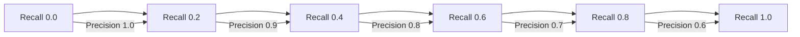
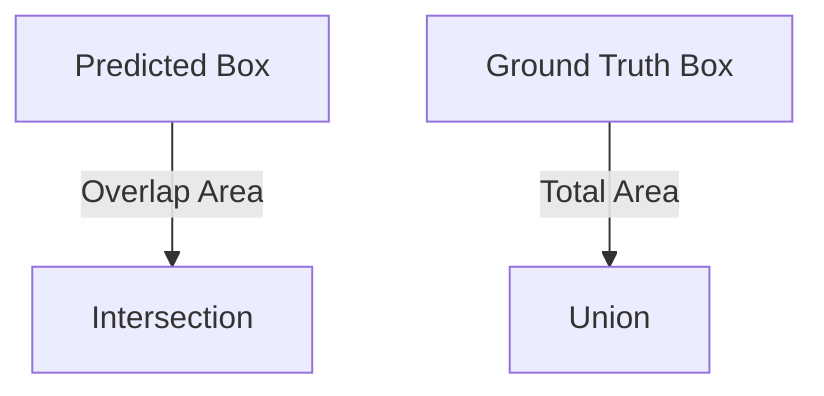

# 📏📊 Object Detection Evaluation Metrics

You’ve trained your model, and it starts drawing boxes around things. But how do you know it’s doing a _good_ job?

That's where **Evaluation Metrics** come in!

---

## 🔢 Key Terms You Must Know

| Term                              | Description                                                       |
| --------------------------------- | ----------------------------------------------------------------- |
| **True Positive (TP)**            | Correctly detected object (right class, right location)           |
| **False Positive (FP)**           | Detected something that _wasn’t there_ or misclassified an object |
| **False Negative (FN)**           | Missed a real object – should’ve detected it, but didn’t          |
| **IoU (Intersection over Union)** | A measure of how much the predicted box overlaps the actual box   |

---

## 🧮 Object detection Metrics – With Pizza 🍕

Let’s say your job is to detect **pepperonis** on a pizza 🍕 using object detection.

### 🎯 **1.Precision**

> Out of all pepperonis you _found_, how many were **actually** pepperoni?

```text
Precision = TP / (TP + FP)
```

🎯 High precision = few false alarms

🔍 Use Case: Self-driving car doesn’t want to think a mailbox is a child 😬

---

### 🔍 **2.Recall**

> Out of all the real pepperonis on the pizza, how many did you actually find?

```text
Recall = TP / (TP + FN)
```

🎯 High recall = fewer misses

🔍 Use Case: Detecting tumors in medical scans – you want to catch _everything_

---

### 📊 **3.mAP** – Mean Average Precision

> **mAP** stands for **Mean Average Precision**. It is the **average** of the **precision scores** calculated at various **recall levels**, across all object categories.

Let’s unpack it:

#### 🧮 Step-by-step

1. Calculate **Precision & Recall** at different confidence thresholds
2. Plot a **Precision-Recall Curve**
3. Compute the **Area Under Curve (AUC)** → This is called **AP (Average Precision)** for one class
4. Repeat for each class → dog, cat, pepperoni, etc.
5. Take the **mean** of all APs → this is your **mAP**

---

#### 📈 Visual: Precision-Recall Curve

<div align="center">



</div>

> 📌 The area under this curve = **AP** for one class.  
> 📌 Average this across classes = **mAP**.  
> 🚨 **mAP** This is the **most important** metric in object detection. AI-102 exam expects you to know this one well.

---

### 🌌 **4.IoU** – Intersection over Union

It's how much your predicted box overlaps with the actual pepperoni.

<div align="center">



</div>

📏 Formula:

```text
IoU = Area of Overlap / Area of Union
```

🔁 Typical thresholds: `0.5` or `0.75` (higher = stricter)

---

## 📦 Azure Custom Vision mAP in Practice

When you **train your object detection model**, Azure shows:

- **mAP (Mean Average Precision)**
- **Precision**
- **Recall**
- **Per-tag metrics** too

| Tag     | Precision | Recall | AP (Area) |
| ------- | --------- | ------ | --------- |
| Car     | 0.93      | 0.88   | 0.90      |
| Bus     | 0.88      | 0.94   | 0.91      |
| Person  | 0.80      | 0.85   | 0.82      |
| **mAP** |           |        | **0.88**  |

---

## 🧪 Sample Confusion Example

Let’s say your object detection model:

- Correctly detects 4 cats (TP = 4)
- Misses 1 real cat (FN = 1)
- Incorrectly detects 2 dogs as cats (FP = 2)

🔍 Calculate:

```text
Precision = 4 / (4 + 2) = 0.67
Recall    = 4 / (4 + 1) = 0.80
```

---

## 🧠 Which Metric to Use When?

| Goal                                    | Use This Metric |
| --------------------------------------- | --------------- |
| Catch as many harmful items as possible | Recall          |
| Avoid false positives (high confidence) | Precision       |
| Balance both (overall performance)      | mAP             |
| Evaluate by class                       | Per-class AP    |

---

## 🎢 Precision and Recall Tradeoff

You can’t always have both. Imagine:

- High Precision, Low Recall = You detect only _perfect_ pepperonis, but miss some real ones.
- High Recall, Low Precision = You detect _everything that looks like pepperoni_, including olives 🫒

---

## 🧠 Exam Tips – Memorize This

- ✅ **IoU** – How much your predicted box overlaps real object
- ✅ **Precision** – Accuracy of your detections
- ✅ **Recall** – How many objects you found
- ✅ **mAP** – Mean of all average precision across classes
- ✅ Azure Custom Vision shows these right after training

---

## 🧪 Want to Test This?

Head to the [Custom Vision Portal](https://customvision.ai), create an object detection project, upload images, draw boxes, and click **Train**.
Then go to the **Performance tab**, and you’ll see:

```text
Mean Average Precision: 0.89
Precision: 0.91
Recall: 0.87
```
