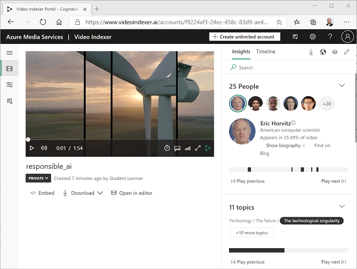
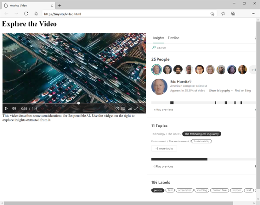

# 🎬 Analyze Video with Azure Video Indexer

_Extract AI-powered insights from video and audio content using Microsoft Azure!_

---

## 🧠 What is Azure Video Indexer?

**Azure Video Indexer** is an AI-powered service that extracts rich insights from `audio` and `video` files,

It uses multiple Azure AI services behind the scenes, all packaged under one powerful REST API or portal interface.

---

<div style="text-align: center;">
    
</div>

---

## 🧩 Key Features & Capabilities

| Capability                              | Description                                                         |
| --------------------------------------- | ------------------------------------------------------------------- |
| **Face Recognition**                    | Detect and identify known people (requires Limited Access approval) |
| **OCR (Optical Character Recognition)** | Extract readable text from video frames                             |
| **Speech Transcription**                | Convert spoken audio to text                                        |
| **Speaker Diarization**                 | Distinguish between speakers                                        |
| **Topic Detection**                     | Identify concepts/themes in conversations                           |
| **Sentiment Analysis**                  | Detect tone (positive, neutral, negative)                           |
| **Object Labels**                       | Identify common objects (cars, fruit, logos)                        |
| **Content Moderation**                  | Flag adult or violent content                                       |
| **Scene Segmentation**                  | Split video into logical scenes with thumbnails                     |

---

## 🔐 Customization Options

Azure Video Indexer supports **custom models** to fit your business:

| Custom Model | Purpose                                                               |
| ------------ | --------------------------------------------------------------------- |
| **Person**   | Train facial recognition using your own images (e.g. known employees) |
| **Language** | Add domain-specific terminology to improve transcriptions             |
| **Brands**   | Detect specific products, logos, or project names                     |

> 🚨 **Note**: Person model training **requires Limited Access** under Microsoft's Responsible AI Standard.

---

## 🌐 Ways to Use It

### 🖥 1. **Azure Video Indexer Portal**

- Drag and drop videos for upload
- Review AI-extracted insights visually
- Great for business users & testing

### 🧩 2. **Embedded Widgets**

- Use widgets (video player + timeline insights) in your own web apps
- Share insights without exposing full portal access

```html
<iframe src="https://www.videoindexer.ai/embed/player/..."></iframe>
```

<div style="text-align: center;">
    
</div>

### 🔧 3. **REST API Access**

- Automate everything from upload to insights retrieval
- Requires authentication token

#### Example: Get Access Token

```http
GET https://api.videoindexer.ai/Auth/{location}/Accounts/{accountId}/AccessToken
```

#### Example: Get Video Details

```http
GET https://api.videoindexer.ai/{location}/Accounts/{accountId}/Videos?accessToken=<your_token>
```

---

## 📂 Supported File Formats & Upload Limits

### ✅ **Supported File Types**

| Type      | Extensions                                                     |
| --------- | -------------------------------------------------------------- |
| **Video** | `.mp4`, `.mov`, `.wmv`, `.avi`, `.flv`, `.mkv`, `.ts`, `.webm` |
| **Audio** | `.mp3`, `.wav`, `.m4a`, `.flac`, `.wma`, `.aac`, `.ogg`        |

### 📏 **Limitations**

| Property                         | Limit                               |
| -------------------------------- | ----------------------------------- |
| Max video size (via URL)         | **30 GB**                           |
| Max video size (via byte stream) | **2 GB**                            |
| Max duration                     | **4 hours**                         |
| Frame rate (recommended)         | \~2–3 fps (for scene detection/OCR) |
| Recommended resolution           | **720p–1080p** (≤ 30 fps)           |
| Storage quota                    | **30 GB total** per account         |
| Upload rate                      | 1 req/sec (≈ 60/min) per account    |

> 💡 **Tip**: For large files, always prefer **URL-based uploads** with Azure Blob SAS tokens.

---

## 📦 Sample Response (JSON)

```json
{
  "id": "30e66ec1b1",
  "name": "training-day.mp4",
  "created": "2025-06-20T16:50:00Z",
  "durationInSeconds": 124,
  "sourceLanguage": "en-US",
  "thumbnailId": "5584b7b7-xxxx-yyyy",
  "state": "Processed",
  "insights": {
    "faces": [...],
    "transcript": [...],
    "labels": [...],
    "sentiments": [...],
    "brands": [...]
  }
}
```

---

## 🚀 Best Practices

✅ **Use Azure Blob SAS URL** for large uploads
✅ **Request callback URL** to avoid polling for state
✅ **Use custom models** when generic transcription/recognition isn't enough
✅ **Respect quotas** and use retry logic with `Retry-After` header
✅ **Use low frame sampling (\~3 fps)** for better performance

---

## 📚 Summary Table

| Task                      | Where to do it                   |
| ------------------------- | -------------------------------- |
| Upload Video              | Portal / REST API / Blob URL     |
| Index & Analyze           | Automatic after upload           |
| View Insights             | Portal / REST API                |
| Share Insights            | Embedded widget                  |
| Automate Process          | REST API (token > upload > poll) |
| Extend with Custom Models | People, Brands, Language         |
