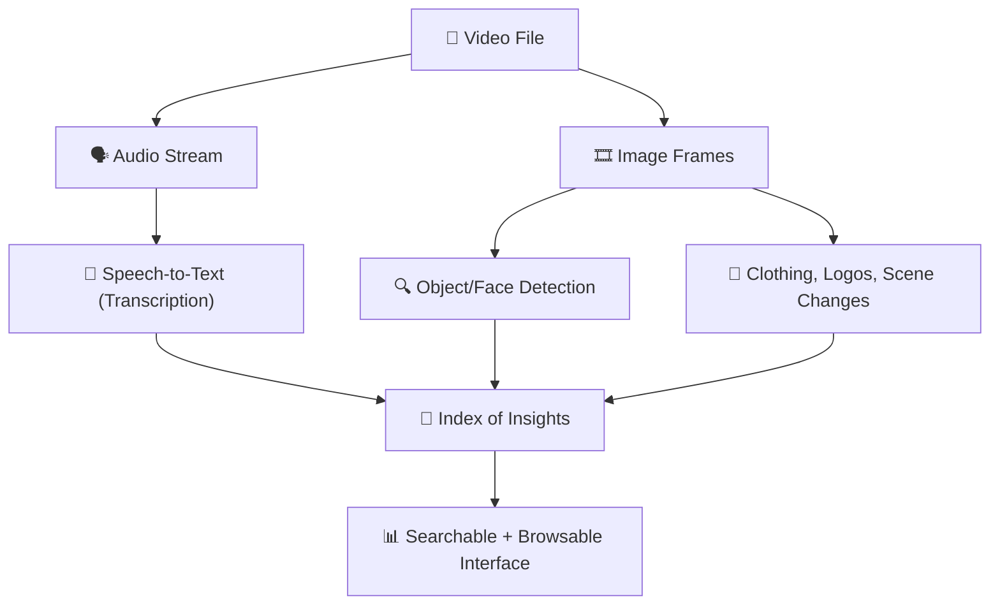
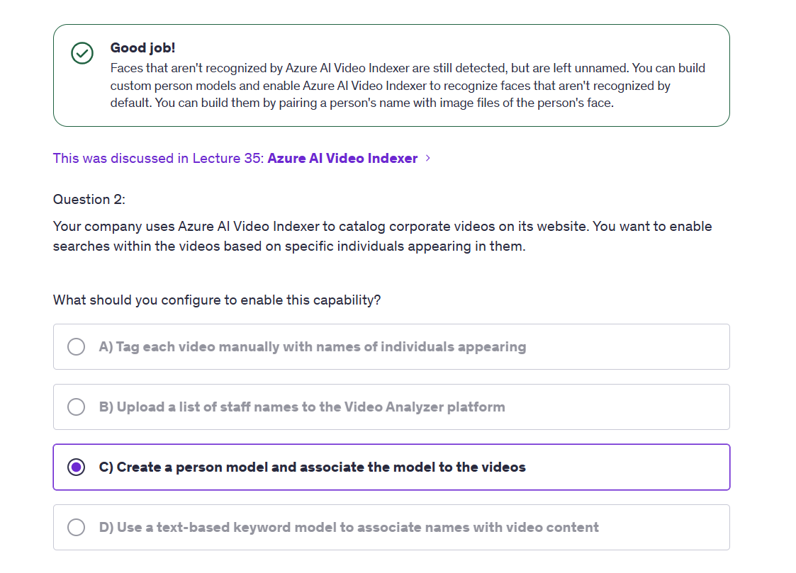
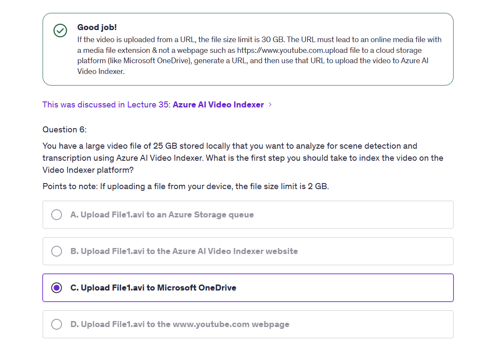

# 🎥 Azure AI Video Indexer — Understand Your Video Like a Pro

## 🧠 What Is Azure AI Video Indexer?

> **Official Definition**: _Azure AI Video Indexer is a composite service that automatically extracts insights from video and audio files using multiple AI models for transcription, face detection, object tracking, language identification, and more._

💡 **Translation**: Video Indexer = “YouTube-like super analyzer” powered by AI tools you already love (Speech to Text, Vision, Language, etc.)

It slices, it dices, it:

- 🗣️ Converts speech to accurate transcripts
- 🤖 Detects faces (even celebrities!)
- 📸 Analyzes images frame by frame
- 🔠 Detects keywords and topics
- 🎭 Finds emotions, brands, clothes, even background objects

---

## 🧬 How It Works Internally (Spoiler: It's Many Services)

**Video = Audio + Frames** → Each stream analyzed separately using existing AI tools → Output is searchable insights and metadata.

---

## 🧰 What Can It Detect?

| Feature                   | Description                                                                      |
| ------------------------- | -------------------------------------------------------------------------------- |
| 🧾 **Transcription**      | Extract accurate subtitles and searchable dialogue                               |
| 🧍 **People Detection**   | Finds **famous** and **unknown** faces, shows when and where they appear         |
| 📚 **Topic Extraction**   | Identifies themes (e.g. “machine learning”, “cybernetics”) based on spoken words |
| 🎭 **Emotion Detection**  | Joy, anger, sadness — based on voice tone                                        |
| 👕 **Attire & Objects**   | Recognizes logos, shirts, laptops, microphones                                   |
| 📌 **Scene Segmentation** | Breaks videos into chapters, like YouTube timestamps                             |
| 🌍 **Language Detection** | Automatically identifies and transcribes up to 10 languages                      |
| 🧠 **Custom Vocabulary**  | Teaches it niche terms (e.g., “AFD = Ancillary Function Driver”)                 |

---

## 🚀 Getting Started – No Code Needed

### 🛠️ Step-by-Step in Azure:

1. 🔍 Search **"Video Indexer"** in Azure Portal (not under AI Studio!)
2. 🏗️ Create the resource – pick a name, region, and storage account
3. 🤖 Enable managed identity + assign storage access role
4. 🌐 Visit [https://www.videoindexer.ai](https://www.videoindexer.ai)
5. 📤 Upload your video!
6. 🎯 Watch it get indexed: topics, faces, transcripts, objects, emotions

💬 Want to use it via **REST API**? Absolutely. Video Indexer supports full API access to:

- Upload
- Track indexing status
- Get insights (JSON)
- Customize models

---

## 📦 Presets & Configuration Options

When uploading a video, you can configure:

| Option                      | Purpose                                                                      |
| --------------------------- | ---------------------------------------------------------------------------- |
| 🎛️ **Indexing Presets**     | Choose what kind of AI detection to run (`objects`, `brands`, `faces`, etc.) |
| 🧠 **Enable OCR**           | Read text from visuals (e.g. "RØDE" on microphone)                           |
| 🔡 **Custom Vocabulary**    | Upload `.txt` or `.srt` files for extra tuning                               |
| 🌐 **Auto Language Detect** | Pick up to 10 languages for smart detection                                  |
| 🛑 **Adult/Racy Detection** | Classify inappropriate content from frames                                   |

---

## 📸 Example Insights (From Real Video Demo)

From a sample keynote video:

| Insight Type | Example                                                |
| ------------ | ------------------------------------------------------ |
| 🧑‍💼 People | Satya Nadella (40.9%), Jensen Huang (42.1%)            |
| 📚 Topics    | "AI", "Machine Learning", "Cybernetics", "Cloud"       |
| 🎭 Emotions  | Joy (23%), Anger (0.1%)                                |
| 👔 Clothing  | Long pants, short sleeves                              |
| 🖼️ Objects   | Laptop, Potted Plant, Microphone                       |
| 🗓️ Timeline  | Click to jump to specific topics or people appearances |

---

## 🤯 Bonus: Real Example of Super Accuracy

✅ Uploaded a complex video on Windows **networking drivers**  
✅ Video Indexer **transcribed terms like "AFD" (Ancillary Function Driver)**  
✅ Even expert humans struggle with that — this tool **nailed it perfectly!**

💡 Even niche technical domains (e.g., cybersecurity, medicine, law) are accurately transcribed when audio is clear.

---

## ⚠️ Caveats

- 🧏 If there's **no audio**, insights are limited (mostly frame-based analysis)
- 🔒 Trial account has **feature restrictions** (e.g., people detection may be disabled)
- 💸 It’s not free forever — paid plans exist based on video duration (e.g., 2400 minutes in free trial)
- 🚫 Some objects/logos may be misidentified (e.g., “RØDE” on a stand vs. actual microphone)

---

## 🎓 AI-102 Takeaways (Exam + Real World)

- ✅ Know that **Video Indexer is a composite AI service**
- ✅ Uses Speech + Vision + OCR under the hood
- ✅ Outputs **multi-layered insights**: people, speech, sentiment, brands
- ✅ Understand use cases: **media, surveillance, education, RAG pipeline**
- ✅ Highly useful for **searching videos**, breaking down large corpora
- ✅ Available via **portal UI + REST API**
- ✅ Custom vocab/training available to fine-tune detection

---

## 🧠 Use Cases You Should Remember

| Use Case                  | Value Add                                                   |
| ------------------------- | ----------------------------------------------------------- |
| 🏫 Educational Videos     | Auto-caption, detect topics, build chapters                 |
| 📺 Media & News Archives  | Detect speakers, topics, brands                             |
| 🧾 Legal Depositions      | Timestamped transcript, searchable dialogue                 |
| 🚨 Law Enforcement        | Detect presence, timing, and behavior of people             |
| 🧠 RAG with Video Content | Index video → convert to searchable chunks → feed to OpenAI |

---

## 📒 Notebooks

    

---

    

