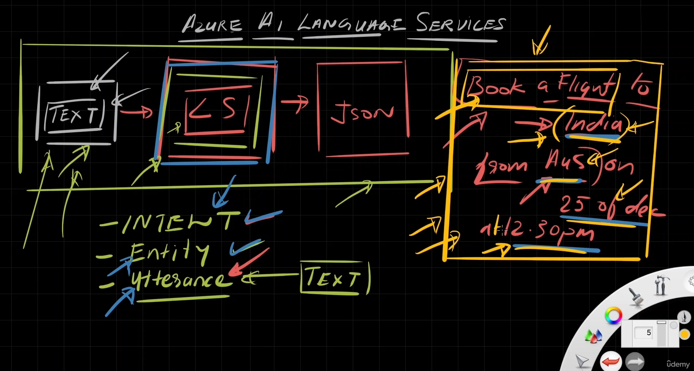

# 🧠 Azure AI Language Service – Conversation Analysis

## 🗂️ Official Definition

> **Azure AI Language** is a cloud-based service that provides natural language processing capabilities such as:  
> `sentiment analysis`, `language detection`, `key phrase extraction`, `conversation analysis`, `entity recognition`, and more—using pre-trained or custom models.

**🗨️ Conversation Analysis** is a lightweight, intent-driven NLP model that extracts structured info (intents + entities) from natural utterances—like building a task-focused chatbot without a full LLM.

---

<div style="text-align: center;">
    
</div>

---

## 🧠 Key Concepts

### 🗣️ 1. Utterance

> “A single phrase the user types or speaks”

💬 Example:

```text
"Book a flight to New York on December 25th."
```

---

### 🎯 2. Intent

> “The user’s goal or task in the utterance.”

💡 Example:

```text
"BookFlight"
```

🧠 Think of it like a method or function name. Your app routes logic based on this.

---

### 🧩 3. Entity

> “A variable extracted from the utterance to fulfill the intent.”

🧾 Example:

```json
{
  "Destination": "New York",
  "Date": "December 25"
}
```

---

## 🧬 Anatomy of a Project

You define:

```json
{
  "intents": ["BookFlight", "CancelFlight"],
  "entities": ["Location", "Date", "Time"],
  "utterances": ["Book a flight to {Location} on {Date}", "Cancel my flight on {Date}"]
}
```

---

## 🚀 Endpoint (Prediction)

```http
POST https://<your-resource-name>.cognitiveservices.azure.com/language/analyze-conversations/jobs?api-version=2023-04-01
```

> 🧪 This endpoint is used to analyze user utterances using a trained conversation project.

---

## 📥 Sample Request

```json
{
  "kind": "Conversation",
  "parameters": {
    "projectName": "flight-booking-bot",
    "deploymentName": "production"
  },
  "analysisInput": {
    "conversationItem": {
      "id": "1",
      "participantId": "user1",
      "modality": "text",
      "language": "en",
      "text": "I want to fly from London to Dubai on 1st July at 10 AM"
    }
  }
}
```

---

## 📤 Sample Response

```json
{
  "kind": "ConversationResult",
  "result": {
    "query": "I want to fly from London to Dubai on 1st July at 10 AM",
    "prediction": {
      "projectKind": "Conversation",
      "topIntent": "BookFlight",
      "intents": [
        {
          "category": "BookFlight",
          "confidenceScore": 0.92
        },
        {
          "category": "CancelFlight",
          "confidenceScore": 0.07
        }
      ],
      "entities": [
        {
          "category": "Source",
          "text": "London",
          "offset": 20,
          "length": 6,
          "confidenceScore": 0.87
        },
        {
          "category": "Destination",
          "text": "Dubai",
          "offset": 30,
          "length": 5,
          "confidenceScore": 0.89
        },
        {
          "category": "Date",
          "text": "1st July",
          "offset": 40,
          "length": 8,
          "confidenceScore": 0.88
        },
        {
          "category": "Time",
          "text": "10 AM",
          "offset": 51,
          "length": 5,
          "confidenceScore": 0.85
        }
      ]
    }
  }
}
```

---

## 🧪 Training vs Prediction

| 🔧 Phase   | 🎯 Purpose                           | 🧰 Tool               |
| ---------- | ------------------------------------ | --------------------- |
| Training   | Define intents, utterances, entities | Azure Language Studio |
| Prediction | Send new user input to get result    | REST API / SDK        |

---

## 🧰 Tooling Options

- 🧑‍💻 SDKs (Python, C#, Node.js)
- 🌐 REST API (as shown above)
- 🧪 No-code via [Language Studio](https://language.azure.com)

---

## 🧠 Comparison: LLM vs Conversation Analysis

| Feature | ChatGPT / LLMs                 | Conversation Analysis              |
| ------- | ------------------------------ | ---------------------------------- |
| Size    | 🐘 Large                       | 🪶 Lightweight                      |
| Speed   | 🚶‍♂️ Slower                      | 🚀 Fast, low-latency               |
| Cost    | 💰 Expensive                   | 💸 Cost-effective                  |
| Usage   | ✍️ Text generation & reasoning | 🎯 Intent & entity detection only  |
| Control | 🧩 Harder to control           | 🧰 Highly structured and trainable |

---

## 🧪 Use Case in Action

🗣️ User says:

> “Book a flight from Cairo to Dubai on Friday at 6 PM”

🎯 Extracted:

- **Intent:** BookFlight
- **Entities:**

  - `Source: Cairo`
  - `Destination: Dubai`
  - `Date: Friday`
  - `Time: 6 PM`

Your backend can then use this to call an API like:

```bash
POST /api/flights/book { destination: "Dubai", date: "Friday", time: "6PM" }
```

---

## ✅ Exam Tips

- Learn the 🔑 difference between `Intent`, `Entity`, `Utterance`
- REST endpoint is `/language/analyze-conversations/jobs`
- Prebuilt = no training; Custom = training required
- Azure Studio allows full labeling and testing UI
- Know difference vs OpenAI LLM (purpose-built vs generative)
