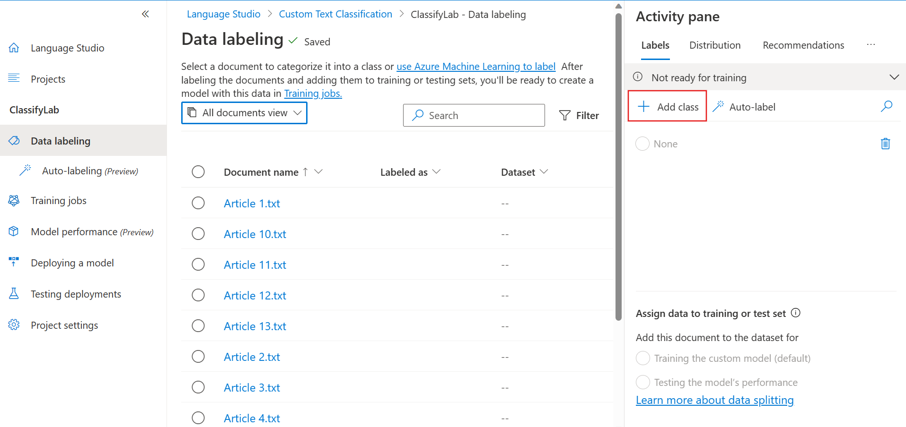
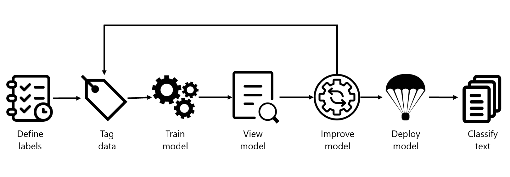

# 🧠 Azure AI Language – Custom Text Classification (NLP AI)

> Build your own AI model that reads and classifies text—like emails, reviews, or articles—into categories you define.

---

<div style="text-align: center;">
  
</div>

---

## 📌 What You’ll Learn

By the end of this topic, you’ll be able to:

- ✅ Understand single-label vs multi-label classification projects
- ✅ Create, tag, train, and deploy classification models
- ✅ Use the REST API to submit and evaluate predictions
- ✅ Split your data and improve your model
- ✅ Deploy and consume the model via endpoint

---

## 🤖 What is Custom Text Classification?

Custom Text Classification lets you train a model to assign **your own labels** to natural language documents (like “Support Request”, “Order”, or “Complaint”).

Azure AI Language supports two classification types:

| Classification Type | Description                                    | Example                                        |
| ------------------- | ---------------------------------------------- | ---------------------------------------------- |
| **Single-label**    | Each document can be assigned only one class   | A game summary labeled only as "Action"        |
| **Multi-label**     | Each document can be assigned multiple classes | A game labeled as both "Action" and "Strategy" |

---

<div style="text-align: center;">
  
</div>

---

## 🧪 Project Lifecycle: From Labels to Live Predictions

<div style="text-align: center;">
  
</div>

---

### 🔁 Full Project Lifecycle

1. **Define Labels**
   Choose the categories you want (e.g., `Adventure`, `Strategy`, `Support`, `Billing`).

2. **Tag Training Data**
   Assign these labels to documents manually or in bulk.

3. **Train the Model**
   Azure trains the model based on examples you tagged.

4. **Evaluate Results**
   Review Precision, Recall, and F1 Score to identify gaps.

5. **Improve Model**
   Add more diverse examples or adjust labels.

6. **Deploy Model**
   Deploy versioned models for real-time or batch predictions.

7. **Submit Predictions**
   Use REST API or SDK to send text and get classified output.

---

## 🧮 Key Evaluation Metrics

| Metric        | Description                                                              |
| ------------- | ------------------------------------------------------------------------ |
| **Recall**    | Of all the correct labels, how many were found? (True Positive %)        |
| **Precision** | Of all predicted labels, how many were correct? (True Positive Accuracy) |
| **F1 Score**  | Balance between Recall and Precision (2×(P×R)/(P+R))                     |

Example insight:
If your model misclassifies “Strategy” games as “Action,” boost training data with more distinct Strategy examples.

---

## 🧱 Dataset Splitting Options

| Split Type    | Training Set | Testing Set | Use Case                                         |
| ------------- | ------------ | ----------- | ------------------------------------------------ |
| **Automatic** | 80%          | 20%         | Quick setup with large datasets                  |
| **Manual**    | Custom       | Custom      | Precise control for small or imbalanced datasets |

In REST API, controlled via:

```json
"evaluationOptions": {
  "kind": "percentage",
  "trainingSplitPercentage": 80,
  "testingSplitPercentage": 20
}
```

---

## 📦 Project Definition – REST JSON Payload

### 🟨 Single-Label Classification Payload

```json
{
  "projectFileVersion": "2022-05-01",
  "metadata": {
    "projectName": "MySingleProject",
    "projectKind": "customSingleLabelClassification",
    "language": "en"
  },
  "assets": {
    "classes": [{ "category": "Adventure" }, { "category": "Action" }],
    "documents": [
      {
        "location": "document1.txt",
        "dataset": "Training",
        "class": { "category": "Adventure" }
      }
    ]
  }
}
```

### 🟩 Multi-Label Classification Payload

```json
{
  "projectFileVersion": "2022-05-01",
  "metadata": {
    "projectName": "MyMultiProject",
    "projectKind": "customMultiLabelClassification",
    "language": "en"
  },
  "assets": {
    "classes": [{ "category": "Strategy" }, { "category": "Adventure" }],
    "documents": [
      {
        "location": "doc2.txt",
        "dataset": "Training",
        "classes": [{ "category": "Strategy" }, { "category": "Adventure" }]
      }
    ]
  }
}
```

---

## 🚀 Submitting a Classification Task

### 🧾 Request Format

```http
POST /language/analyze-text/jobs?api-version=2023-04-01
Host: <YOUR-ENDPOINT>
Ocp-Apim-Subscription-Key: <YOUR-KEY>
Content-Type: application/json
```

### 🧠 Request Body

```json
{
  "displayName": "Classify Feedback",
  "analysisInput": {
    "documents": [{ "id": "1", "language": "en", "text": "This game is fast-paced and exciting!" }]
  },
  "tasks": [
    {
      "kind": "CustomSingleLabelClassification",
      "taskName": "FeedbackTask",
      "parameters": {
        "projectName": "MyGameProject",
        "deploymentName": "v1"
      }
    }
  ]
}
```

Check result using the `operation-location` header with a GET request.

---

## 📡 Deployment Best Practices

- Each project can have **up to 10 named deployments**
- Use deployment name (e.g. `v1`, `staging`, `prod`) to compare model performance
- Switch deployment without changing client code—just change the `deploymentName` value

---

## 🔐 API Endpoint Patterns

| Action             | Endpoint Format                                                          |
| ------------------ | ------------------------------------------------------------------------ |
| Train Model        | `POST /language/analyze-text/projects/<project-name>/:train`             |
| Check Train Status | `GET /language/analyze-text/projects/<project-name>/train/jobs/<job-id>` |
| Submit Job         | `POST /language/analyze-text/jobs`                                       |
| Get Job Result     | `GET /language/analyze-text/jobs/<job-id>`                               |

---

## 💡 Tips for Better Accuracy

| Strategy                       | Benefit                                       |
| ------------------------------ | --------------------------------------------- |
| Add diverse examples per class | Improves generalization                       |
| Avoid ambiguous labels         | Cleaner classification boundaries             |
| Balance class distribution     | Prevents bias toward majority class           |
| Combine labels smartly         | e.g. `Adventure + Strategy`, not just `Mixed` |
| Monitor F1 Score               | Best metric for imbalanced datasets           |

---

## 🧠 AI-102 Exam Checklist

✅ Know difference between Single vs Multi-label
✅ Understand F1 Score vs Recall vs Precision
✅ Be able to structure REST payloads
✅ Know what each field in the JSON payload means
✅ Understand project lifecycle steps
✅ Know how to deploy and consume predictions

---

## 🔗 Resources

- 📚 [Azure Docs: Custom Classification](https://learn.microsoft.com/en-us/azure/ai-services/language-service/custom-text-classification/overview)
- 🛠️ [Language Studio (GUI)](https://language.cognitive.azure.com/)
- 🧪 [REST API Reference](https://learn.microsoft.com/en-us/azure/ai-services/language-service/quickstarts)
