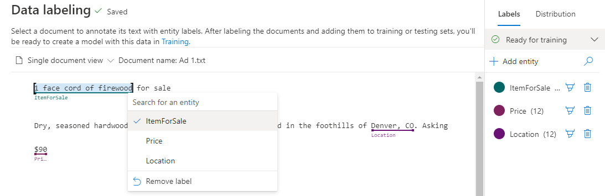
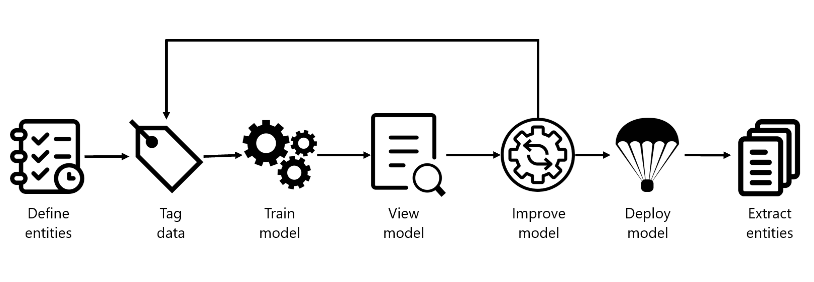

# 🧠 Azure AI Language: Custom Named Entity Recognition (NER)

## 📘 What is Custom NER?

> _"Custom Named Entity Recognition (Custom NER) allows you to extract domain-specific entities (like item names, prices, locations) from unstructured text using your own labels."_

Use it when built-in NER (like recognizing names, locations, dates) isn't enough — and you need **very specific** extractions like:

- Product names in e-commerce
- Legal clause types in contracts
- Inventory or part numbers in manuals

---

<div style="text-align: center;">
    
</div>

---

## 🧰 Built-in vs Custom NER

| Feature        | Built-in NER                    | Custom NER                                 |
| -------------- | ------------------------------- | ------------------------------------------ |
| Use case       | General categories (Name, Date) | Domain-specific (e.g., Price, ItemForSale) |
| Setup required | None                            | You define entity labels                   |
| Accuracy       | General-purpose                 | Highly accurate with good training data    |
| Examples       | "John" → Person                 | "face cord of firewood" → ItemForSale      |

---

## 🛠️ Project Workflow: Custom NER Lifecycle

<div style="text-align: center;">
    
</div>

---

### 1. 🏷️ Define Entities

Think of these as your custom tags. Examples:

- `ItemForSale`
- `Price`
- `Location`

> ✨ Tip: Keep your entities distinct (not too broad like “Contact Info” — break it into Email, Phone, etc.)

---

### 2. ✍️ Label Data (Tag Entities)

Using **Language Studio**:

- Select text spans and tag with your entity label.
- Save each document after tagging.
- Maintain:

  - ✅ **Consistency**: Same way across all files
  - ✅ **Precision**: Don’t over- or under-label
  - ✅ **Completeness**: Capture all examples

📸 _Example:_

- "face cord of firewood" → `ItemForSale`
- "\$90" → `Price`
- "Denver, CO" → `Location`

---

### 3. 🧪 Train the Model

Use either:

- ✅ **Language Studio**
- 🧑‍💻 **Authoring REST API**:

```http
POST /language/analyze-text/projects/{project-name}/train?api-version=2023-05-01
```

#### Payload example:

```json
{
  "modelLabel": "v1.0",
  "trainingConfigVersion": "latest",
  "evaluationOptions": {
    "kind": "percentage",
    "trainingSplitPercentage": 80,
    "testingSplitPercentage": 20
  }
}
```

---

### 4. 📊 Evaluate Your Model

Metrics:

| Metric       | Description                                     |
| ------------ | ----------------------------------------------- |
| 🎯 Precision | Of the entities detected, how many are correct? |
| 🔍 Recall    | Of the actual entities, how many were detected? |
| 🧪 F1 Score  | Balance between precision and recall            |

📉 **Low Precision**: Model detects wrong entities
📉 **Low Recall**: Model misses entities
💡 Use Confusion Matrix to see where it struggles most

---

### 5. 🔁 Improve Model

Strategies:

- Add diverse document formats
- More examples for confusing entities
- Use real-world data when possible
- Split broad entities into narrower ones

---

### 6. 🚀 Deploy the Model

Each project can have up to **10 deployments**. Pick a meaningful name like `ner-prod-v1`.

```http
POST /language/analyze-text/projects/{project-name}/deployments?api-version=2023-05-01
```

---

### 7. 📤 Extract Entities via API

**Request:**

```http
POST https://<your-endpoint>/language/analyze-text/jobs?api-version=2023-05-01
```

**Headers:**

```ini
Ocp-Apim-Subscription-Key: <your-key>
Content-Type: application/json
```

**Payload:**

```json
{
  "displayName": "ExtractEntities",
  "analysisInput": {
    "documents": [
      {
        "id": "1",
        "text": "Dry, seasoned hardwood, $90, in Denver, CO."
      }
    ]
  },
  "tasks": [
    {
      "kind": "CustomEntityRecognition",
      "taskName": "NER-Task",
      "parameters": {
        "projectName": "MyProject",
        "deploymentName": "ner-prod-v1"
      }
    }
  ]
}
```

**Result:**

```json
"entities": [
  {
    "text": "face cord of firewood",
    "category": "ItemForSale",
    "confidenceScore": 0.93
  },
  {
    "text": "$90",
    "category": "Price",
    "confidenceScore": 0.98
  }
]
```

---

## 📦 Labeling Format (for Importing)

```json
{
  "location": "doc1.txt",
  "language": "en-us",
  "dataset": "training",
  "entities": [
    {
      "regionOffset": 0,
      "regionLength": 120,
      "labels": [
        {
          "category": "ItemForSale",
          "offset": 10,
          "length": 20
        }
      ]
    }
  ]
}
```

---

## ⚙️ Service Limits

| Limit Type                | Value                       |
| ------------------------- | --------------------------- |
| 🧾 Documents for training | 10 – 100,000                |
| 🔢 Entity types           | Max 200                     |
| 📦 Model deployments      | Max 10 per project          |
| 🔁 Requests per minute    | Authoring: 10 POST, 100 GET |
| 🔍 Analyze API usage      | 20 GET/POST per minute      |

---

## 🧠 Exam Tips

✔ Built-in NER supports general categories (Location, Date)
✔ Use **Custom NER** when you need domain-specific entities
✔ Language Studio is used to label, train, and view model
✔ Metrics: Precision, Recall, F1
✔ Confusion Matrix shows weak areas
✔ JSON payload uses `"kind": "CustomEntityRecognition"`
✔ 10 deployments per project
✔ REST API requires `Ocp-Apim-Subscription-Key` header

---

## 📚 Resources

- 🔗 [Custom NER Docs](https://learn.microsoft.com/en-us/azure/ai-services/language-service/custom-named-entity-recognition/overview)
- 🔗 [Service Limits](https://learn.microsoft.com/en-us/azure/ai-services/language-service/quotas-limits)
- 🔗 [Azure Language Studio](https://language.azure.com/)
