# 🗣️ Azure AI Speech Service – Full Breakdown for AI-102

> From raw voice to intelligent interaction, the Speech Service powers the future of AI conversations.

---

## 📘 What Is Azure AI Speech Service?

Azure AI Speech Service is a powerful cloud-based suite that allows apps to interact using **voice and audio**. It combines multiple capabilities:

| Feature                 | What it Does                                              |
| ----------------------- | --------------------------------------------------------- |
| **Speech-to-Text**      | Converts spoken audio to written text                     |
| **Text-to-Speech**      | Converts text into natural-sounding audio                 |
| **Speech Translation**  | Translates spoken language into another spoken language   |
| **Speaker Recognition** | Identifies or verifies a person based on their voice      |
| **Custom Speech**       | Improves recognition for domain-specific terms or accents |

Think of this as a **Swiss Army knife** 🛠️ for everything voice-related!

---

## 🧱 How It Works (Conceptual Flow)

```mermaid
flowchart TD
    A[🎤 Microphone or Audio File] --> B[Azure Speech SDK or REST API]
    B --> C{Selected Capability}
    C -->|Speech to Text| D[📝 Transcribed Text]
    C -->|Text to Speech| E[🔊 Audio Output]
    C -->|Translation| F[🗣️ Translated Audio/Text]
    C -->|Speaker Recognition| G[🧑 Speaker ID or Verification]
    D & E & F & G --> H[👩‍💻 Your App Logic]
```

<div align="center">



</div>

---

## 🧪 Common Use Cases

| Scenario                       | Feature Used                   |
| ------------------------------ | ------------------------------ |
| Real-time voice dictation      | Speech to Text                 |
| Accessibility in web apps      | Text to Speech                 |
| Voice-enabled language apps    | Speech Translation             |
| Voice biometric authentication | Speaker Recognition            |
| Domain-specific call center AI | Custom Speech + Speech to Text |

---

## 🛠️ Core Components Explained

### 🎙️ 1. **Speech-to-Text (STT)**

- Converts audio (live or pre-recorded) into text.
- Output includes:

  - Recognized text
  - Confidence score
  - Timestamps

**Use cases:** Live captioning, note dictation, command processing.

🧠 **Customization tip**: Use **Custom Speech** to train it with your own vocabulary.

---

### 🔊 2. **Text-to-Speech (TTS)**

- Converts text to realistic voice output.
- Supports:

  - Multiple languages/accents
  - Styles (cheerful, serious, etc.)
  - Neural voices via SSML (Speech Synthesis Markup Language)

🎧 Example:

```ssml
<speak version='1.0' xml:lang='en-US'>
  <voice name='en-US-JennyNeural'>Hello! I'm a neural voice from Azure.</voice>
</speak>
```

---

### 🌐 3. **Speech Translation**

- Input: spoken language
- Output: written and spoken text in another language
- Ideal for **live meetings**, **language learning**, or **cross-border apps**

🌍 Example:

- Input: "Bonjour"
- Output: "Hello" (text + spoken)

---

### 🧑 4. **Speaker Recognition**

Two Modes:

| Mode               | Purpose                          |
| ------------------ | -------------------------------- |
| **Verification**   | "Is this person who they claim?" |
| **Identification** | "Who is speaking right now?"     |

Used for secure apps like:

- Voice login systems
- Personalized voice responses
- Audio classification

---

### 🛠️ 5. **Custom Speech**

- Tailor speech models to your **domain-specific vocabulary** (e.g., medical, legal, slang)
- Use cases:

  - Call centers
  - Internal company jargon
  - Regional accents

📦 Trained using:

- Audio recordings
- Transcripts
- Pronunciation rules

---

## 🧪 Hands-On (What You Should Know for the Exam)

For AI-102:

| Action                            | Exam Expectation                                    |
| --------------------------------- | --------------------------------------------------- |
| Create a Speech resource in Azure | Know where to find key + endpoint                   |
| Use Speech Studio                 | Know how to test features in browser                |
| Build client code                 | Understand high-level SDK flow                      |
| Understand pricing                | Know that neural voices and custom models cost more |
| Know speech region support        | Not all features are in all regions                 |

---

## 🧪 Sample Python SDK Snippet (Speech-to-Text)

```python
import azure.cognitiveservices.speech as speechsdk

speech_config = speechsdk.SpeechConfig(subscription="YourKey", region="YourRegion")
audio_config = speechsdk.AudioConfig(filename="example.wav")

speech_recognizer = speechsdk.SpeechRecognizer(speech_config=speech_config, audio_config=audio_config)

result = speech_recognizer.recognize_once()

if result.reason == speechsdk.ResultReason.RecognizedSpeech:
    print(f"Recognized: {result.text}")
else:
    print("No speech could be recognized")
```

🧠 But for the **exam**, don't focus on syntax—**know what is being done, and why**.

---

## 🧠 Azure Speech Studio

> 🔗 [Azure Speech Studio](https://speech.microsoft.com/)

The no-code web UI for:

- Testing STT, TTS, and translation
- Creating and training **Custom Speech**
- Creating voice assistants
- Testing pronunciation

---

## 🎓 Key Terms for AI-102

| Term              | Meaning                                     |
| ----------------- | ------------------------------------------- |
| SpeechRecognizer  | Object for STT in SDK                       |
| SpeechSynthesizer | Object for TTS in SDK                       |
| AudioConfig       | Represents mic or audio file                |
| Custom Speech     | Model tailored for your audio dataset       |
| SSML              | XML syntax for customizing speech synthesis |
| Confidence score  | 0 to 1 — reliability of recognition output  |

---

## ✅ Summary

| Capability         | API / SDK Class           | Testable in Studio |
| ------------------ | ------------------------- | ------------------ |
| Speech to Text     | `SpeechRecognizer`        | ✅                 |
| Text to Speech     | `SpeechSynthesizer`       | ✅                 |
| Speech Translation | `TranslationRecognizer`   | ✅                 |
| Speaker ID/Verify  | `SpeakerRecognizer`       | ❌                 |
| Custom Speech      | Azure Portal + CLI/Studio | ✅                 |

---

## 📎 Resources

- [🧠 Speech Service Overview](https://learn.microsoft.com/en-us/azure/ai-services/speech-service/overview)
- [📘 Azure SDK for Speech](https://learn.microsoft.com/en-us/python/api/overview/azure/cognitiveservices/speech/)
- [🎧 Speech Studio](https://speech.microsoft.com/)
- [💡 AI-102 Skill Measured – Speech](https://learn.microsoft.com/en-us/certifications/exams/ai-102/)
