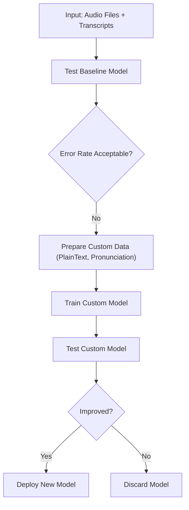

# 🚀 MLOps for Custom Speech Models with Azure AI Speech Service

**Automating Training, Testing, and Deployment with CI/CD Pipelines!**

---

## 🎯 What’s the Goal Here?

You’ve trained a custom speech model manually using **Azure Speech Studio** — uploading audio files, human transcriptions, pronunciation lists, plain text vocabularies… all through clicks.

But now? We automate it.
You’re about to learn how to wrap that whole manual workflow into a fully automated **CI/CD pipeline** using **MLOps**.

---

## 🧠 MLOps in Simple Words

> MLOps = Machine Learning + DevOps = Automating model training, testing, and deployment

Just like DevOps automates building and shipping software, **MLOps automates the lifecycle of an ML model** — especially when your models need continuous updates with **new data**, **new tuning**, and **constant testing**.

In this case, we’ll apply MLOps to a **Custom Speech-to-Text** model using Azure’s Custom Speech API and automate everything.

---

## 📦 Manual Process Recap: What Did We Do Before?

Let’s break it down:

### 🔊 Input: Audio + Human-Labeled Transcript

| Input           | Format     | Description                      |
| --------------- | ---------- | -------------------------------- |
| 🎧 `speech.wav` | Audio file | Raw spoken content               |
| 📝 `speech.txt` | Transcript | What it should be transcribed to |

### 🤖 Model Actions:

| Action       | Output                   | Notes                             |
| ------------ | ------------------------ | --------------------------------- |
| Model Output | `speech.transcribed.txt` | The machine-generated result      |
| Evaluation   | 🔢 Error Rate            | Compare human vs model transcript |

---

## 📈 Training Process

1. **Evaluate baseline model**
   → Compare original audio → model output vs. human transcript
   → Maybe: 20% error rate

2. **Identify mistakes**
   → The model fails on certain words (e.g., names like “Sharjah”, “GoDrive”)

3. **Prepare Custom Data**
   → Add `PlainText.txt` with vocabulary
   → Add `Pronunciation.txt` if needed

4. **Train a new model (v2)**
   → Model learns new words
   → Error drops (e.g., to 5%)

5. **Deploy the improved model**
   → Use it for live transcription

---

## 🔁 Now Automate This with MLOps!

Here's the workflow we want to automate 👇

Each of these steps will be part of a pipeline — triggered automatically when new data arrives or when you want to re-train.

---

## 🔄 MLOps vs DevOps: What’s the Difference?

| DevOps                                | MLOps                                        |
| ------------------------------------- | -------------------------------------------- |
| 💻 Works with code                    | 🎧 Works with **data** (audio, text, speech) |
| 📦 Output: Docker or app              | 🧠 Output: Trained **ML model**              |
| ⚙️ Tools like GitHub Actions, Jenkins | Same tools, but add model training logic     |
| 🔁 CI/CD for software delivery        | 🔁 CI/CD for **ML model lifecycle**          |

---

## 🏗️ What CI/CD Automates in MLOps

| Step                 | Description                                             |
| -------------------- | ------------------------------------------------------- |
| 📥 Data Upload       | Automatically fetch new `.wav` + `.txt` files           |
| 🔍 Evaluate Baseline | Test current model accuracy vs new data                 |
| ✍️ Train New Model   | Use updated text/pronunciation vocabularies             |
| 🧪 Run Tests         | Compare human vs. model transcriptions                  |
| 🚀 Deploy If Better  | Auto-deploy only if accuracy improves (e.g., 5% better) |

---

## 🛠️ How This Works in Practice

You’ll use:

- **GitHub Actions** — to trigger pipelines
- **Azure CLI** / REST API — to upload data, train models, and deploy
- **Shell scripts** — for orchestration (provided by Microsoft)

You don’t have to learn full Bash or shell scripting — use the ready-made scripts as a starting point.

---

## 📊 The Azure Speech MLOps Project Flow

1. Place your training and testing files in folders:

   - `training_data/plain_text.txt`
   - `training_data/pronunciation.txt`
   - `testing_data/audio.wav` + `transcript.txt`

2. Git push to trigger CI/CD

3. The pipeline will:

   - Upload training + test data to Azure
   - Train the model
   - Evaluate test accuracy
   - Compare with previous version
   - Deploy if better

---

## ✅ Benefits of MLOps

- 🔁 **Repeatable**: Do it for every new batch of words
- ⏱ **Faster**: No manual clicking
- 📈 **Reliable**: Auto-test every version
- 🧠 **Smarter**: Models keep improving with new data
- 💸 **Cost-saving**: Train only when needed

---

## 🧪 What’s Next?

In the next section, you’ll:

- See the GitHub Actions workflow for training
- Understand how Azure CLI commands are used to control model training and deployment
- Test different datasets (e.g., “Sharjah landmarks” instead of dinosaurs 😅)
