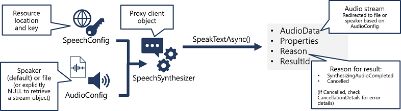
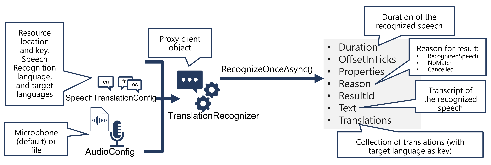

# 🧠 Azure AI Speech Service

Azure AI Speech empowers your apps to understand and generate human language via voice. It includes intelligent, real-time services like:

| 💬 Feature              | 🧠 What It Does                                                       |
| ----------------------- | --------------------------------------------------------------------- |
| **Speech to Text**      | Converts spoken audio into text (aka speech recognition)              |
| **Text to Speech**      | Converts text into spoken audio (aka speech synthesis)                |
| **Speech Translation**  | Translates spoken language into one or more spoken or textual outputs |
| **Speaker Recognition** | Identifies or verifies a person based on their voice                  |
| **Custom Speech**       | Improves recognition for domain-specific terms or accents             |

> it also support **Keyword Recognition** which Listens for predefined keywords or commands  
> it also support **Intent Recognition** which Uses CLU (Conversational Language Understanding) to determine speaker's intent

---

## 🧠 Azure AI Speech = 3 Primary SDK Workflows

---

## 1️⃣ Speech to Text (STT) 🗣️ → 📝

<div style="text-align: center;">
    
</div>

### 🔁 Workflow:

1. 🧩 **SpeechConfig** – Contains subscription key & region info.
2. 🎙️ **AudioConfig** – Defines the source: microphone or `.wav` file.
3. 🛠️ **SpeechRecognizer** – The core recognizer (proxy client).
4. 🧠 **RecognizeOnceAsync()** – Single-shot speech recognition.
5. 📦 **SpeechRecognitionResult** – Contains recognition output.

### 🧪 SDK Output:

```csharp
var result = await recognizer.RecognizeOnceAsync();
Console.WriteLine($"Text: {result.Text}");
```

### 🧾 Result Properties:

| Property        | Meaning                                      |
| --------------- | -------------------------------------------- |
| `Text`          | The actual transcribed text.                 |
| `Duration`      | How long the spoken phrase lasted.           |
| `OffsetInTicks` | Timestamps (for aligning with video/audio).  |
| `ResultId`      | Unique operation ID.                         |
| `Reason`        | `RecognizedSpeech`, `NoMatch`, or `Canceled` |
| `Properties`    | Any metadata or custom diagnostic data       |

---

## 2️⃣ Text to Speech (TTS) 📝 → 🗣️

<div style="text-align: center;">
    
</div>

### 🔁 Workflow:

1. 🧩 **SpeechConfig** – Includes key, region, and voice settings.
2. 🔈 **AudioConfig** – Where to send audio: speaker, file, or stream.
3. 🛠️ **SpeechSynthesizer** – The proxy client for synthesis.
4. 🔁 **SpeakTextAsync()** – Converts input text into spoken output.
5. 📦 **SpeechSynthesisResult** – Contains output or error info.

### 🧾 Result Properties:

| Property     | Meaning                                        |
| ------------ | ---------------------------------------------- |
| `AudioData`  | Raw audio stream (can save/play)               |
| `Reason`     | `SynthesizingAudioCompleted`, `Canceled`, etc. |
| `ResultId`   | Request ID                                     |
| `Properties` | Metadata (voice used, latency, etc.)           |

### 🧙 Voice Customization:

```csharp
speechConfig.SpeechSynthesisVoiceName = "en-GB-GeorgeNeural";
```

Azure supports over **400 neural voices** in **140+ languages**. Find full voice list: [https://learn.microsoft.com/en-us/azure/ai-services/speech-service/language-support](https://learn.microsoft.com/en-us/azure/ai-services/speech-service/language-support)

---

## 3️⃣ Speech Translation 🗣️ → 🌎

<div style="text-align: center;">
    
</div>

### 🔁 Workflow:

1. 🧩 **SpeechTranslationConfig** – Includes key, region, recognition language, target languages.
2. 🎤 **AudioConfig** – Input from mic or file.
3. 🌍 **TranslationRecognizer** – Multilingual speech-to-text converter.
4. 🔁 **RecognizeOnceAsync()** – Transcribes & translates the spoken input.
5. 📦 **TranslationRecognitionResult** – Includes transcript & translations.

### 🧾 Result Properties:

| Property        | Meaning                                                      |
| --------------- | ------------------------------------------------------------ |
| `Text`          | Transcript of recognized speech (source)                     |
| `Translations`  | Dictionary with key = language code, value = translated text |
| `Duration`      | Length of utterance                                          |
| `OffsetInTicks` | Timestamp offset                                             |
| `Reason`        | `RecognizedSpeech`, `NoMatch`, `Canceled`                    |
| `ResultId`      | Unique ID                                                    |

---

## 🔁 Speech-to-Speech Translation (🗣️ ➡️ 🌍 ➡️ 🗣️)

You can **pipe translated text** into **Text to Speech** and get full spoken output:

```csharp
// Step 1: Translate speech
var result = await recognizer.RecognizeOnceAsync();
var translatedText = result.Translations["fr"];

// Step 2: Synthesize result
await synthesizer.SpeakTextAsync(translatedText);
```

### 🧭 Two Ways to Translate and Synthesize:

| Scenario                 | Use this method               |
| ------------------------ | ----------------------------- |
| 1:1 translation          | Event-based synthesis         |
| Many-to-many translation | Manual synthesis per language |

---

## 🧑‍🎤 Speaker Recognition (Who’s Talking?)

Azure AI Speech provides **speaker recognition** capabilities through REST APIs and container support. It enables you to:

| Mode                       | What it Does                                                 |
| -------------------------- | ------------------------------------------------------------ |
| **Speaker Verification**   | Confirms if a voice matches a specific enrolled speaker      |
| **Speaker Identification** | Detects _who_ among a group of enrolled speakers is speaking |

### 🎯 Use Cases:

- Voice-based login or access control (biometric auth)
- Personalization (adjust responses based on who’s talking)
- Forensic audio identification

### 🔁 Workflow (Speaker Verification):

1. **Enroll the speaker** using a sample of their voice.
2. Use the `/verify` REST endpoint to compare new voice against stored profile.
3. Azure returns a **confidence score** and verification result.

### 🧪 Example (Verify):

```http
POST /speaker/verify
Headers:
  Ocp-Apim-Subscription-Key: <your-key>
  Content-Type: audio/wav
Body: <audio sample>
```

```json
{
  "recognitionResult": "Accept",
  "score": 0.98,
  "profileId": "xyz-123"
}
```

---

## 🧠 Custom Speech (Train for Accents, Jargon, or Noisy Mics)

Custom Speech allows you to improve **speech recognition accuracy** for:

- Industry-specific jargon (e.g., "cardiotocography")
- Brand names or acronyms (e.g., "Contoso CRM")
- Non-native accents or background noise

### 🚀 Workflow:

1. Upload training data (audio + transcripts) to **Speech Studio**.
2. Create and train a **Custom Speech model**.
3. Deploy the model and get the **custom endpoint**.
4. Use `SpeechConfig.endpoint = "<custom endpoint>"` in SDKs.

### 🧪 Sample:

```csharp
speechConfig.EndpointId = "your-custom-speech-model-id";
var recognizer = new SpeechRecognizer(speechConfig, audioConfig);
```

✅ Works exactly like normal recognition – just more accurate for your domain!

---

## ⚙️ Configure audio format and voices

### 🔉 Audio format

The Azure AI Speech service supports multiple output formats for the audio stream that is generated by speech synthesis. Depending on your specific needs, you can choose a format based on the required:

- Audio file type
- Sample-rate
- Bit-depth

### 🗣️ Voices

The Azure AI Speech service provides multiple voices that you can use to personalize your speech-enabled applications. There are two kinds of voice that you can use:

Standard voices - synthetic voices created from audio samples.
Neural voices - more natural sounding voices created using deep neural networks.

```c#
speechConfig.SpeechSynthesisVoiceName = "en-GB-George";
```

## 🎨 SSML – Speech Synthesis Markup Language

SSML = HTML for speech.

```xml
<speak version="1.0" xmlns="http://www.w3.org/2001/10/synthesis"
       xmlns:mstts="https://www.w3.org/2001/mstts" xml:lang="en-US">
  <voice name="en-US-AriaNeural">
    <mstts:express-as style="cheerful">Let's celebrate success!</mstts:express-as>
  </voice>
  <break time="500ms"/>
  <voice name="en-US-GuyNeural">
    I say <phoneme alphabet="sapi" ph="t ao m ae t ow"> tomato </phoneme>.
  </voice>
</speak>
```

🔹 Use **express-as**, **break**, **phoneme**, **say-as**, etc.

---

## 🧠 Azure Speech Studio

> 🔗 [Azure Speech Studio](https://speech.microsoft.com/)

The no-code web UI for:

- Testing STT, TTS, and translation
- Creating and training **Custom Speech**
- Creating voice assistants
- Testing pronunciation

---

## 🧰 Bonus Features

| 🔧 Feature                     | ⚙️ What It Does                                                          |
| ------------------------------ | ------------------------------------------------------------------------ |
| **Custom Speech**              | Improve recognition accuracy for noisy/technical/industry-specific audio |
| **Real-time Transcription**    | Continuous recognition, intermediate results, low latency                |
| **Batch Transcription**        | Useful for large .wav/.mp3 files in Azure Blob Storage                   |
| **Audio Format Customization** | Choose sample rate, channel layout, bit depth                            |

---

## ✅ AI-102 Exam Tips

- Know difference between `SpeechRecognizer`, `TranslationRecognizer`, `SpeechSynthesizer`.
- Understand result properties like `Text`, `Reason`, `ResultId`, `Translations`.
- SSML gives you **more control** over the speech output—memorize key tags.
- `AudioConfig` can be mic input (real-time) or file input/output.
- Translate then synthesize = manual speech-to-speech translation pipeline.

Absolutely! Below are **three clean, structured, and SDK-aligned sections** for the Azure AI Speech features you asked about. These will integrate well with the rest of your enhanced documentation:
