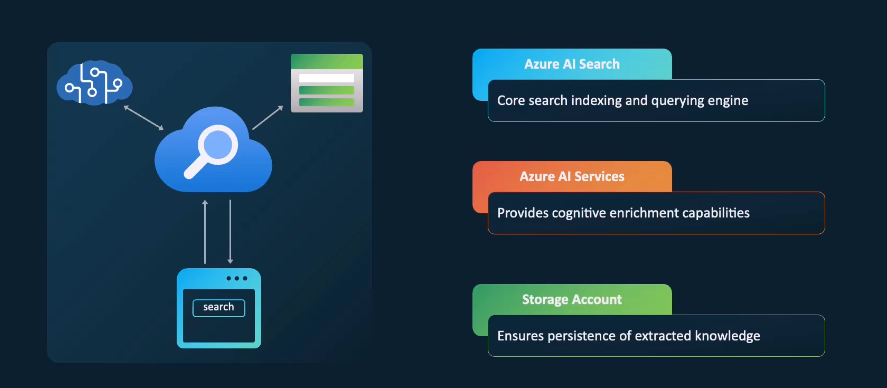
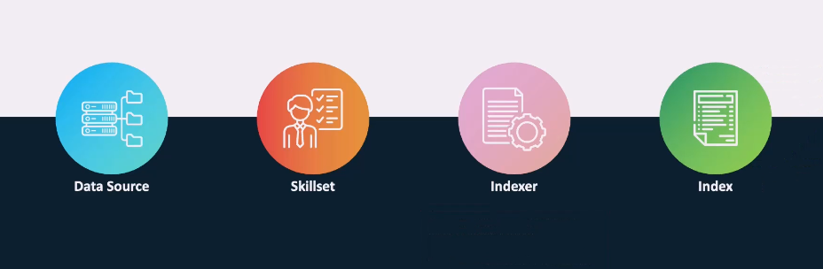
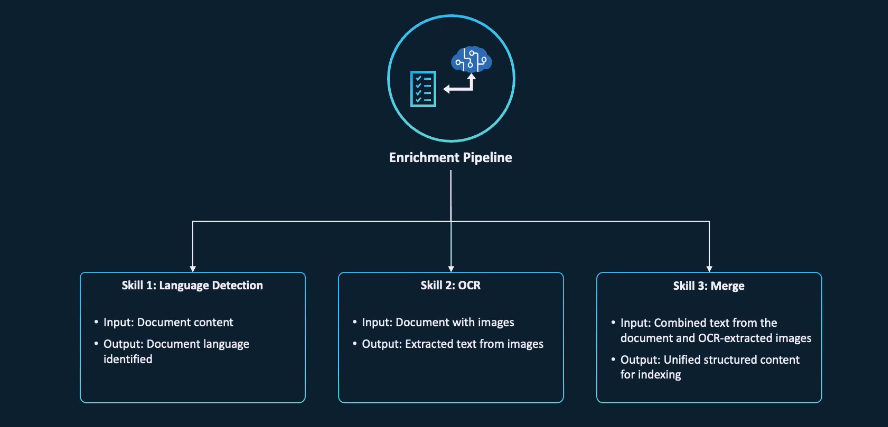

# 🔍 Azure AI Search – Enrichment, Indexing & Intelligence

> Azure AI Search combines **powerful full-text search** with **AI-powered cognitive skills** to extract insights, enrich content, and make documents smartly searchable.

---

## 🧠 What Makes Azure AI Search Special?

- Understands **content and intent** (semantic search, OCR, language detection)
- Can **fix spelling**, apply **synonyms**, and provide **intelligent ranking**
- Supports **AI-based enrichment** (entity recognition, translation, OCR)
- Integrates with multiple **Azure data sources and services**

---

## 🌟 Key Features

### 🤖 Semantic Search

- Understands user intent beyond keyword matches
- Uses **vector search + ranking model**
- Improves result relevance for natural language queries

### 📝 Spell Correction & Synonyms

- Fixes common typos (e.g., `azur` → `azure`)
- Matches semantically equivalent terms via **synonym maps**

### 🛍️ Personalized Recommendations

- Suggests products, articles, or content using **user behavior data**

### 🧠 AI-Driven Knowledge Discovery

- Extracts and indexes unstructured content
- Enriches raw text using **AI skillsets**
- Stores structured data in a **Knowledge Store**

---

## ⚙️ Azure AI Search Resource Components

<div style="text-align: center;">
  
</div>

---

### 🔹 1. Azure AI Search

> Core engine that handles indexing, querying, and search operations.

### 🔹 2. Azure AI Services

> Provides enrichment through predefined or custom AI skills (OCR, key phrase extraction, translation, etc.)

### 🔹 3. Storage Account

> Stores **enriched data** for reuse, analysis, and downstream machine learning.

---

## 🔁 Enrichment Workflow Using Skillset

<div style="text-align: center;">
  
</div>

---

### 🗃️ 1. Data Source

> Where your documents live (must be in Azure):

- Azure Blob Storage
- Azure SQL Database
- Azure Cosmos DB
- Azure Data Lake Gen2
- Azure Table Storage
- Microsoft Fabric OneLake (file-based)

---

### 🧪 2. Skillset

> A pipeline of cognitive skills that enrich raw content before indexing

Types of skills:

- ✅ **Built-in AI skills** (entity recognition, language detection, OCR, sentiment)
- 🛠️ **Custom skills** (hosted in Azure Functions or APIs)

---

### ⚙️ 3. Indexer

> The **data ingestion brain** of the system

- Reads from data source
- Applies skillset
- Maps enriched data to index fields
- Can run **on schedule or on demand**

---

### 📄 4. Index

> The final searchable structure (like a table in SQL)

- Holds enriched and structured documents
- Supports full-text search, filters, scoring, faceting, and more

---

### 🔄 Enrichment Pipeline Example

This example shows how Azure AI Search uses skills to transform input data into **searchable knowledge**.

#### 🧠 Skills Used

1. **Language Detection**
2. **OCR** (text extraction from images)
3. **Merge** (combining all content into one field)

---

## 🛠️ Skillset Pipeline Walkthrough

<div style="text-align: center;">
  
</div>

---

**Skillset JSON Template:**

Here’s a minimal example of how the skillset would look in JSON:

```json
{
  "description": "My skillset for OCR and language detection",
  "skills": [
    {
      "@odata.type": "#Microsoft.Skills.Text.LanguageDetectionSkill",
      "inputs": [{ "name": "text", "source": "/document/content" }],
      "outputs": [{ "name": "languageCode", "targetName": "language" }]
    },
    {
      "@odata.type": "#Microsoft.Skills.Vision.OcrSkill",
      "inputs": [{ "name": "image", "source": "/document/images/*" }],
      "outputs": [{ "name": "text", "targetName": "ocrText" }]
    },
    {
      "@odata.type": "#Microsoft.Skills.Util.MergeSkill",
      "inputs": [
        { "name": "text", "source": "/document/content" },
        { "name": "text", "source": "/document/ocrText" }
      ],
      "outputs": [{ "name": "mergedText", "targetName": "document_text" }]
    }
  ]
}
```

---

### 📨 Input

```json
{
  "metadata_source": "file_system",
  "metadata_creator": "John Doe",
  "content": "...",
  "images": []
}
```

---

### 🧠 Step 1: Language Detection

```json
{
  "language": "en"
}
```

Detects document language for downstream processing (e.g., sentiment, translation).

---

### 🧠 Step 2: OCR

```json
"images": [
  {
    "url": "https://example.com/image1.jpg",
    "text": "This is an image of a cat."
  },
  {
    "url": "https://example.com/image2.jpg",
    "text": "This is an image of a dog."
  }
]
```

Extracts text from embedded or attached images.

---

### 🧠 Step 3: Merge

```json
"merged_text": "This is an image of a cat. This is an image of a dog."
```

Combines textual and visual content into a single searchable document.

---

### 🧾 Final Output

```json
{
  "file_name": "content.pdf",
  "creator": "John Doe",
  "language": "en",
  "document_text": "This is an image of a cat. This is an image of a dog."
}
```

Now fully enriched, structured, and ready to be indexed and searched!

---

## ✅ Summary

| Component             | Description                                           |
| --------------------- | ----------------------------------------------------- |
| **Data Source**       | Where the raw data lives (Blob, SQL, Cosmos)          |
| **Skillset**          | Defines enrichment steps using AI                     |
| **Indexer**           | Processes and maps data to the index                  |
| **Index**             | Final searchable data structure                       |
| **Storage Account**   | Optionally stores enriched outputs (Knowledge Store)  |
| **Azure AI Services** | Powers skills like OCR, translation, entity detection |
