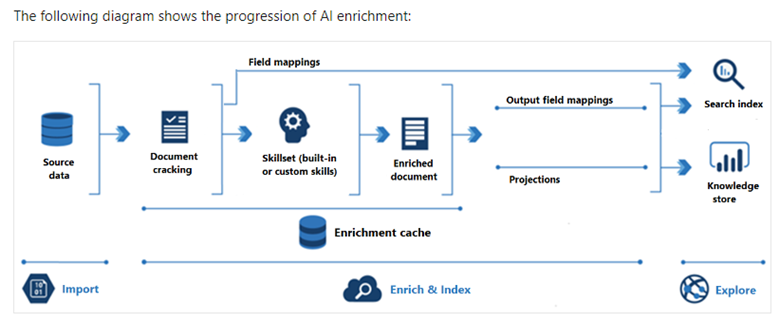
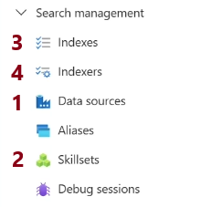

# 🧠 Full Resume Indexing Workflow with Azure AI Search

> **Scenario**: You want to ingest resumes (PDFs), extract names, emails, and skills using AI, and build a smart search index.

---

<div style="text-align: center;">
  
</div>

---

<div style="text-align: center;">
  
</div>

---

## 🔢 Step 1: Data Source

🎯 Define where the raw resumes are stored.

### 👨‍💼 Use Case

You have resumes as PDFs in **Azure Blob Storage** inside a container named `resumes`.

### 📝 JSON Definition

```json
{
  "name": "resumes-datasource",
  "type": "azureblob",
  "credentials": {
    "connectionString": "<your_connection_string>"
  },
  "container": {
    "name": "resumes"
  },
  "dataChangeDetectionPolicy": {
    "@odata.type": "#Microsoft.Azure.Search.HighWaterMarkChangeDetectionPolicy",
    "highWaterMarkColumnName": "metadata_storage_last_modified"
  }
}
```

---

## 🔢 Step 2: Skillset

🎯 Define enrichment pipeline to extract key fields from the resumes.

### 🧠 Cognitive Skills Used:

- **OCRSkill** – extract text from scanned PDFs
- **EntityRecognitionSkill** – find person names, emails
- **KeyPhraseExtractionSkill** – extract skills

### 📝 JSON Definition

```json
{
  "name": "resume-skillset",
  "skills": [
    {
      "@odata.type": "#Microsoft.Skills.Vision.OcrSkill",
      "inputs": [{ "name": "image", "source": "/document/normalized_images/*" }],
      "outputs": [{ "name": "text", "targetName": "ocrText" }]
    },
    {
      "@odata.type": "#Microsoft.Skills.Text.EntityRecognitionSkill",
      "categories": ["Person", "Email"],
      "minimumPrecision": 0.5,
      "inputs": [{ "name": "text", "source": "/document/ocrText" }],
      "outputs": [
        { "name": "persons", "targetName": "personNames" },
        { "name": "emails", "targetName": "emails" },
        { "name": "entities", "targetName": "entities" }
      ]
    },
    {
      "@odata.type": "#Microsoft.Skills.Text.KeyPhraseExtractionSkill",
      "inputs": [{ "name": "text", "source": "/document/ocrText" }],
      "outputs": [{ "name": "keyPhrases", "targetName": "skills" }]
    }
  ],
  "description": "Skillset to extract data from resume PDFs"
}
```

---

## 🔢 Step 3: Index

🎯 Define the **structure of the final searchable index**.

### 🧱 Index Fields

- `file_name`, `personNames`, `emails`, `skills`, `content`

### 📝 JSON Definition

```json
{
  "name": "resume-index",
  "fields": [
    { "name": "id", "type": "Edm.String", "key": true, "filterable": true },
    { "name": "file_name", "type": "Edm.String", "searchable": true },
    { "name": "personNames", "type": "Collection(Edm.String)", "searchable": true },
    { "name": "emails", "type": "Collection(Edm.String)", "searchable": true },
    { "name": "skills", "type": "Collection(Edm.String)", "searchable": true },
    { "name": "content", "type": "Edm.String", "searchable": true }
  ]
}
```

---

## 🔢 Step 4: Indexer

🎯 Glue everything together — read data, run enrichment, and write to index.

### 📝 JSON Definition

```json
{
  "name": "resume-indexer",
  "dataSourceName": "resumes-datasource",
  "targetIndexName": "resume-index",
  "skillsetName": "resume-skillset",
  "schedule": {
    "interval": "PT1H", // runs every hour
    "startTime": "2025-06-24T10:00:00Z"
  },
  "parameters": {
    "configuration": {
      "dataToExtract": "contentAndMetadata",
      "imageAction": "generateNormalizedImages"
    }
  },
  "fieldMappings": [{ "sourceFieldName": "metadata_storage_name", "targetFieldName": "file_name" }],
  "outputFieldMappings": [
    { "sourceFieldName": "/document/personNames", "targetFieldName": "personNames" },
    { "sourceFieldName": "/document/emails", "targetFieldName": "emails" },
    { "sourceFieldName": "/document/skills", "targetFieldName": "skills" },
    { "sourceFieldName": "/document/ocrText", "targetFieldName": "content" }
  ]
}
```

---

## ✅ Final Result

You now have a working Azure AI Search pipeline that:

- 📥 Reads resumes from Blob Storage
- 🤖 Uses OCR & entity recognition to extract names, emails, and skills
- 📦 Stores enriched results in a searchable index
- 🔎 Allows full-text search and filters like:

  - `"skills:Azure AND personNames:'John Doe'"`

---

## 🧪 Bonus: Query Example

```http
GET https://<search-service>.search.windows.net/indexes/resume-index/docs?api-version=2023-07-01-Preview&search=Azure+Functions
api-key: <your-query-key>
```

---

## 🎓 Summary: Portal Steps by Numbers (Matching Your Screenshot)

| #   | Portal Section   | What You Do                           |
| --- | ---------------- | ------------------------------------- |
| 1   | **Data Sources** | Point to Blob Storage with resumes    |
| 2   | **Skillsets**    | Define pipeline (OCR, entity, skills) |
| 3   | **Indexes**      | Define output schema                  |
| 4   | **Indexers**     | Orchestrate the flow + schedule runs  |
