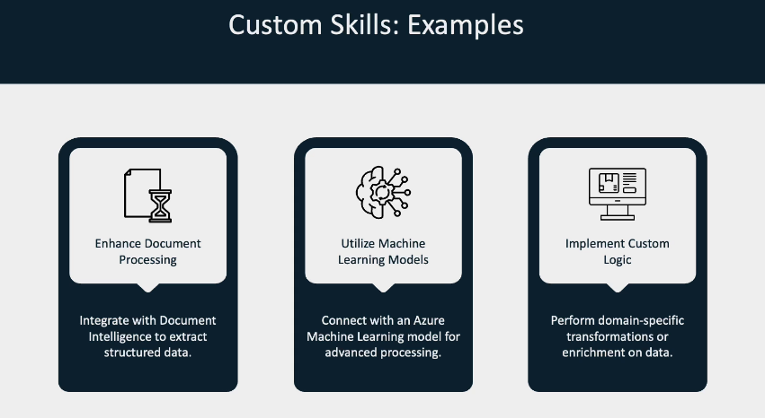
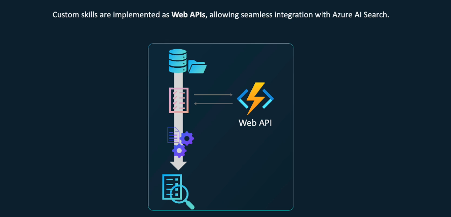
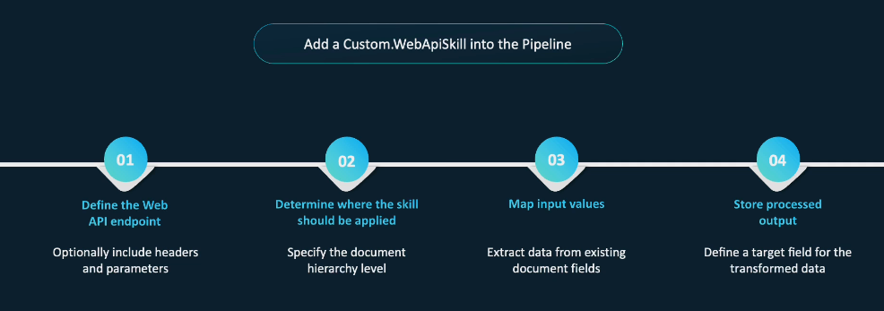

# 🧠 Custom Skills in Azure AI Search

> **Custom Skills** are used when built-in skills just aren't enough — they allow you to call **your own Web APIs** to perform any logic, ML inference, data transformation, or extraction.

---

## 🧪 Why Use Custom Skills?

Use custom skills when you need to:

✅ **Enhance Document Processing**

- E.g., extract structured data using Azure Document Intelligence

✅ **Use Machine Learning Models**

- Call Azure ML or HuggingFace models for intent classification, summarization, etc.

✅ **Implement Custom Logic**

- Extract domain-specific values like invoice numbers, employee IDs, or code references

---

<div style="text-align: center;">
    
</div>

---

## ⚙️ How Custom Skills Work

> Custom skills are implemented as **Web APIs** and plugged into your **Skillset** pipeline.

---

<div style="text-align: center;">
    
</div>

---

Your API is called by Azure Search, processes a batch of documents, and returns the enriched fields.

- You can use **Azure Functions**, **Flask apps**, or even **Docker APIs**
- Secured with **AAD**, **OAuth2**, or left public for testing

---

## 📥 Custom Skill Interface – Input Schema

Each batch Azure sends to your API looks like this:

```json
{
  "values": [
    {
      "recordId": "<unique-identifier>",
      "data": {
        "<input1_name>": "<value1>",
        "<input2_name>": "<value2>"
      }
    },
    {
      "recordId": "<unique-identifier>",
      "data": {
        "<input1_name>": "<value1>",
        "<input2_name>": "<value2>"
      }
    }
  ]
}
```

✅ Each item has:

- `"recordId"`: Unique ID per document (you must preserve this in output)
- `"data"`: The fields passed to your API as input

---

## 📤 Custom Skill Interface – Output Schema

You return a matching array with processed values:

```json
{
  "values": [
    {
      "recordId": "<unique_identifier_from_input>",
      "data": {
        "<output1_name>": "<value1>",
        "<output2_name>": "<value2>"
      },
      "errors": [],
      "warnings": []
    },
    {
      "recordId": "<unique_identifier_from_input>",
      "data": {
        "<output1_name>": "<value1>",
        "<output2_name>": "<value2>"
      },
      "errors": [],
      "warnings": []
    }
  ]
}
```

✅ You must:

- Preserve the `recordId`
- Put the result inside `data`
- Return optional `errors` and `warnings` for diagnostics

---

## 🧱 Steps to Add a Custom Skill

<div style="text-align: center;">
    
</div>

---

### 🔹 1️⃣ Define the Web API

- Must support POST
- JSON in, JSON out
- Optionally secured (AAD, OAuth2)
- Accept `application/json`

---

### 🔹 2️⃣ Determine Context (Where it Applies)

- Use `context` to tell Azure where to apply (e.g., `/document`)
- Can loop over arrays (e.g., `/document/images/*`)

---

### 🔹 3️⃣ Map Input Fields

- Use `"inputs"` to map input names to JSON paths
- Example:

  ```json
  { "name": "text", "source": "/document/content" }
  ```

---

### 🔹 4️⃣ Define Output Fields

- Azure will store the output inside the enriched document
- You define both `"name"` and `"targetName"`

---

## 🧪 JSON Example of a Custom Skill in a Skillset

```json
{
  "skills": [
    {
      "@odata.type": "#Microsoft.Skills.Custom.WebApiSkill",
      "description": "Extract employee ID from text",
      "uri": "https://your-function.azurewebsites.net/api/extract-employee-id",
      "httpHeaders": {
        "x-api-key": "your-api-key"
      },
      "context": "/document",
      "inputs": [{ "name": "text", "source": "/document/content" }],
      "outputs": [{ "name": "employeeId", "targetName": "employee_id" }]
    }
  ]
}
```

---

## 🧪 Full Use Case Example: Extracting Employee ID

### 🎯 Goal: Extract `EMP-xxxxx` from unstructured text documents

#### 📥 Input sent by Azure to your Web API:

```json
{
  "values": [
    {
      "recordId": "1",
      "data": {
        "text": "Resume content: John Doe, EMP-98765, Software Engineer"
      }
    }
  ]
}
```

#### ⚙️ Your API parses text using regex:

```python
import re
from flask import Flask, request, jsonify

app = Flask(__name__)

@app.route("/", methods=["POST"])
def skill():
    items = request.json["values"]
    results = []

    for item in items:
        text = item["data"].get("text", "")
        match = re.search(r"EMP-\d+", text)
        emp_id = match.group(0) if match else None

        results.append({
            "recordId": item["recordId"],
            "data": {
                "employeeId": emp_id
            },
            "errors": [],
            "warnings": []
        })

    return jsonify({"values": results})
```

#### 📤 Output returned to Azure AI Search:

```json
{
  "values": [
    {
      "recordId": "1",
      "data": {
        "employeeId": "EMP-98765"
      },
      "errors": [],
      "warnings": []
    }
  ]
}
```

---

## ✅ Summary: Why You’d Use a Custom Skill

| Reason                       | Examples                                                 |
| ---------------------------- | -------------------------------------------------------- |
| Built-in skill doesn’t exist | Extract Invoice #, Employee ID, custom legal clause      |
| Need external ML             | Use Azure ML/LLM to generate embeddings, classifications |
| Need logic/validation        | Normalize values, match against lookup lists, etc.       |
