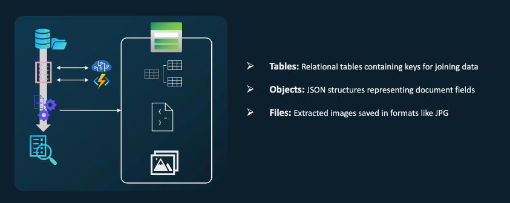
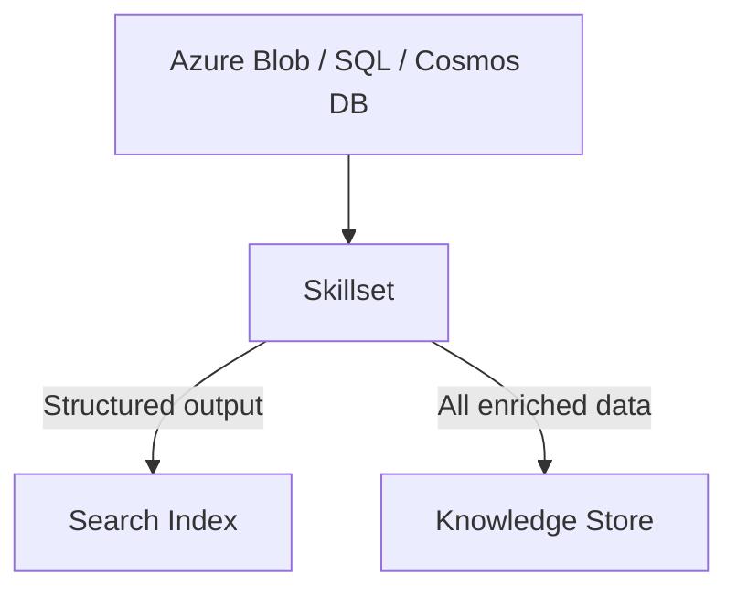
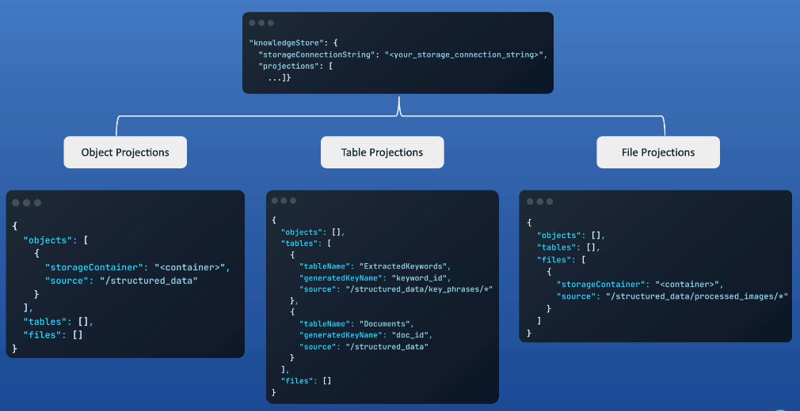

# 🧠 Knowledge Store

> A **Knowledge Store** is an **optional output location** where Azure AI Search stores enriched data in a structured format (tables, blobs, or files), **outside** of the Search Index.

---

<div style="text-align: center;">
  
</div>

---

## 🔍 Why Do We Need a Knowledge Store?

When your skillset enriches data, it outputs fields like:

- `language: "en"`
- `entities: [ "Microsoft", "Azure" ]`
- `keyPhrases: [ "cloud computing" ]`

📌 Normally, this goes directly into your **search index**  
✅ But what if you want to:

- Analyze the enriched data in Power BI?
- Use it in machine learning?
- Store a full enriched snapshot of every doc?

👉 That’s where the **Knowledge Store** comes in.

---

## 📦 What Exactly Is Stored?

When you enable the Knowledge Store, you get:

| Storage Type | What It Contains                                |
| ------------ | ----------------------------------------------- |
| **Tables**   | Tabular data like entities, key phrases, etc.   |
| **Objects**  | JSON blobs of enriched documents                |
| **Files**    | Extracted or converted files (e.g., OCR images) |

---

## 🧩 Architecture Overview

<div align="center">



</div>

---

> Azure AI Search can send enriched data to **both** a Search Index and a Knowledge Store at the same time.

---

## 🗂️ What is the Knowledge Store?

> The **Knowledge Store** lets you **store structured data** (tables, objects, files) outside the index — for BI, ML, or archiving.  
> The **Knowledge Store** is where you save **enriched outputs** from a skillset in structured formats like:

- 🧾 **Objects** (full enriched JSON)
- 📊 **Tables** (flattened tabular data)
- 🖼 **Files** (OCR images, documents, etc.)

---

<div style="text-align: center;">
  
</div>

---

You define these under the **`knowledgeStore`** section in the skillset.  
**`knowledgeStore`** are object in the skillset.

---

### 📁 Object Projection Example

```json
{
  "objects": [
    {
      "storageContainer": "structured-json",
      "source": "/document/final_projection"
    }
  ],
  "tables": [],
  "files": []
}
```

This saves the structured data (from Shaper) as JSON blobs.

---

### 📊 Table Projection Example

```json
{
  "tables": [
    {
      "tableName": "KeyPhrases",
      "generatedKeyName": "phraseId",
      "source": "/document/processed_content/keywords/*"
    }
  ]
}
```

This flattens keyword arrays into rows in a table named `KeyPhrases`.

---

### 🖼 File Projection Example

```json
{
  "files": [
    {
      "storageContainer": "images",
      "source": "/document/ocr_images/*"
    }
  ]
}
```

Used with `OcrSkill`, this saves extracted images.

---

### 🧰 Final Skillset with Knowledge Store

Here’s a complete example combining everything:

```json
{
  "name": "my-enrichment-skillset",
  "description": "Skillset with projection and knowledge store",
  "skills": [
    {
      "@odata.type": "#Microsoft.Skills.Text.SentimentSkill",
      "inputs": [
        { "name": "text", "source": "/document/content" },
        { "name": "languageCode", "source": "/document/language" }
      ],
      "outputs": [{ "name": "score", "targetName": "sentiment" }]
    },
    {
      "@odata.type": "#Microsoft.Skills.Util.ShaperSkill",
      "name": "projection-shaper",
      "context": "/document",
      "inputs": [
        { "name": "document_url", "source": "/document/url" },
        { "name": "user_sentiment", "source": "/document/sentiment" }
      ],
      "outputs": [{ "name": "structured_output", "targetName": "final_projection" }]
    }
  ],
  "knowledgeStore": {
    "storageConnectionString": "DefaultEndpointsProtocol=https;AccountName=YOUR_STORAGE_ACCOUNT;AccountKey=YOUR_KEY;",
    "projections": [
      {
        "objects": [
          {
            "storageContainer": "structured-json",
            "source": "/document/final_projection"
          }
        ],
        "tables": [
          {
            "tableName": "ExtractedKeywords",
            "generatedKeyName": "keyword_id",
            "source": "/document/keywords/*"
          }
        ],
        "files": []
      }
    ]
  }
}
```

---

## 🤔 What is Shaper Skill?

> The **Shaper Skill** helps you **organize** and **flatten** enriched outputs.  
> The Shaper Skill builds a clean **JSON structure** from multiple fields so that the **Knowledge Store projections** can easily consume and store the results.

---

### 🛠️ Example: Shaper Skill JSON

```json
{
  "@odata.type": "#Microsoft.Skills.Util.ShaperSkill",
  "name": "format-projection",
  "description": "Organize projection fields",
  "context": "/document",
  "inputs": [
    {
      "name": "document_url",
      "source": "/document/url"
    },
    {
      "name": "user_sentiment",
      "source": "/document/sentiment"
    },
    {
      "name": "key_terms",
      "source": null,
      "sourceContext": "/document/processed_content/keywords/*",
      "inputs": [
        {
          "name": "term",
          "source": "/document/processed_content/keywords/*"
        }
      ]
    }
  ],
  "outputs": [
    {
      "name": "structured_output",
      "targetName": "final_projection"
    }
  ]
}
```

---

#### 📌 Key Concepts

| Property        | Meaning                                       |
| --------------- | --------------------------------------------- |
| `context`       | The object path (usually `/document`)         |
| `sourceContext` | A loopable collection path (e.g., for arrays) |
| `inputs`        | What fields you want to project               |
| `outputs`       | The final JSON object you'll write            |

✅ This skill outputs a clean structure like:

```json
{
  "document_url": "...",
  "user_sentiment": 0.93,
  "key_terms": [{ "term": "AI" }, { "term": "Cognitive Search" }]
}
```

---

## 🧠 Use Cases of Knowledge Store

| Use Case                      | How Knowledge Store Helps                       |
| ----------------------------- | ----------------------------------------------- |
| 🧪 Machine Learning           | Store labeled outputs for training ML models    |
| 📊 Power BI / Data Analytics  | Connect to enriched tables using Power Query    |
| 🧾 Compliance / Data Auditing | Keep track of what was extracted from documents |
| 🧠 Knowledge Mining           | Feed data into a knowledge graph or ML pipeline |

---

## ✅ Summary

| Concept       | Value                                            |
| ------------- | ------------------------------------------------ |
| Purpose       | Stores enriched data for reuse outside of search |
| Outputs       | Tables, JSON objects, extracted files            |
| Storage Type  | Azure Blob Storage (usually)                     |
| Configured In | Indexer via `knowledgeStore` block               |
| Use Cases     | Analytics, ML, auditing, graph generation        |
