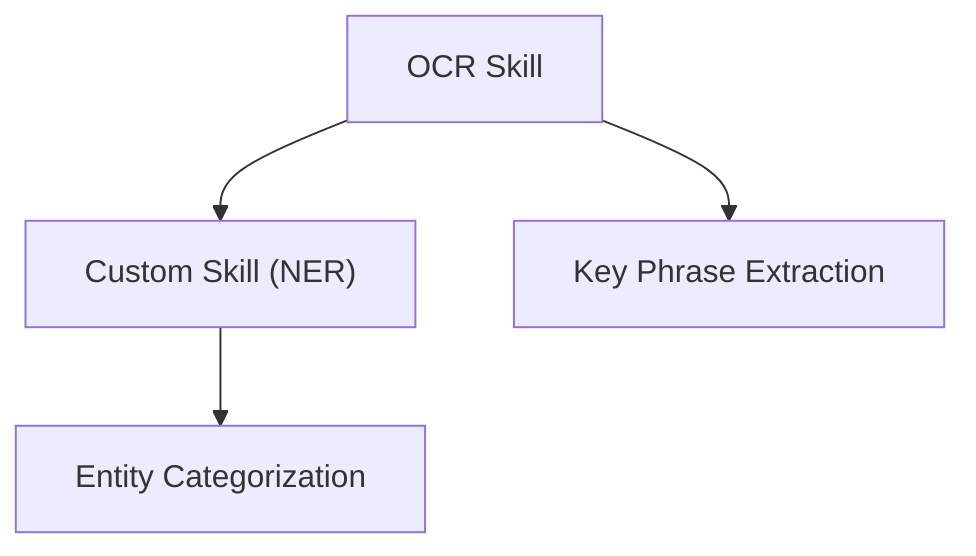

# 📒 Azure AI Search - Notes

## 1. 🗺️ **Synonym maps**

- Synonym maps Feature in **Azure AI Search** help **enhance search results** by matching user queries with equivalent terms.
- For example, if a user searches for `"car"`, and your synonym map defines `"car" ↔ "automobile"`, the search engine will return results that contain **either term**.
- They are particularly useful in **enterprise, e-commerce, and multilingual search scenarios** where users may use varied vocabulary for the same concept.

---

🔍 **Bonus Tip:**
There are two types of synonym maps:

- **Equivalent:** `"car, automobile, vehicle"` → all terms treated as equal.
- **Explicit Mapping:** `"USA => United States, America"` → "USA" is expanded to the others, but not the reverse.

You attach a synonym map to a specific **search analyzer** during index creation or modification.

## 2. [Semantic ranker](https://learn.microsoft.com/en-us/azure/search/search-synonyms?tabs=rest%2Crest-assign)

A **Semantic Ranker** in **Azure AI Search** is an **AI-powered feature** that re-ranks search results using **natural language understanding**, not just keyword matching. It uses deep learning models to better understand the **context and meaning** behind the user’s query and the content of your documents.

---

**🤔 Why This Is the Best Answer:**

- Semantic ranker uses **transformer-based language models** (like BERT) to analyze:

  - The full **query** (not just keywords)
  - The **semantic meaning** of documents
  - **Passages, captions, and answers** in context

- It produces:

  - **Improved relevance** of search results
  - **Highlighted passages** (semantic captions)
  - **Direct answers** from content (semantic answers)

- It works **after the initial keyword ranking**, giving a smarter reordering of results.

---

🧠 **Example Use Case:**

> User searches: “how to fix battery issues in surface pro”
> With keyword ranking only: matches all documents with "battery", "fix", "surface"
> With **semantic ranker**: boosts documents that actually discuss **battery troubleshooting for Surface Pro** devices, in the **same context** as the query.

---

📦 **How to Use:**

- Enable Semantic Search via the **Azure portal** or **REST API**
- Add the `queryType=semantic` and optional `semanticConfiguration` in your search request
- Combine it with **vector search** and **cognitive skills** for even more powerful search experiences

## 3. ⚖️ **Synonym maps** vs **Semantic ranker**

**Semantic Ranker is not like a Synonym Map.** They are very different tools in Azure AI Search, serving different purposes.

---

**🤔 Why This Is the Best Answer:**

- A **Synonym Map** is a **manual rule-based mapping** of words that tells the search engine which terms are considered equivalent.
  Example: `"laptop ↔ notebook"` – if the user searches for "laptop", results with "notebook" are also returned.

- A **Semantic Ranker**, on the other hand, uses **machine learning models** to understand the **meaning of the entire query and document**, not just the words.
  It can:

  - Identify related concepts even without explicit synonyms.
  - Extract **semantic answers and captions**.
  - Re-rank results based on **contextual understanding**.

They **complement each other** but do not replace one another.

---

🔍 **Think of it like this:**

| Feature  | Synonym Map              | Semantic Ranker                           |
| -------- | ------------------------ | ----------------------------------------- |
| Type     | Rule-based               | AI-powered (ML)                           |
| Use Case | Match similar words      | Understand query meaning and re-rank      |
| Setup    | Manual definitions       | Enable semantic search and config scoring |
| Strength | Precise word control     | Smart context and relevance               |
| Weakness | Limited to defined words | Requires AI pricing tier                  |

---

🧠 **Pro Tip:** Use **Synonym Maps** for domain-specific vocabulary and **Semantic Ranker** for natural language search experiences. You can even use both together for best results!

## 4. ⚖️ **searchable** vs **filterable**

### 🔎 `searchable` — Think **full-text search**

- Enables **text analysis** like word-breaking, stemming, and case-insensitive matching.
- Used when users **search for words/phrases** within a field.
- Supports fuzzy, wildcard, and partial matches.

🧠 **Example**:

```json
{ "Review": "This laptop has amazing battery life" }
```

A search for `"battery"` or `"amazing"` will match this document **if `Review` is searchable**.

---

### 🧮 `filterable` — Think **exact matches** and **WHERE conditions**

- Allows filtering using **exact values**.
- Used in structured queries like:

  - `price lt 100`
  - `rating eq 5`
  - `brand eq 'Sony'`

- **No full-text matching**; no stemming or tokenization.

🧠 **Example**:

```json
{ "Brand": "Sony" }
```

A filter like `brand eq 'Sony'` works **only if `Brand` is filterable**.

---

### ⚖️ Side-by-Side Comparison

| Feature       | `searchable`                     | `filterable`                         |
| ------------- | -------------------------------- | ------------------------------------ |
| Use case      | Full-text search                 | Exact filtering                      |
| Tokenization  | Yes (e.g., breaks into words)    | No                                   |
| Query syntax  | `search=great laptop`            | `filter=brand eq 'Sony'`             |
| Field type    | Typically used with long text    | Best for enums, categories, keywords |
| Search method | Matches inside text (partial ok) | Only exact matches                   |

---

## 5. **🧠 Handling Projection Failures in Azure Knowledge Store**

If a **projection fails** during the **Knowledge Store save process** in **Azure AI Search**, that specific projection is **skipped**, and the error is **logged**, but the **rest of the pipeline continues**. The failure of one projection **does not stop the entire enrichment process**.

---

**🤔 Why This Is the Best Answer:**

- Azure Cognitive Search’s Knowledge Store is **resilient**: projections are processed **independently**.
- A failure in one (e.g., a table or object projection) does **not affect others**.
- Errors are recorded in the **skillset execution logs**, allowing easy diagnostics.
- This design supports **partial success**, meaning usable data can still be stored even if some outputs fail.

---

**❌ Why Other Options Are Wrong:**

- ❌ _"The entire indexing process fails"_ – Incorrect. The **enrichment pipeline keeps running**, and only the failing projection is skipped.
- ❌ _"All projections are rolled back"_ – Wrong. There’s **no rollback mechanism**; other successful projections are still committed.
- ❌ _"The skillset is deleted automatically"_ – Completely false. The skillset and index definition remain intact.

---

📦 **Real-World Example:**
You define:

- A table projection: `extracted_entities`
- An object projection: `customer_summary`

If the `customer_summary` fails (e.g., due to malformed JSON), the `extracted_entities` table will still be saved successfully. You’ll find error logs in Azure portal → Cognitive Search → Skillsets → Execution details.

---

🛠️ **Troubleshooting Tips:**

- Verify field mappings between enrichment outputs and projection schema
- Ensure all required enriched fields exist
- Check Knowledge Store targets (Blob path, Cosmos container) for permission issues or structural conflicts

This modular fault-tolerant design makes Azure Knowledge Store reliable in real-world enrichment pipelines.

---

## 6. **🧠 What Happens If a Custom Skill Fails in the Middle of a Skillset?**

**✅ The answer:**
If a **custom skill fails** during execution in the **middle of a skillset**, **only that skill and its dependent outputs** fail — but the **rest of the pipeline continues** if there are no downstream dependencies on the failed output. The entire skillset **does not fail**, unless the failure **breaks the dependency chain** for other skills.

---

**🤔 Why This Is the Best Answer:**

- Azure Cognitive Search skillsets follow a **graph structure** where each skill may depend on outputs of previous skills.
- If your **custom skill** (e.g., a custom web API) fails, its **outputs are unavailable**, and any skill that **relies on those outputs will also fail**.
- However, skills that are **not dependent** on the failed one will still execute successfully.
- This allows for **graceful degradation** of the enrichment process.

---

🔗 **Example Skill Graph:**



- If **Custom Skill (B)** fails:

  - ✅ Key Phrase Extraction (C) still runs
  - ❌ Entity Categorization (D) fails because it depends on B

---

🛠️ **Best Practices for Custom Skills:**

- Always return a valid JSON response, even in case of errors (e.g., return empty fields instead of HTTP 500)
- Implement error handling and fallback logic inside your custom skill
- Use conditional logic in downstream skills to avoid hard failure propagation
