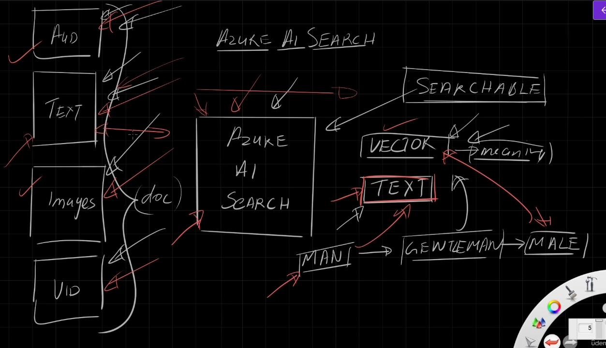
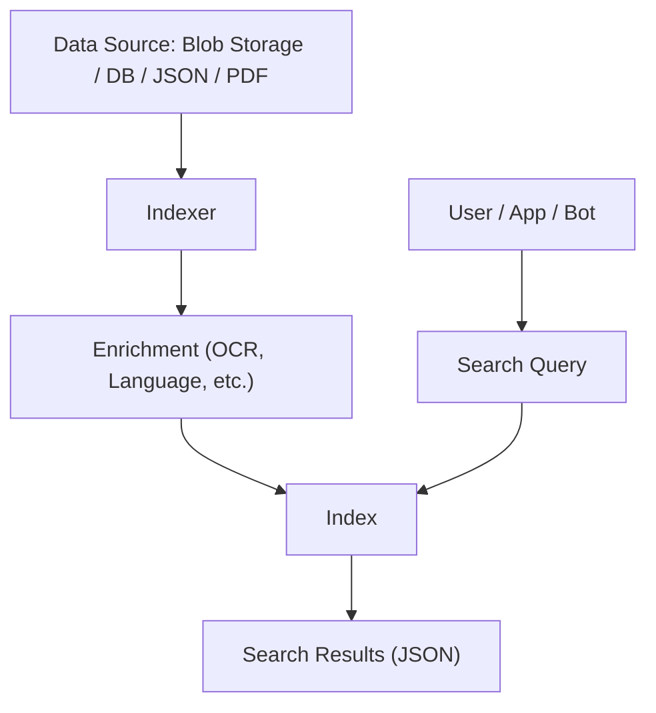

# 🔎 Azure AI Search

## 🧠 What Is Azure AI Search?

**Azure AI Search** (formerly Azure Cognitive Search) is a powerful **search engine-as-a-service** hosted in Azure. Think of it like a **Google search** for your own data — documents, PDFs, databases, websites — anything text-based or convertible into text.

It **indexes** your data, adds **search capabilities**, and can even **enrich it with AI** (like reading images, extracting text, identifying entities, and more).

- ✅ It's like ElasticSearch + AI superpowers
- ✅ Works great for search apps, knowledge bases, help centers, and **RAG (Retrieval Augmented Generation)** with LLMs

---

<div style="text-align: center;">
    
</div>

---

## 🎭 Search Types in Azure Ai Search

Azure AI Search supports **both vector search and traditional text search**, and even lets you combine them in what's called **hybrid search**.

- **🔎 Text search** uses keyword-based matching (like BM25) to find documents containing specific terms.
- **🧠 Vector search** works with embeddings—numerical representations of content—allowing it to find semantically similar results, even if the exact words don’t match.
- **🤝 Hybrid search** blends both approaches in a single query, so you get the precision of keyword search and the nuance of semantic similarity.

---

> 💪 This makes Azure AI Search especially powerful for applications like `semantic search`, `multilingual retrieval`, and even `multimodal search` (e.g., combining text and image embeddings).  
> 🧠 Vector search is key to modern **RAG** apps (chat with PDFs, internal docs, etc.).

---

| Feature          | Text Search                     | Vector Search (AI)                      |
| ---------------- | ------------------------------- | --------------------------------------- |
| Matching Type    | Exact keywords                  | Semantic similarity (meaning)           |
| Tech             | `Lucene-based`                  | `Embeddings` (from OpenAI or similar)   |
| Search for "man" | Matches only "man"              | Matches "man", "male", "gentleman"      |
| Works with       | All Azure AI Search indexes     | `Requires vector store integration`     |
| Use Case         | `FAQ`, `filtering`, lookup apps | `LLMs`, `RAG`, Chat over your documents |

---

## 🧱 Core Concepts You Must Know

### 📦 1. Data Source (The Stuff You Want to Search)

You give Azure AI Search some **data**:

- Text files (plain `.txt`, `.json`)
- PDFs, scanned forms, HTML files
- Images or scanned docs (if OCR is enabled)
- Databases like SQL, CosmosDB
- Blob Storage (most common)

🔁 It doesn’t search the files directly — instead, it first creates an…

---

### 📊 2. Index (Your Search Table)

An **Index** is like a smart Excel table:

- **Rows** = individual documents (e.g. Hotel A, Hotel B)
- **Columns (Fields)** = metadata or values (e.g. name, description, tags)

Each field can be:

| Property      | Meaning                                             |
| ------------- | --------------------------------------------------- |
| `searchable`  | Can I search this field with keywords?              |
| `retrievable` | Can I show this field in the result?                |
| `filterable`  | Can I use this field in filter (like price < 100)?  |
| `sortable`    | Can I sort results by this field?                   |
| `facetable`   | Can I create sidebar summaries like Amazon filters? |

🎯 Think of it like: “HotelName” is searchable, “Price” is filterable & sortable.

---

### ⚙️ 3. Indexer (The Robot That Reads Your Files)

The **Indexer** is the Azure job that:

- Connects to your data source (Blob Storage, SQL)
- **Extracts text** from your files
- **Creates or updates** the index automatically

🕒 You can schedule the indexer to run every hour/day.

---

### 🧠 4. Data Enrichment (Using AI to Boost Your Search)

This is where the **AI magic** happens:

| Use Case                         | AI Skill Used          |
| -------------------------------- | ---------------------- |
| OCR on scanned image             | Azure Vision Service   |
| Audio transcription              | Azure Speech-to-Text   |
| Entity extraction (names, dates) | Azure Language Service |
| Language detection & translation | Azure Translator       |

📍 It turns **non-text data into searchable text**.

---

## 🛠️ Hands-On Flow (No Code Version)

### 1. Upload Documents to Blob Storage

→ JSON, PDF, scanned images, etc.

### 2. Create Search Service

→ In Azure portal (⚠️ it's not free, even idle!)

### 3. Import Data

→ Select your Blob Storage as the source

### 4. Choose Enrichment (Optional)

→ Add AI OCR, key phrase extraction, etc.

### 5. Define Index

→ Choose which fields are searchable, retrievable, filterable, etc.

### 6. Create Indexer

→ Schedule how often to update your index

### 7. Search It!

→ Use Azure portal, REST API, or auto-generated **search web app**

---

## 💻 Optional: Create a Web UI Instantly

Azure Search Studio can generate a mini web app:

- HTML + JavaScript frontend
- Search box + filters
- Auto fetch results via API

✅ Great for demo
✅ Code is visible and editable

---

## 🧪 Use Cases You’ll See in the Real World

- 🔍 **Helpdesk search** – search FAQs and manuals
- 🧾 **Invoice search** – extract and query PDF data
- 💬 **Chatbot with RAG** – use AI Search + OpenAI
- 🛒 **Product catalog** – searchable store with filters
- 📑 **Compliance search** – across millions of PDFs

---

## 💰 Pricing Tips

- ⚠️ This is **not free-tier friendly**
- Charges apply even **without using it**, just for keeping it
- Use the **Free** tier (limited to 125MB) for test projects
- Always **delete** the service when not in use

---

## 🧠 Lucene Query Language (Bonus)

Azure Search uses **Lucene syntax** for filters and queries:

```text
wifi AND luxury
hotelName: "Palm Jumeirah"
description: (sea OR beach) AND (luxury NOT budget)
```

You can also sort, paginate, and facet:

```json
{
  "search": "beach",
  "orderby": "price desc",
  "facets": ["tags", "rating"]
}
```

---

## 🎓 What You Must Know for AI-102

- ✅ What is Azure AI Search
- ✅ How index, indexer, enrichment work
- ✅ Use cases of data enrichment with other AI services
- ✅ Differences between text & vector search
- ✅ Integration with OpenAI for **RAG**
- ✅ Pricing awareness
- ✅ Real-world search examples
- ✅ Lucene query structure (basic)

---

## 📸 Diagram Time: Azure AI Search Architecture

<div align="center">



</div>
