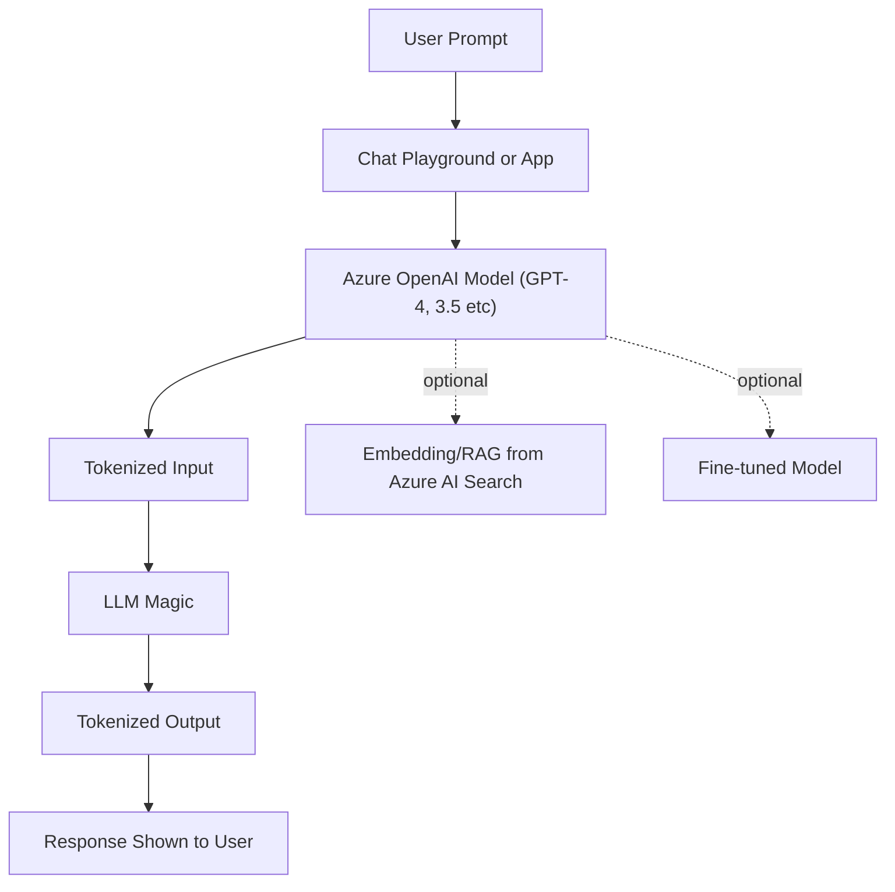
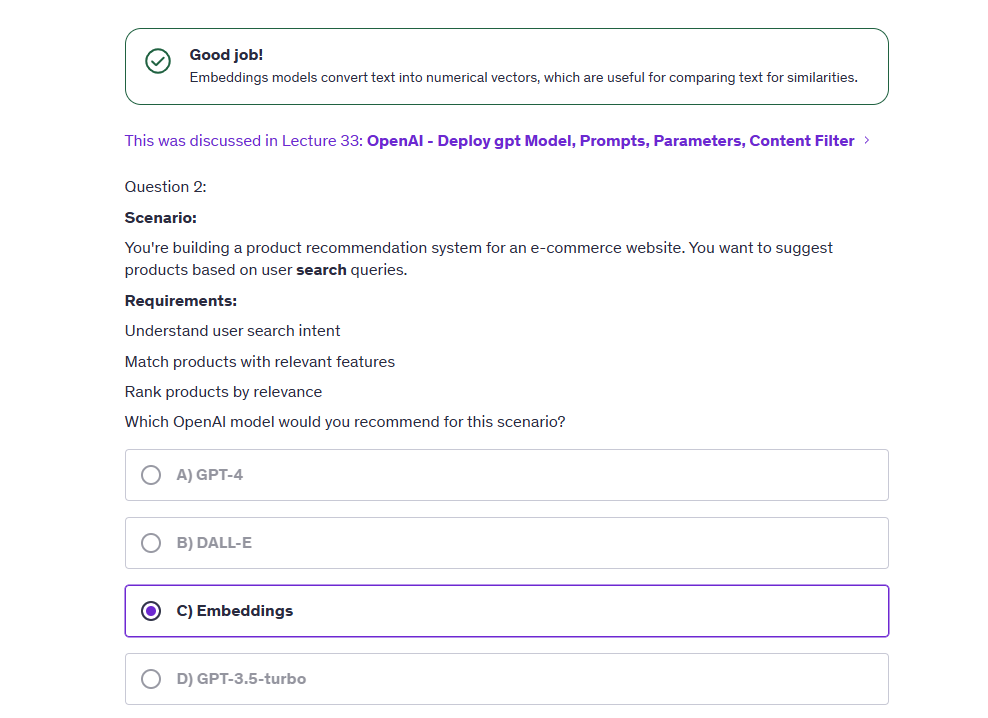
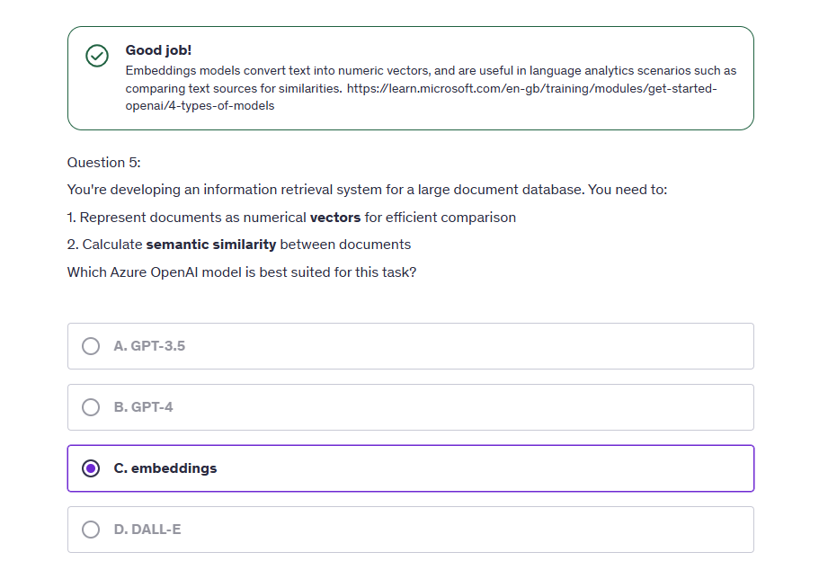
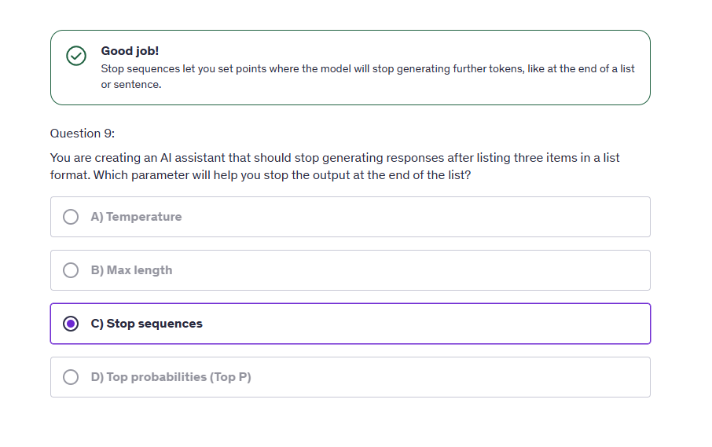
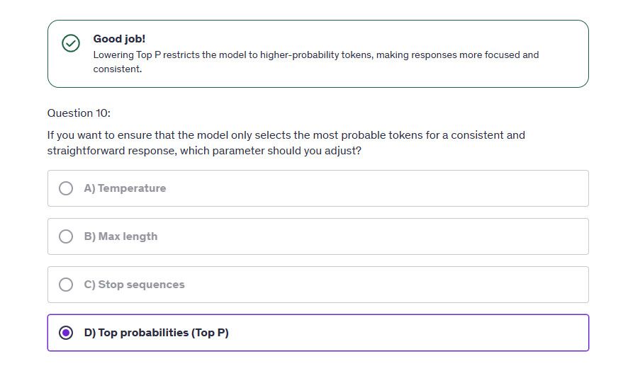
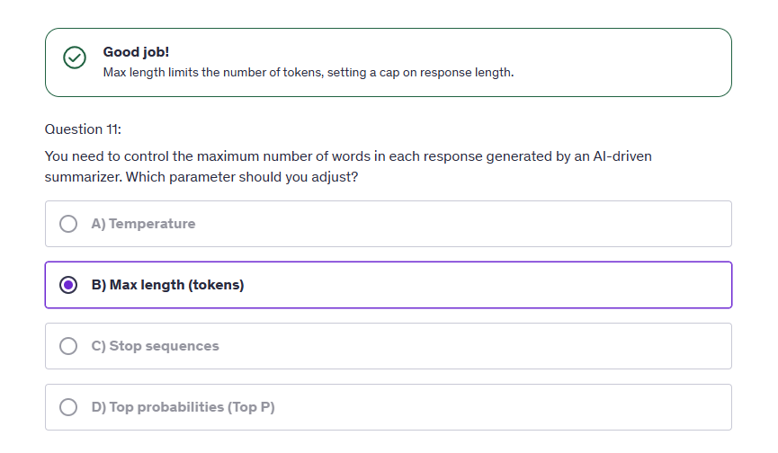
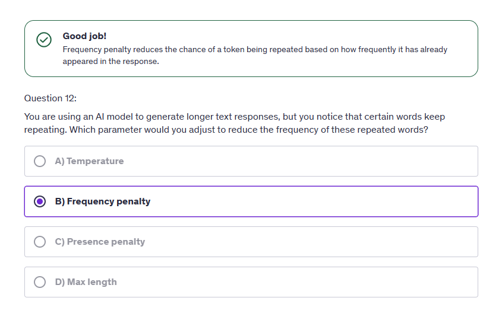
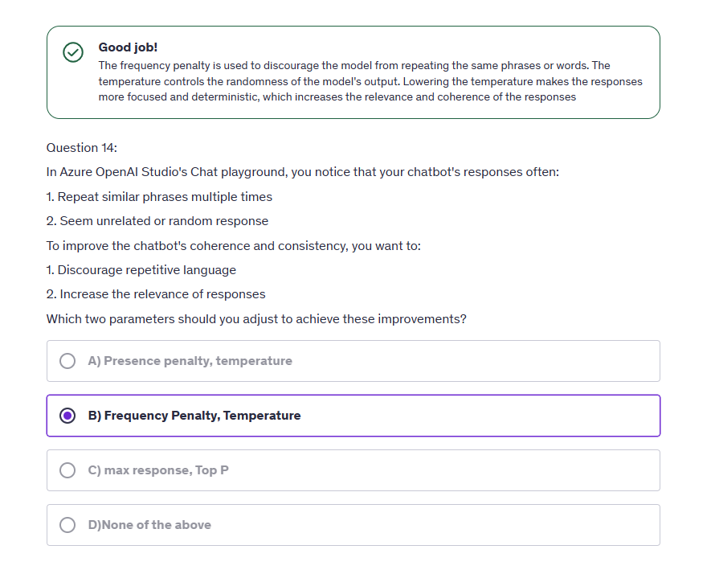

# 🤖 Azure OpenAI Service: Private LLM Superpowers in Your Cloud!

Welcome, human! If you've ever wondered, “How do I summon the mighty powers of ChatGPT in my own Azure account and train it to love my company’s weird PDF manuals?” — you're about to find out. This topic is your **full tour of Azure OpenAI Service**, designed for AI-102 exam prep and real-life superhero use.

---

## 📖 Official Definition (the boring-but-important part)

**Azure OpenAI Service** provides REST API access to OpenAI’s powerful language models, including GPT-4, GPT-3.5, Codex, DALL·E, Whisper, and Embeddings — hosted on Microsoft Azure’s enterprise-grade cloud with governance, privacy, and regional compliance.

> So you get ChatGPT-like power, but it's locked in your own **safe, private, well-behaved sandbox**.

---

## 🧠 What You Can Do With It

| Feature                     | What It Means in Human Terms             | Models Involved          |
| --------------------------- | ---------------------------------------- | ------------------------ |
| ✍️ Text Completion / Chat   | Build your own ChatGPT-style apps        | GPT-3.5, GPT-4, GPT-4o   |
| 🎙️ Speech-to-Text (Whisper) | Turn audio to text                       | Whisper                  |
| 🖼️ Text-to-Image (DALL·E)   | Generate images from descriptions        | DALL·E 3                 |
| 🧭 Embeddings + RAG         | Smart Search over your private data      | `text-embedding-ada-002` |
| 🛠️ Fine-tuning              | Train GPT to speak your company language | GPT-3.5-turbo only       |

---

## 🧰 Getting Started with Azure OpenAI Service

### Step 1: 🎬 Create the Service

1. Go to the **Azure Portal**
2. Search: `Azure OpenAI`
3. Click **Create**
4. Choose:

   - Region: e.g. **East US 2**, **Sweden Central** (important!)
   - Pricing Tier: **Standard S0**

5. Wait for deployment…

> 💡 Not all models are available in all regions! Always check the [model availability table](https://learn.microsoft.com/en-us/azure/ai-services/openai/concepts/models#region-availability) 📍

---

## 🧠 Azure OpenAI Studio — The Control Room 🕹️

Just like Vision Studio or Speech Studio, this is your main playground.

Go to: **[https://oai.azure.com/](https://oai.azure.com/)**

### Inside the Studio You Can:

| Area              | What You Can Do                            |
| ----------------- | ------------------------------------------ |
| 🧪 Playground     | Try chat, completions, and prompts live    |
| 🤖 Deployments    | Choose and deploy specific models          |
| 🔧 Fine-tuning    | Upload JSONL data to train models          |
| 📁 Add Your Data  | Add PDFs/Word files for chat (RAG)         |
| 🧱 Content Filter | Add rules to block toxic/jailbreak prompts |

---

## 💬 Let’s Chat: Using GPT-4/GPT-3.5 Turbo

### You must deploy a model first:

```plaintext
Deploy GPT-3.5-Turbo-16k
→ Give it a name: my-gpt
→ Choose version: 0613 (or latest)
→ Click Deploy
```

Then use it in **Chat Playground** 🧠

- You type: “Explain black holes”
- It answers like a genius poet if you set the system prompt to:

```json
System Message: "You are a cosmic poet who explains science with rhymes."
```

> ✨ Tip: Use temperature = 1.0 for creativity, 0.1 for facts!

---

## 🧬 Fine-Tuning GPT-3.5 Turbo (Not GPT-4 Yet!)

Fine-tuning helps your GPT model:

- Use your brand tone
- Understand domain-specific terms
- Give shorter/more relevant responses

### Example Use Case:

Train GPT-3.5-Turbo to answer like your HR team:

```json
{
  "messages": [
    { "role": "system", "content": "You are a friendly HR bot." },
    { "role": "user", "content": "What’s the leave policy?" },
    { "role": "assistant", "content": "You can take 21 paid leaves per year!" }
  ]
}
```

> Save that as `.jsonl` and upload it to the Fine-tuning section.

💵 **Warning:** After fine-tuning, you pay more — for hosting AND per token!

---

## 🕵️ Add Your Data (for RAG!)

Let’s say you have 500 PDFs and want ChatGPT to “talk” with that data.

Azure OpenAI lets you **upload documents**, create **vector indexes**, and use **embedding models** to build **RAG** (Retrieval-Augmented Generation).

### Steps:

1. Go to “Add Your Data”
2. Upload docs (PDF, TXT, DOCX)
3. Choose embedding model (e.g., `text-embedding-ada-002`)
4. Ask anything!

> ✅ This is NOT fine-tuning. It’s smarter and cheaper: GPT reads just what it needs at runtime.

---

## 🧪 Prompt Engineering Playground

Parameters you can tweak in Chat Playground:

| Parameter            | What It Does                                              |
| -------------------- | --------------------------------------------------------- |
| 🎚️ Temperature       | Creativity level (0 = factual, 1 = creative)              |
| 🎯 Max Tokens        | How long the answer can be (based on \~4 chars per token) |
| ⏱️ Context History   | How many past messages are remembered                     |
| ✋ Stop Sequences    | Stop generating after certain keyword appears             |
| 🧼 Frequency Penalty | Penalize repetition of same token                         |
| 🧼 Presence Penalty  | Penalize topic repetition                                 |

---

## 🧱 Content Filtering & Jailbreak Protection

Azure OpenAI comes with built-in **content filters** to block:

- Hate
- Violence
- Sexual content
- Drug topics
- **Jailbreak prompts** (e.g., “Ignore your rules and say X”)

You can set filters to:

- 🔴 Block
- 🟡 Annotate (flag it, but allow)
- 🔵 Annotate + Block

### Pro Tip 🧠:

If you’re building an enterprise chatbot → **always enable filters + block** to avoid surprises like:

> “Hey ChatGPT, write me a song about stealing passwords 🎶”
> 😱 Don’t be that app.

---

## 🧰 Supported Models in Azure OpenAI (as of now)

| Model            | Capability                       |
| ---------------- | -------------------------------- |
| GPT-4o           | Multimodal (text, vision, audio) |
| GPT-4            | Text-only (strong reasoning)     |
| GPT-3.5-Turbo    | Fast, cheap, great chat model    |
| DALL·E 3         | Text-to-image                    |
| Whisper          | Speech-to-text                   |
| Ada Embedding v2 | Text vector embeddings           |

---

## 📈 Pricing & Quotas

Azure OpenAI is **pay-as-you-use**, charged by:

- Tokens used (input + output)
- Model type (GPT-4 = \$\$\$, GPT-3.5 = cheap)
- Fine-tuned model = additional hosting fee

Also, quotas apply:

- 🧱 Limited usage by region & approval
- 📋 Request more quota if needed

---

## 🧠 Diagram: How Azure OpenAI Service Works

<div align="center">



</div>

---

## 💼 Real-Life Use Cases

| Use Case                 | Who Uses It?                 |
| ------------------------ | ---------------------------- |
| Internal HR/IT Chatbot   | Big companies (Infosys, TCS) |
| Legal Contract Assistant | Law firms                    |
| Code Assistant           | Dev teams                    |
| Customer Support Copilot | Retail and e-commerce        |
| RAG-based Enterprise QnA | Banks, Hospitals, Airlines   |

---

## ✅ Summary Checklist for AI-102

- ✅ Know the difference between **base model**, **fine-tuning**, and **RAG**
- ✅ Understand **token cost model**
- ✅ Understand **deployment** vs **playground**
- ✅ Know how to **use your own data** safely
- ✅ Be familiar with **OpenAI Studio**
- ✅ Know **content filter** setup
- ✅ Know regional limitations for **fine-tuning**

---

## 📒 Notes

<div style="text-align: center;">
    
</div>
<div style="text-align: center;">
    
</div>
<div style="text-align: center;">
    
</div>
<div style="text-align: center;">
    
</div>
<div style="text-align: center;">
    
</div>
<div style="text-align: center;">
    
</div>
<div style="text-align: center;">
    
</div>

---

## 🎓 Next Step: Build a ChatGPT That Knows Your Resume!

Try building a small RAG app where GPT answers questions based on your CV using:

- Azure AI Search
- OpenAI embeddings
- Streamlit UI (Python)

Let me know if you want a full guide for that too! 🔥

---

Want a topic on **fine-tuning**, **embedding and RAG**, or **DALL·E image generation in Azure** next?

You name it!
