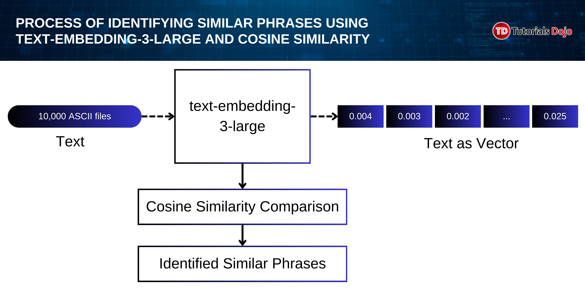

# OpenAi Model Types

[Azure OpenAI in Azure AI Foundry Models](<[https://](https://learn.microsoft.com/en-us/azure/ai-services/openai/concepts/models?tabs=global-standard%2Cstandard-chat-completions#image-generation-models)>)

## codex-mini

## model-router

## Embeddings

provides the necessary functionality by generating text embeddings. These embeddings are numerical representations of the text that can be used to compute cosine similarity and perform tasks like semantic search and text comparison. This model is specifically designed for tasks that require embeddings for similarity comparison, making it the ideal solution for this scenario.

**Examples:**

- `text-embedding-3-large`
- `text-embedding-3-small`
- `text-embedding-ada-002`

---

---

For extracting phrases from text files and comparing their similarity using cosine similarity, the best approach is to generate embeddings, which can then be compared using cosine similarity. The text-embedding-ada-002 model is designed for exactly this task, as it generates embeddings that can be easily compared for similarity.

---

## GPT-4.1 series

## GPT-4

## GPT-3.5

## GPT-4o & GPT-4o mini & GPT-4 Turbo

## Image generation - DALL-E 3
