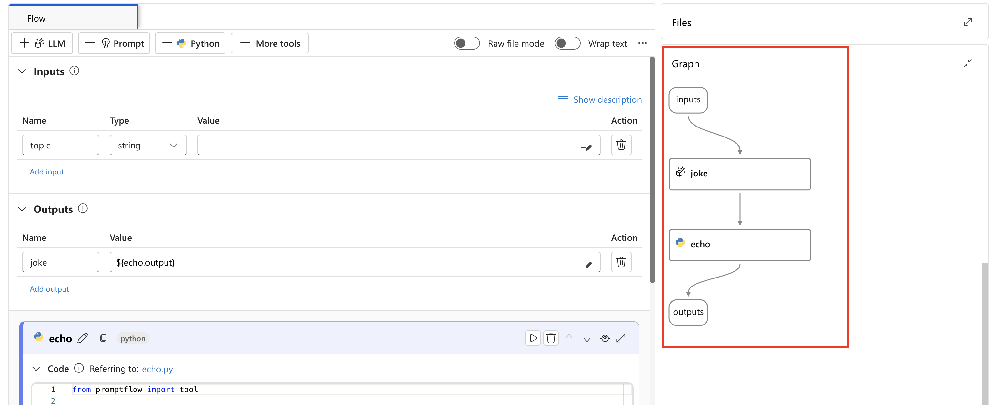

# 🤖🧩 **Prompt Flow in Azure AI Foundry** – From Basics to Advanced

> The beating heart of modern Azure-based LLM applications — visually programmable, prompt-enhanced, and Python-powered.

---

    

---

## 🚀 What Is Prompt Flow?

> **Prompt Flow** is an orchestration system inside **Azure AI Foundry** (and Azure Machine Learning) that lets you build, test, debug, deploy, and monitor **LLM workflows** using **modular nodes** — combining prompts, Python code, and AI services.

Think of it like:

- 🧠 Prompt Engineering ➕
- 🛠️ Code Tooling ➕
- 🔁 Workflow Engine ➕
- 📦 Deployment pipeline ➕
- 📊 Evaluation framework

All wrapped inside a GUI **flow graph** + YAML + code.

---

## 🎯 Why Prompt Flow Exists?

LLMs (like GPT-4) don’t work in isolation. Real-world LLM apps need:

- Preprocessing (PDF → text, HTML cleaning, etc.)
- Prompt tuning and template filling
- Calling external tools/APIs to augment answers
- Postprocessing and validation
- Evaluation and debugging

⚡ **Prompt Flow** solves these **LLM app complexity problems** — visually and programmatically.

---

## 📦 Prompt Flow Components (Core Building Blocks)

### 🧩 1. **Nodes**

A Prompt Flow is a **DAG (Directed Acyclic Graph)** made up of connected **nodes**:

| Node Type | Purpose                                      |
| --------- | -------------------------------------------- |
| `llm`     | Call OpenAI model (e.g. GPT-4o-mini)         |
| `prompt`  | Jinja2 template with structured instructions |
| `python`  | Run scripts or preprocessing tools           |
| `data`    | Load structured input like CSV               |
| `file`    | Read static text / sample docs               |

Each node takes inputs, processes something, and passes output to the next.

---

### 📄 2. **Prompt Tool**

- Jinja2-powered template with support for:

  - Chat history rendering
  - Input variables (`{{ question }}`)
  - Few-shot examples
  - System-level instructions

🧠 It's where **prompt engineering** happens.

---

### 🧠 3. **LLM Tool**

- Calls Azure OpenAI (e.g., `gpt-35-turbo`, `gpt-4`, or `gpt-4o`)
- Supports:

  - Temperature, max_tokens, top_p
  - System vs user role
  - Format: `chat`, `json`, `text`

---

### 🐍 4. **Python Tool**

- Run real Python code in the pipeline:

  - Call APIs (e.g., search Wikipedia, query SQL)
  - Process PDFs, images, HTML
  - Add grounding logic (e.g. search, vector DBs)
  - Postprocess outputs (cleaning, summarizing)

📌 Uses `@tool` decorators to define functions.

---

### 💾 5. **Compute Sessions**

To run Python and LLM tools, Prompt Flow uses **Compute Sessions**:

- Backed by Azure ML Compute (Docker/VM)
- Cost is incurred during execution
- Required for flow **debugging**, **chatting**, and **evaluation**

---

## 🧱 Flow DAG (Architecture)

Each Prompt Flow is defined by:

- `flow.dag.yaml`: Graph definition with input/output mapping
- `*.jinja`: Prompt templates
- `*.py`: Custom tool scripts
- `inputs.json`: Optional test data

📌 Think of it as a **self-contained LLM app**.

---

## 🔄 Prompt Flow Types

Prompt Flows are **categorized by purpose**:

| Type                   | Description                                             |
| ---------------------- | ------------------------------------------------------- |
| **Standard**           | General-purpose flow with mixed tools                   |
| **Chat**               | Conversational multi-turn format with chat history      |
| **Evaluation**         | For evaluating flows across sample datasets and metrics |
| **Streaming (coming)** | Designed for real-time streaming of inputs              |

You choose the type when creating or cloning a flow.

---

## 📊 Use Cases & Examples

| Use Case                      | How Prompt Flow Helps                        |
| ----------------------------- | -------------------------------------------- |
| Chatbot with grounding        | Search Wikipedia, inject text into prompt    |
| RAG (Retrieval-Augmented Gen) | Fetch from vector DB, inject as context      |
| PDF Q\&A                      | Convert PDF to text, extract Q\&A, summarize |
| Multi-modal                   | Process images, audio before prompting       |
| Data-to-text summary          | Python → JSON → LLM-generated text           |
| Evaluation                    | A/B test multiple prompt versions            |

---

## 🛠️ Real Example: “Chat with Wikipedia”

Flow steps:

1. Input: “What is the capital of India?”
2. `llm`: Extract search keywords → “capital of India”
3. `python`: Search Wikipedia using `requests` + `BeautifulSoup`
4. `python`: Parse HTML text and clean it
5. `prompt` + `llm`: Ask the final question using Wikipedia text as **context**
6. Output: “New Delhi” (grounded response)

> 📌 This is **prompt engineering + grounding = RAG** — implemented using Prompt Flow.

---

## 🔍 Prompt Flow vs. Other Techniques

| Feature              | Prompt Engineering | RAG          | Prompt Flow         |
| -------------------- | ------------------ | ------------ | ------------------- |
| Manual Prompting     | ✅ Yes             | ⚠️ Optional  | ✅ Yes (Jinja2)     |
| Uses external data   | ❌ No              | ✅ Yes       | ✅ Yes              |
| Handles Python logic | ❌ No              | ⚠️ Partially | ✅ Yes              |
| Visual pipeline      | ❌ No              | ❌ No        | ✅ Yes (DAG)        |
| Evaluation tools     | ❌ No              | ⚠️ Limited   | ✅ Yes (Built-in)   |
| Deployment           | ❌ Manual          | ❌ Manual    | ✅ One-click deploy |
| Monitoring           | ❌ No              | ⚠️ Complex   | ✅ Built-in logs    |

---

## 📥 How to Create a Prompt Flow

1. Go to **Azure AI Studio → AI Foundry → Prompt Flows**
2. Click ➕ `New Flow` or clone sample
3. Choose flow type (Standard, Chat, Eval)
4. Drag nodes: Input → Prompt → LLM → Python
5. Define prompt template in `.jinja`
6. Attach compute
7. Run/debug the flow
8. Evaluate using datasets (optional)
9. Deploy to endpoint

---

## 🔒 Permissions & Security

| Resource           | Required Role                                 |
| ------------------ | --------------------------------------------- |
| Azure AI Project   | `Contributor` or `ML Workspace User`          |
| Compute Instance   | `Reader` / `Contributor` on ML workspace      |
| Prompt Flow Access | Role inside **Hub-based project** (mandatory) |
| Blob/File Storage  | `Reader` or `Storage Blob Data Reader`        |

✅ Use **Managed Identity** or `AzureMLCompute` role for automation.

---

## ⚡ Gotchas & Best Practices

- Always **start Compute** to run/debug flows
- Make sure to **stop sessions** to avoid extra billing
- Use `flow.dag.yaml` to version and manage flows as code
- Split logic: Prompt for prompting, Python for logic
- Add logging inside Python tools for debugging
- Evaluate flows regularly to detect prompt regressions
- Avoid massive prompt context — can hit token limits

---

## 🔗 Integration & Deployment

- Expose as REST API via Azure deployment
- Use in **Agents**, **Copilot**, or external apps
- Integrated with:

  - Azure AI Studio
  - Azure DevOps (CI/CD)
  - Azure ML Monitor
  - PromptFlow SDK / CLI / VS Code

---

## 📚 Learn More

- [🔹 Prompt Flow Concepts – Microsoft Docs](https://learn.microsoft.com/en-us/azure/ai-foundry/concepts/prompt-flow)
- [🔹 Prompt Flow GitHub & SDK](https://microsoft.github.io/promptflow/)
- [🔹 YouTube Tutorial - Getting Started with Prompt Flow](https://www.youtube.com/watch?v=Q0udLVx07HY)

---

## 🧠 Summary

| Feature              | Value                              |
| -------------------- | ---------------------------------- |
| Visual LLM builder   | Yes, with DAG + Graph UI           |
| Python Integration   | Yes (custom tools with decorators) |
| Prompt Engineering   | Yes (Jinja2 templates)             |
| Evaluation           | Yes, using datasets and metrics    |
| Grounding support    | Yes (like RAG with custom logic)   |
| End-to-End App Ready | Yes – deploy, monitor, iterate     |

Prompt Flow lets you build real-world, production-grade LLM apps — grounded, debuggable, and deployable.
