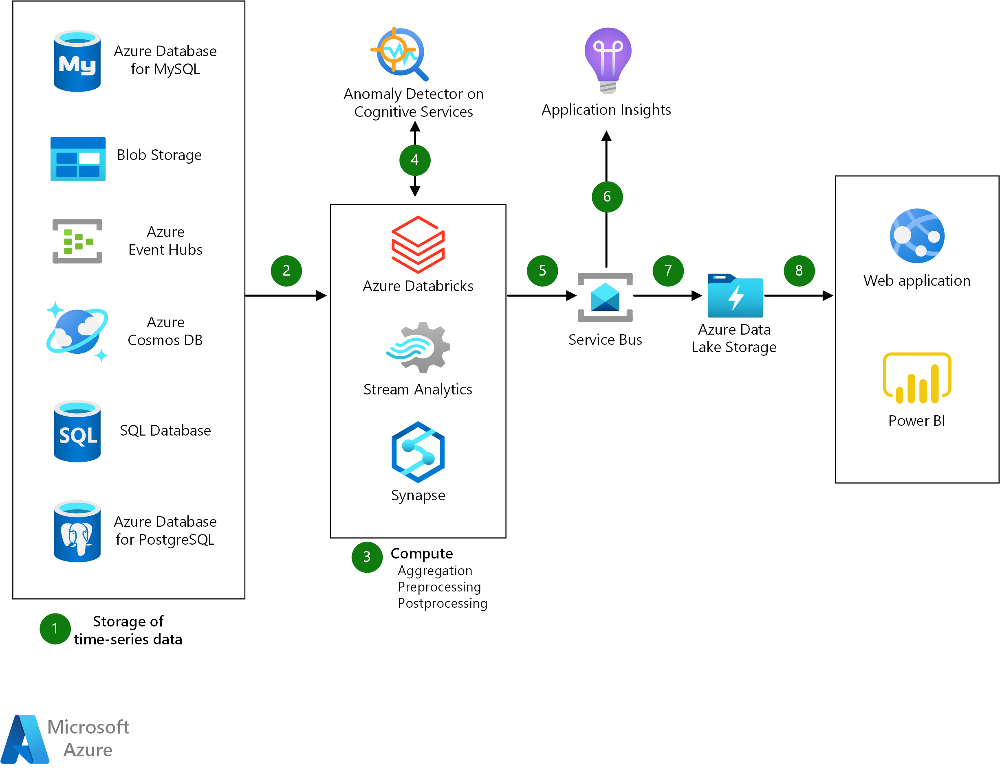

# **Azure Anomaly Detector**

> 📖 **Azure Anomaly Detector** is a fully managed Azure service that automatically identifies anomalies (unusual patterns or outliers) in time-series data. As part of the Azure AI Services suite, it is specifically built to detect abnormal patterns in large datasets, such as those generated by IoT sensors, server logs, financial transactions, and other continuous data streams.

    

---

[Anomaly Detector API Documentation](https://learn.microsoft.com/en-us/azure/ai-services/anomaly-detector/)
