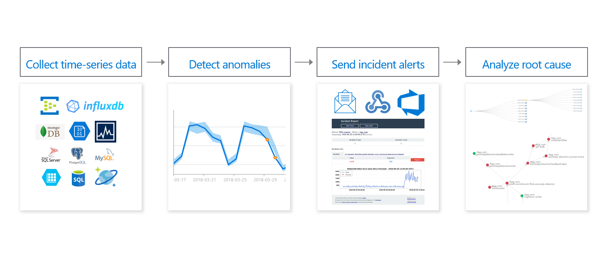

# Azure AI Metrics Advisor

> 📖 **Azure AI Metrics Advisor** is a fully managed service focused on detecting anomalies in time series data, particularly across multiple correlated sensors. It directly supports the need to monitor telemetry data from interconnected machines. It includes built-in root cause analysis and automated alerting, which minimizes custom development and speeds up deployment. Designed for operational monitoring, it effectively detects anomalies, identifies the causes of production problems, and easily sends incident alerts.

---

    

---

[What is Azure AI Metrics Advisor?](<[https://](https://learn.microsoft.com/en-us/azure/ai-services/metrics-advisor/overview)>)
