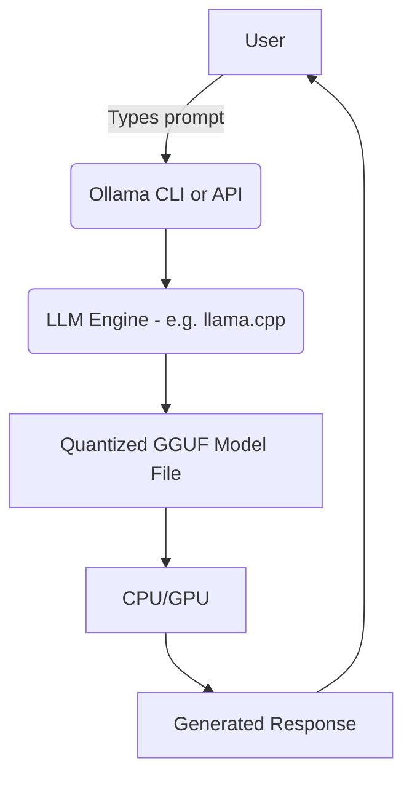

# 🦙💻 **Ollama Explained – From Basics to Beast Mode**

_A smart, clear, fun, and powerful guide to running Large Language Models (LLMs) locally like a pro._

---

## 🧠 What Is Ollama? – _The Official + Human Definition_

> **Official Definition:**  
> 🧾 “Ollama is an open-source tool that lets you run, manage, and interact with large language models (LLMs) locally on your own machine.”  
> — [Ollama Docs](https://ollama.com)
>
> **Human-ified Version:**  
> 🧍💬 Imagine ChatGPT, but **installed like Spotify**, runs **without the internet**, and obeys your every command because it’s running **on your laptop**.

### 🧰 Ollama is for

- Running models like `Llama 2`, `Mistral`, `Gemma`, or `Code LLaMA`
- Managing models easily via a CLI or REST API
- Serving them locally for **LangChain**, **RAG**, or agent-based frameworks
- Airgapped environments with no cloud calls (security, performance, fun)

---

## 🚀 Why Use Ollama?

| Feature                   | Why it’s Awesome                            |
| ------------------------- | ------------------------------------------- |
| 🧩 Easy Setup             | `brew install` or `curl` and you're done    |
| 🧠 LLMs On Your Machine   | No more OpenAI keys or cloud costs          |
| ⚡ Fast                   | Uses **GGUF models** (optimized, quantized) |
| 🔐 Private                | No data leaves your machine                 |
| 🧪 Local Agent Playground | Use with **LangChain**, **AutoGen**, etc.   |

---

## 🛠️ How Ollama Works (Technically Speaking)

Let’s break it down with a Mermaid diagram:



**TL;DR:**  
You type → Ollama talks to its internal LLM engine (like `llama.cpp`) → runs a local `.gguf` model → gives you answers → all on your own machine!

---

## ⚙️ Installing Ollama (Your Local AI Engine)

### 🐧 Linux / 🪟 Windows / 🍏 macOS

Just run this:

```bash
curl -fsSL https://ollama.com/install.sh | sh
```

Then start it:

```bash
ollama run llama2
```

This will:

- Pull the **LLaMA 2 7B GGUF** model (2–4GB depending on quantization)
- Start a REPL terminal
- Let you chat!

### ✅ Example Output

```ini
> What is the capital of Egypt?
Cairo is the capital and largest city of Egypt.
```

**Boom. You're now ChatGPT (but with no API key).** 🎯

---

## 🧪 Popular Models You Can Run with Ollama

| Model          | Description                            | Command                |
| -------------- | -------------------------------------- | ---------------------- |
| 🦙 `llama2`    | Meta’s open-weight GPT-3.5-style model | `ollama run llama2`    |
| ⚡ `mistral`   | Lightweight, fast, powerful 7B model   | `ollama run mistral`   |
| 💻 `codellama` | Specialized for code completion        | `ollama run codellama` |
| 🤖 `gemma`     | Google's lightweight open LLM          | `ollama run gemma`     |
| 🧠 `phi`       | MSFT's tiny 1.3B/2.7B models           | `ollama run phi`       |

---

## 📦 Advanced Features (Going Pro)

### 🔁 1. Ollama REST API (for LangChain)

Once a model is running, Ollama opens an HTTP server locally:

```bash
ollama serve
```

Then you can POST requests to:

```bash
http://localhost:11434/api/generate
```

Sample Python usage:

```python
import requests

res = requests.post("http://localhost:11434/api/generate", json={
  "model": "llama2",
  "prompt": "What's the capital of Japan?"
})

print(res.json()['response'])
```

🧠 Use this with:

- LangChain (via `LLM API`)
- FastAPI
- Node.js backends
- Chat UIs (React/Next.js)

---

### 🧪 2. Running Ollama in Docker 🐳

Yes! Ollama can run in a container if you want isolation:

```bash
docker run --rm -p 11434:11434 ollama/ollama
```

---

### ✍️ 3. Custom Models and Modelfiles

Want to bake your own model config? Use a `Modelfile` like this:

```Dockerfile
FROM llama2
SYSTEM "You are a polite assistant that only answers in Haiku."
```

Then:

```bash
ollama create haikubot -f Modelfile
ollama run haikubot
```

---

### 🧱 4. Use with LangChain

```python
from langchain.llms import Ollama

llm = Ollama(model="mistral")
response = llm.invoke("Explain quantum physics like I'm 5.")
print(response)
```

🎉 Now you're running LangChain locally with no OpenAI bill!

---

## 💬 Tips from the Trenches

| Tip                                   | Why                       |
| ------------------------------------- | ------------------------- |
| Use `mistral` or `phi`                | Faster + less RAM usage   |
| Use quantized models (`Q4_0`, `Q8_0`) | Save VRAM, still accurate |
| Run `nvidia-smi` or `htop`            | Check resource usage      |
| Disable sleep while testing           | Ollama needs RAM focus!   |

---

## 🔥 Real-World Use Cases

- 🧠 Local ChatGPT with custom behavior
- 🧑‍💻 Offline code assistant (e.g. `codellama`)
- 📚 Private RAG chatbot with your PDFs
- 🧪 LangGraph & CrewAI agent loops (fast!)
- 🚫 Air-gapped secure environments

---

## 🧠 Summary – Why You’ll Love Ollama

| ✅ Feature           | 💡 Benefit                   |
| -------------------- | ---------------------------- |
| Runs on your laptop  | No OpenAI bill ever again    |
| Easy install         | One-line setup               |
| Works with LangChain | Plug-and-play                |
| No internet needed   | Air-gapped and private       |
| Customizable         | Build your own assistant     |
| REST API support     | Easily build backends or UIs |

---

## 💭 Final Thoughts

Ollama is like the **Docker of local LLMs** — super simple, surprisingly powerful, and totally under your control. Whether you're building agents with LangChain, deploying a private GPT clone, or just experimenting with language models, **Ollama gives you freedom** — and it’s free. 🫶

---

Want me to create:

- ✅ A ready-to-run Ollama + LangChain Colab notebook?
- ✅ A CLI wrapper to auto-deploy Ollama model + Flask/Next.js UI?
- ✅ A custom `Modelfile` that turns it into a SaaS assistant?

Say the word, and I’ll generate it for you, Captain LLM! 🧙‍♂️🦙🚀
