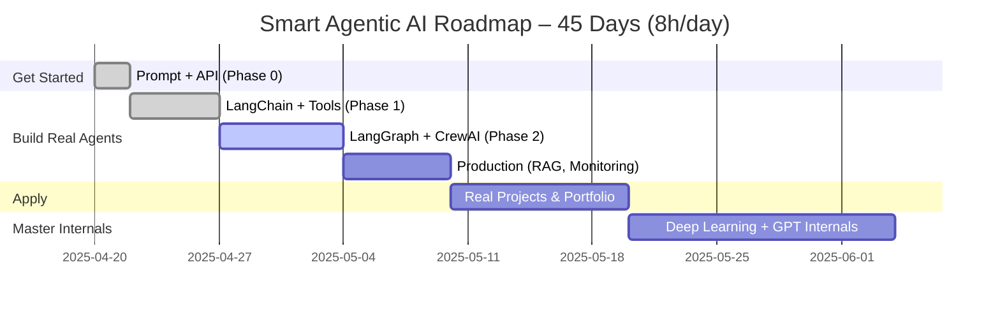

# 🚀 **Smart & Optimized AI Agent Roadmap (for Full Stack Devs)**

_🏗️ Build fast. 🧠 Learn deeply. 💼 Grow career. 💰 Launch product._

---

## 🧭 Phase 0 – Kickstart: Prompting + LLM API (Days 1–2)

### 🎯 Goal: Use GPT/Claude APIs right away. Build your first agent

- Learn how prompts, tokens, temperature, system roles work
- Build your first LLM-powered app (chatbot, Q&A, etc.)

### 🧠 Courses

- ✅ [ChatGPT Prompt Engineering for Developers](https://www.deeplearning.ai/short-courses/chatgpt-prompt-engineering-for-developers/)
- ✅ [OpenAI Playground](https://platform.openai.com/playground) or [Claude API](https://console.anthropic.com/)

---

## 🧭 Phase 1 – LangChain + Tools & Agents (Days 3–7)

### 🎯 Goal: Build full LLM workflows & tool-using agents

- Understand chains, memory, parsing, tool calling
- Use embeddings + documents for RAG
- Create tool-based agents that use calculators, search APIs, etc.

### 🧠 Courses

- ✅ [LangChain for LLM App Dev – DeepLearning.AI](https://www.deeplearning.ai/short-courses/langchain-for-llm-application-development/)
- ✅ [Functions, Tools, and Agents with LangChain](https://www.deeplearning.ai/short-courses/langchain-functions-tools-agents/)

---

## 🧭 Phase 2 – LangGraph + CrewAI: Agentic Frameworks (Days 8–14)

### 🎯 Goal: Master multi-agent workflows

- Build agents that collaborate or reason over graphs
- Design agent loops (e.g., Planner → Coder → Verifier)
- Use LangGraph for control and CrewAI for modular teams

### 🧠 Courses

- ✅ [AI Agents in LangGraph – DeepLearning.AI](https://www.deeplearning.ai/short-courses/ai-agents-in-langgraph/)
- ✅ [CrewAI Docs](https://docs.crewai.com/) + [CrewAI YouTube Tutorial](https://www.youtube.com/watch?v=qsrl2DHYi1Y)

---

## 🧭 Phase 3 – Production Stack: RAG, Vector DBs, Monitoring (Days 15–20)

### 🎯 Goal: Make your agents real-world-ready

- Retrieval-Augmented Generation (RAG) with FAISS/Pinecone
- Use LangSmith to log, trace, evaluate
- Containerize + deploy to cloud (FastAPI, Docker)

### 🧠 Courses

- ✅ [AI Agents Bootcamp (LangChain, RAG, Langflow, GPT)](https://www.udemy.com/course/ai-agents-bootcamp-build-with-langchain-rag-langflow-gpt/)
- ✅ [OpenAI Cookbook](https://github.com/openai/openai-cookbook)

---

## 🧭 Phase 4 – Build Projects & Portfolio (Days 21–30)

### 🎯 Goal: Apply everything to real, monetizable projects

- Deploy production agents (e.g., AI planner, research bot, SaaS MVP)
- Publish GitHub repos, videos, or articles
- Optionally: monetize or apply for jobs

### 🛠️ Project Ideas

| Project                      | Description                                                        |
| ---------------------------- | ------------------------------------------------------------------ |
| 🧠 AI Research Agent         | Takes a query, pulls docs, summarizes, sources info                |
| 💬 AI Customer Assistant     | Uses tools & memory to answer business FAQs                        |
| 📚 GPT for Your Docs         | Embed PDFs, run secure LangChain + RAG pipeline                    |
| 🧾 Travel / Business Planner | Multi-agent planner using CrewAI + LangGraph                       |
| 🚀 MVP SaaS                  | Wrap one of the above in a full-stack app (e.g. Angular + FastAPI) |

---

## 🧠 Phase 5 (Optional but Powerful) – Deep Learning Core (Days 31–45)

### 🎯 Goal: Understand internals of GPT + Transformers

- Backprop, activation, loss, optimization
- Build toy LLM (e.g., Karpathy's nanoGPT)
- Know what’s under the hood — no more black boxes

### 🧠 Courses

- ✅ [Deep Learning Specialization – Andrew Ng](https://www.coursera.org/specializations/deep-learning)
  - Do at least Course 1 & 2
- ✅ [Let’s Build GPT – Karpathy (YouTube)](https://www.youtube.com/watch?v=kCc8FmEb1nY)
- ✅ [Generative AI with LLMs – DeepLearning.AI](https://www.coursera.org/learn/generative-ai-llms)

---

## ⏳ Timeline Overview (with 8h/day dedication)

---

## 💼 Result After This Plan

You’ll be able to:

- ✅ Architect & build complex AI agents
- ✅ Use LangChain, LangGraph, CrewAI confidently
- ✅ Understand LLM internals (transformers, GPT, fine-tuning)
- ✅ Launch an agent-powered product or SaaS
- ✅ Speak with authority in AI/Dev/Startup interviews

---

Would you like this roadmap exported as:

- ✅ Notion Template
- ✅ Trello Board
- ✅ PDF Guide

I’ll generate it for you in your preferred format.
